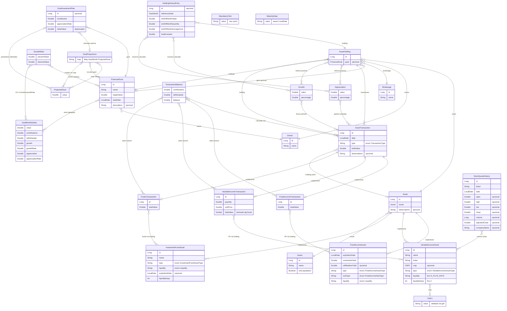

# Domínio — módulo `entity` (Investments-KMP)

**Documento canônico** do modelo de domínio deste módulo (única fonte para entidades, relacionamentos e vocabulário).  
**Regras de negócio** (cálculos, fluxos, políticas): serão documentadas no módulo `usecases` (futuro); até lá, referências legadas em `docs/rules/`.

**Gradle:** `:entity` · **Código:** `core/domain/entity/src/commonMain/kotlin/com/eferraz/entities/`

---

## 1. Problema e escopo

Aplicativo de **carteira de investimentos**: cadastro de ativos, posições por corretora e titular, movimentações, histórico de posição, metas financeiras e projeções. O módulo `entity` define **tipos e estruturas**; a lógica de negócio fica fora (casos de uso / camada de aplicação).

---

## 2. Mapa de pacotes

| Pacote | Conteúdo principal |
|--------|-------------------|
| `assets` | `Asset` (sealed), RF/RV/Fundo, `Issuer`, `Liquidity`, enums, `CNPJ`, `MaturityDate`, `InvestmentCategory` |
| `holdings` | `AssetHolding`, `Owner`, `Brokerage`, `HoldingHistoryEntry`, `Appreciation`, `Growth`, `StockQuoteHistory` |
| `transactions` | `AssetTransaction` (sealed), `TransactionType`, `TransactionBalance` |
| `goals` | `FinancialGoal`, `GoalInvestmentPlan`, `GrowthRate`, `GoalMonthlyData`, `ProjectedGoal`, `GoalProjections` |
| `value` | `MandatoryText` |
| `di` | `EntityModule` (Koin) |

---

## 3. Camadas conceituais

1. **`Asset`** — *O quê*: características intrínsecas do título/ativo; **`Issuer`** obrigatório; sem dono/corretora.
2. **`AssetHolding`** — *Quem* (`Owner`) + *onde* (`Brokerage`) + *quê* (`Asset`); **`FinancialGoal?`**. Não armazena quantidade, custo médio nem valor investido.
3. **`AssetTransaction`** — Fonte de verdade para posição e movimentos; sempre ligada a uma `AssetHolding`.
4. **`HoldingHistoryEntry`** — Snapshot **mensal** (`YearMonth`) da holding. Unicidade natural `(holding, referenceDate)`; PK **`id`** é **chave substituta** (ORM, FKs futuras). Sem campo de rendimento isolado; valores monetários em `Double`.
5. **`FinancialGoal`** — Objetivo por `Owner`; **1:N** meta → holdings (cada holding tem no máximo uma meta). Com `goal` preenchido, **mesmo `Owner`** na holding e na meta.
6. **`GoalInvestmentPlan`** — Parâmetros de plano/simulação: `contribution`, `appreciationRate` (% mês, ex. `0.80` = 0,80%), `initialValue` (deprecated conforme KDoc). `init`: exige `contribution != 0 || appreciationRate != 0`.

---

## 4. Papéis (atores)

Papéis modelados nas entidades `Owner`, `Brokerage` e `Issuer` do diagrama ER (§9): titular da posição, custódia e emissor do ativo. O atributo `isInLiquidation` em `Issuer` cobre risco de crédito / origem (ver implementação no código).

---

## 5. Invariantes e decisões de modelo

- **`Asset` (interface):** `id`, `issuer`, `observations`. **`name`** existe em RV e fundo; **RF** não tem `name` no tipo atual (exibição pode compor tipo, subtipo, rentabilidade e vencimento na UI).
- **`expirationDate`:** obrigatória em RF; inexistente em RV; opcional em fundo.
- **RV:** `liquidity` = `D_PLUS_DAYS`, `liquidityDays` = `2` (fixos, não parâmetros do construtor).
- **`Liquidity`:** `DAILY`, `AT_MATURITY`, `D_PLUS_DAYS` (com `liquidityDays` onde fizer sentido).
- **`AssetTransaction`:** sempre `totalValue`; RF/Fundo = valor explícito; RV = `quantity * unitPrice`.
- **`TransactionType`:** `PURCHASE` aumenta posição; `SALE` reduz.
- **`FinancialGoal`:** `targetValue > 0` no `init`.
- **Datas:** `kotlinx.datetime` (`LocalDate`, `YearMonth`).

---

## 6. Contratos por tipo (alinhado ao código)

### 6.1 `Asset`

Subtipos e campos distintivos estão no diagrama ER (`Asset`, `FixedIncomeAsset`, `VariableIncomeAsset`, `InvestmentFundAsset`).

### 6.2 `AssetTransaction`

Regras de valor por subtipo constam em `FixedIncomeTransaction`, `FundsTransaction` e `VariableIncomeTransaction` no diagrama ER (§9).

### 6.3 Metas e projeções

- **`FinancialGoal`:** `owner`, `name`, `targetValue`, `startDate`, `description?`. Progresso, médias, datas estimadas: **fora** da entidade (camada de aplicação).
- **`GrowthRate`:** CAGR — \((V_f/V_i)^{1/n} - 1\); `calculate(initialValue, finalValue, periods)`.
- **`ProjectedGoal`:** um mês; ordem típica no domínio: aporte no início do mês, depois rentabilidade sobre o total (ver KDoc).
- **`GoalProjections`:** `Map<YearMonth, ProjectedGoal>`; fábrica `calculate(plan, maxMonths)` (padrão 120).
- **`GoalMonthlyData`:** consolidado mensal: `value`, `contributions`, `withdrawals`, `growth`, `growthRate`, `appreciation`, `appreciationRate`.

### 6.4 Outros

- **`TransactionBalance`:** `contributions`, `withdrawals`, `balance` a partir de lista de transações.
- **`Appreciation` / `Growth`:** métricas mensais de posição (ver KDoc).
- **`StockQuoteHistory`:** cotação diária OHLCV por `ticker` (mercado; não substitui ledger de transações).

### 6.5 Enums

`FixedIncomeAssetType`, `FixedIncomeSubType`, `VariableIncomeAssetType`, `InvestmentFundAssetType`, `TransactionType`, `InvestmentCategory`, `Liquidity` — valores no código-fonte (sem duplicar lista longa aqui).

---

## 7. Posição a partir de transações (visão de domínio)

Quantidade, custo médio e valor investido **não** são campos de `AssetHolding`: derivam das transações e do tipo de ativo (ver §9: `AssetHolding` → `AssetTransaction` → subtipos de `Asset`).

Detalhes algorítmicos ficam nos casos de uso, não neste arquivo.

---

## 8. Metas — valores típicos **não** persistidos em `FinancialGoal`

Progresso, valor atual consolidado, médias e datas estimadas **não** são atributos persistidos em `FinancialGoal` no modelo conceitual; são calculados na aplicação. Tipos auxiliares no código (`GoalMonthlyData`, `GoalProjections`, `GrowthRate`, etc.) complementam o diagrama ER.

---

## 9. Diagrama de relacionamento entre entidades (ER)

As **classes** do módulo `entity` aparecem abaixo com o **nome Kotlin** (PascalCase), exceto `EntityModule` (Koin, fora do modelo de domínio). **Enums** (`Liquidity`, tipos de ativo, `TransactionType`, `InvestmentCategory`, etc.) estão no código e na §6.5, não no diagrama. Atributos principais e cardinalidades são conceituais; arestas marcadas como `calculate`, `when` ou `via holding` refletem uso no código, não FK de banco.

**Ligações só no módulo `entity` (Kotlin):** import ou tipo em propriedade; `when` em `TransactionBalance`; `GoalProjections` / `ProjectedGoal` por `calculate`.

**Sem referência a outros tipos do domínio neste módulo:** `MandatoryText`, `MaturityDate` (VOs isolados). **`InvestmentCategory`:** definido no módulo, sem uso por outras classes aqui.

**Fora do Mermaid:** enums (§6.5 e código-fonte); **`EntityModule`** (Koin, não é modelo de domínio).

**Arestas** `calculate`, `when`, `via holding` não são FKs de BD; são uso estático ou navegação em objeto.

---

## 10. Manutenção

Alterou entidade, relacionamento ou vocabulário em `core/domain/entity/` → **atualizar este arquivo**. Alterou regra de negócio → documentar no **`usecases`** (quando existir) e manter entidades aqui só se o **modelo** mudar.
