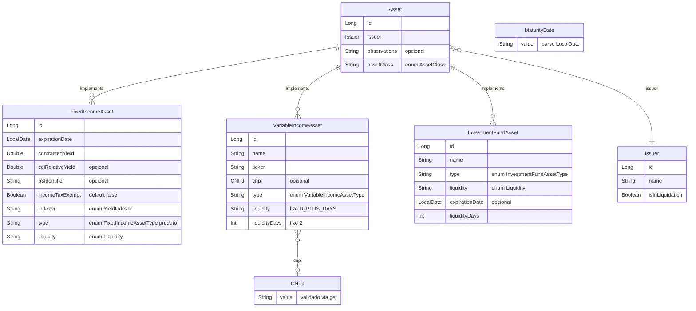
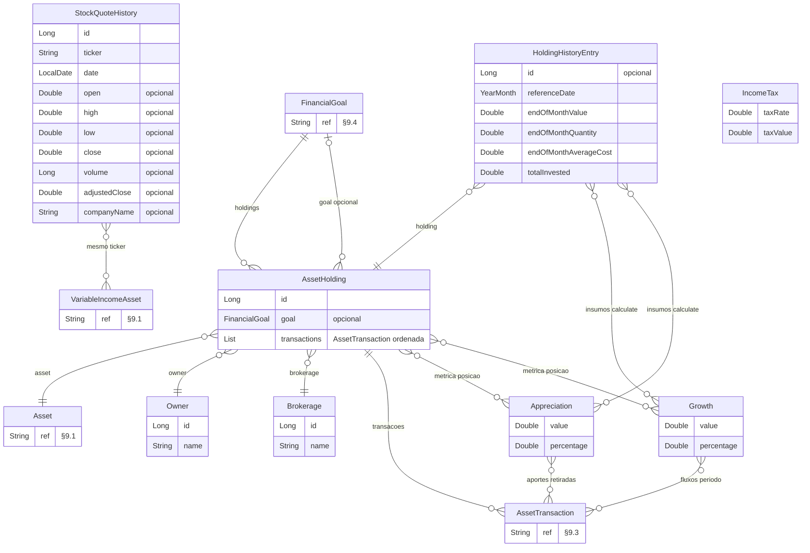
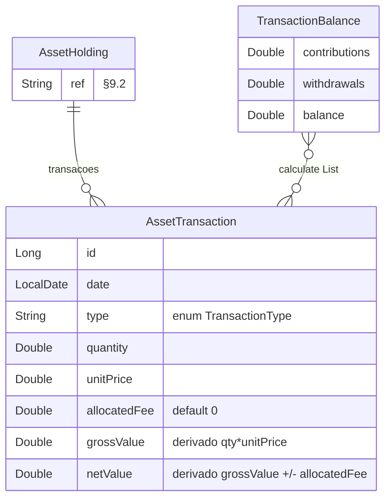
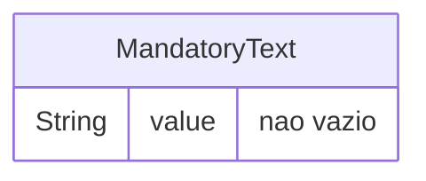

# Domínio — módulo `entity` (Investments-KMP)

**Documento canônico** do modelo de domínio deste módulo (única fonte para entidades, relacionamentos e vocabulário).  
**Regras de negócio** (cálculos, fluxos, políticas): serão documentadas no módulo `usecases` (Gradle **`:domain:usecases`**, futuro); até lá, referências legadas em `docs/rules/`.

**Gradle:** `:domain:entity` · **Código:** `core/domain/entity/src/commonMain/kotlin/com/eferraz/entities/`

---

## 1. Problema e escopo

Aplicativo de **carteira de investimentos**: cadastro de ativos, posições por corretora e titular, movimentações, histórico de posição, metas financeiras e projeções. O módulo `entity` define **tipos e estruturas**; a lógica de negócio fica fora (casos de uso / camada de aplicação).

---

## 2. Mapa de pacotes

| Pacote         | Conteúdo principal                                                                                         |
|----------------|------------------------------------------------------------------------------------------------------------|
| `assets`       | `Asset` (sealed), RF/RV/Fundo, `Issuer`, `Liquidity`, enums, `CNPJ`, `MaturityDate`, `AssetClass`, `YieldIndexer`, `AssetType`  |
| `holdings`     | `AssetHolding`, `Owner`, `Brokerage`, `HoldingHistoryEntry`, `Appreciation`, `Growth`, `IncomeTax`, `StockQuoteHistory` |
| `transactions` | `AssetTransaction` (data class), `TransactionType`, `TransactionBalance`                                   |
| `goals`        | `FinancialGoal`, `GoalInvestmentPlan`, `GrowthRate`, `GoalMonthlyData`, `ProjectedGoal`, `GoalProjections` |
| `value`        | `MandatoryText`                                                                                            |
| `brokeragenotes` | `TradeType`, `ApportionableFees`, `WithheldTaxes`, `FinancialSummary`, `BrokerageNoteMetadata`, `NoteAsset`, `BrokerageNoteAsset`, `BrokerageNote`, `BrokerageNoteValidator`, `NoteFeeAllocation` |
| `di`           | `EntityModule` (Koin)                                                                                      |

---

## 3. Camadas conceituais

1. **`Asset`** — *O quê*: características intrínsecas do título/ativo; **`Issuer`** obrigatório; sem dono/corretora.
2. **`AssetHolding`** — *Quem* (`Owner`) + *onde* (`Brokerage`) + *quê* (`Asset`); **`FinancialGoal?`**. Não armazena quantidade, custo médio nem valor investido. **Cadastro via diálogo “Novo investimento”:** na mesma transação em que o ativo é gravado, cria-se a **primeira** `AssetHolding` do titular corrente com a **corretora** escolhida no formulário e **meta nula** (`FinancialGoal?` ausente).
3. **`AssetTransaction`** — Fonte de verdade para posição e movimentos; sempre ligada a uma `AssetHolding`.
4. **`HoldingHistoryEntry`** — Snapshot **mensal** (`YearMonth`) da holding. Unicidade natural `(holding, referenceDate)`; PK **`id`** é **chave substituta** (ORM, FKs futuras). Sem campo de rendimento isolado; valores monetários em `Double`.
5. **`FinancialGoal`** — Objetivo por `Owner`; **1:N** meta → holdings (cada holding tem no máximo uma meta). Com `goal` preenchido, **mesmo `Owner`** na holding e na meta.
6. **`GoalInvestmentPlan`** — Parâmetros de plano/simulação: `contribution`, `appreciationRate` (% mês, ex. `0.80` = 0,80%), `initialValue` (deprecated conforme KDoc). `init`: exige `contribution != 0 || appreciationRate != 0`.

---

## 4. Papéis (atores)

Papéis modelados nas entidades `Owner`, `Brokerage` e `Issuer` do diagrama ER (§9): titular da posição, custódia e emissor do ativo. O atributo `isInLiquidation` em `Issuer` cobre risco de crédito / origem (ver implementação no código).

---

## 5. Invariantes e decisões de modelo

- **`Asset` (interface):** `id`, `issuer`, `observations`, `assetClass`. **`name`** existe em RV e fundo; **RF** não tem `name` no tipo atual (exibição pode compor indexador, tipo de produto, rentabilidade e vencimento na UI).
- **`expirationDate`:** obrigatória em RF; inexistente em RV; opcional em fundo.
- **RV:** `liquidity` = `D_PLUS_DAYS`, `liquidityDays` = `2` (fixos, não parâmetros do construtor).
- **`Liquidity`:** `DAILY`, `AT_MATURITY`, `D_PLUS_DAYS` (com `liquidityDays` onde fizer sentido).
- **`AssetTransaction`:** tipo único (`data class`) com `quantity`, `unitPrice` e `allocatedFee` persistidos; `grossValue` derivado (`quantity * unitPrice`); `netValue` derivado (`grossValue ± allocatedFee` conforme `TransactionType`). RF/Fundos: convenção UI qty=1, preço unitário = valor total.
- **`TransactionType`:** `PURCHASE` aumenta posição; `SALE` reduz.
- **`FinancialGoal`:** `targetValue > 0` no `init`.
- **Datas:** `kotlinx.datetime` (`LocalDate`, `YearMonth`).
- **`FixedIncomeAsset.b3Identifier`:** opcional (`String?`), exclusivo de renda fixa; texto livre; valor persistido após `trim()`; `null` se vazio após trim (identificador B3 para conciliação manual com posição B3; sem validação de formato na entidade).
- **`FixedIncomeAsset.incomeTaxExempt`:** `Boolean`, default `false` ("Não"); exclusivo de renda fixa; indica isenção de IR do título.

---

## 6. Contratos por tipo (alinhado ao código)

### 6.1 `Asset`

Subtipos e campos distintivos estão no diagrama ER (`Asset`, `FixedIncomeAsset`, `VariableIncomeAsset`, `InvestmentFundAsset`). Em renda fixa, `b3Identifier` opcional identifica o título na B3 para conciliação manual; `incomeTaxExempt` indica isenção de IR (default `false`).

### 6.2 `AssetTransaction`

Tipo único para todas as classes de ativo. Campos: `id`, `date`, `type`, `quantity`, `unitPrice`, `allocatedFee` (default `0.0`); `grossValue` e `netValue` são propriedades derivadas. A classe do ativo (`AssetClass`) vem de `AssetHolding.asset`, não da transação.

### 6.3 Metas e projeções

- **`FinancialGoal`:** `owner`, `name`, `targetValue`, `startDate`, `description?`. Progresso, médias, datas estimadas: **fora** da entidade (camada de aplicação).
- **`GrowthRate`:** CAGR — \((V_f/V_i)^{1/n} - 1\); `calculate(initialValue, finalValue, periods)`.
- **`ProjectedGoal`:** um mês; ordem típica no domínio: aporte no início do mês, depois rentabilidade sobre o total (ver KDoc).
- **`GoalProjections`:** `Map<YearMonth, ProjectedGoal>`; fábrica `calculate(plan, maxMonths)` (padrão 120).
- **`GoalMonthlyData`:** consolidado mensal: `value`, `contributions`, `withdrawals`, `growth`, `growthRate`, `appreciation`, `appreciationRate`.

### 6.4 Outros

- **`TransactionBalance`:** `contributions`, `withdrawals`, `balance` a partir de lista de transações.
- **`Appreciation` / `Growth`:** métricas mensais de posição (ver KDoc).
- **`IncomeTax`:** IR regressivo sobre lucro em reais — `IncomeTax.calculate(profit, purchaseDate, referenceDate)` devolve `taxRate` (percentual legível, ex. 22,5) e `taxValue` (reais, `Double` bruto). Dias investidos = `purchaseDate.daysUntil(referenceDate)`. Tabela: até 180 dias → 22,5%; 181–360 → 20%; 361–720 → 17,5%; acima de 720 → 15%. `taxValue` zero se lucro ≤ 0. Data de compra é sempre parâmetro do chamador (sem derivação de transações nesta entrega).
- **`StockQuoteHistory`:** cotação diária OHLCV por `ticker` (mercado; não substitui ledger de transações).

### 6.5 Notas de corretagem SINACOR (`brokeragenotes`)

Pacote **independente** do modelo de carteira (`AssetTransaction`, `AssetHolding`). Cálculo stateless de rateio proporcional de seis taxas rateáveis (liquidação, emolumentos, transferência, corretagem, ISS, outras) entre ativos de uma nota mista (compra e venda), sem persistência nem parsing de arquivo. Referência: `specs/026-sinacor-fee-rateio/data-model.md` e `contracts/kotlin-api.md`.

- **`TradeType`:** `BUY` | `SELL` — direção da operação na nota (distinto de `TransactionType` em `transactions`).
- **`ApportionableFees`:** seis taxas rateáveis; `total` derivado (soma das seis).
- **`WithheldTaxes`:** `irrfOperations`, `irrfDayTrade` — informativo; **não** entra no rateio.
- **`FinancialSummary`:** `totalVolumeTraded`, `totalBuys`, `totalSells`, `apportionableFees`, `withheldTaxes`.
- **`BrokerageNoteMetadata`:** cabeçalho (`noteNumber`, datas, corretora, CNPJ, `netValue` com sinal da nota: negativo = débito, positivo = crédito).
- **`NoteAsset`:** `ticker`, `specification`, `tradeType`, `quantity`, `unitPrice`, `grossValue` (informado pela fonte; validado em Etapa 1). Todos os campos participam de `equals`/`hashCode`.
- **`BrokerageNoteAsset`:** `ticker` + `transaction: AssetTransaction` — par usado no contexto de importação de nota (ticker não polui `AssetTransaction` genérica).
- **`BrokerageNote`:** `totalVolumeTraded`, `apportionableFees`, `withheldTaxes`, `netValue`, `assets: List<BrokerageNoteAsset>`.
- **`BrokerageNoteValidator`:** Etapa 1 — validação pré-cálculo (`internal`; testável em `jvmTest`); falha → `IllegalArgumentException`.
- **`NoteFeeAllocation`:** `data class` que implementa `Map<NoteAsset, Double>` (valor = `netValue` final por ativo); ponto de entrada `NoteFeeAllocation.calculate(note)` ou atalho `BrokerageNote.calculateFeeAllocation()`:
  - Pipeline em 3 etapas: validação pré-cálculo, rateio proporcional, fechamento contábil.
  - Aritmética inteira em centavos (`Long`) com ROUND_HALF_UP; resíduo no ativo de **maior volume** (empate → primeiro da lista).
  - BUY: `netValue = grossValue + allocatedFee`; SELL: `netValue = grossValue − allocatedFee`.
  - Fechamento: `Σ(allocatedFee) == Soma_Taxas` e `Σ(SELL.netValue) − Σ(BUY.netValue) − withheldTaxes` (quando crédito) `== metadata.netValue` (centavos); falha → `IllegalStateException`.

### 6.6 Enums

`AssetClass`, `YieldIndexer`, `FixedIncomeAssetType` (produto RF), `VariableIncomeAssetType`, `InvestmentFundAssetType` (`AssetType`), `TransactionType`, `TradeType`, `Liquidity` — valores no código-fonte (sem duplicar lista longa aqui).

---

## 7. Posição a partir de transações (visão de domínio)

Quantidade, custo médio e valor investido **não** são campos de `AssetHolding`: derivam das transações e do tipo de ativo (ver §9: `AssetHolding` → `AssetTransaction`; classe via subtipos de `Asset`).

Detalhes algorítmicos ficam nos casos de uso, não neste arquivo.

---

## 8. Metas — valores típicos **não** persistidos em `FinancialGoal`

Progresso, valor atual consolidado, médias e datas estimadas **não** são atributos persistidos em `FinancialGoal` no modelo conceitual; são calculados na aplicação. Tipos auxiliares no código (`GoalMonthlyData`, `GoalProjections`, `GrowthRate`, etc.) complementam o diagrama ER.

---

## 9. Diagrama de relacionamento entre entidades (ER)

As **classes** do módulo `entity` aparecem com **nome Kotlin** (PascalCase), exceto `EntityModule` (Koin). **Enums** estão na §6.5 e no código, não nos diagramas. O ER está **dividido por pacote** (`com.eferraz.entities.*`); onde uma relação atravessa pacotes, a entidade externa aparece como **referência** (atributo `String ref "§9.x"` — ver diagrama daquele pacote). Atributos e cardinalidades são conceituais; arestas `calculate`, `when` ou `via holding` refletem uso no código, não FK de banco.

### 9.1 Pacote `assets` (`com.eferraz.entities.assets`)

### 9.2 Pacote `holdings` (`com.eferraz.entities.holdings`)

Referências: `Asset`, `FinancialGoal`, `VariableIncomeAsset`, `AssetTransaction` (definições completas nos §9.1, §9.4 e §9.3).

### 9.3 Pacote `transactions` (`com.eferraz.entities.transactions`)

Referências: `AssetHolding` (§9.2). A classe do ativo (`AssetClass`) é obtida via `AssetHolding.asset`, não armazenada na transação.

### 9.4 Pacote `goals` (`com.eferraz.entities.goals`)

Referência: `Owner` (§9.2).

```mermaid
erDiagram
    Owner {
        String ref "§9.2"
    }
    FinancialGoal {
        Long id
        String name
        Double targetValue
        LocalDate startDate
        String description "opcional"
    }
    GoalInvestmentPlan {
        Long id "opcional"
        Double contribution
        Double appreciationRate
        Double initialValue "deprecated"
    }
    GoalMonthlyData {
        Double value
        Double contributions
        Double withdrawals
        Double growth
        Double growthRate
        Double appreciation
        Double appreciationRate
    }
    GrowthRate {
        Double percentValue
        Double decimalValue
    }
    ProjectedGoal {
        Double value
    }
    GoalProjections {
        String map "Map YearMonth ProjectedGoal"
    }
    FinancialGoal }o--|| Owner : "owner"
    FinancialGoal }o--o{ GoalMonthlyData : "serie agregada"
    GoalInvestmentPlan }o--|| FinancialGoal : "goal"
    GoalInvestmentPlan }o--o| GoalProjections : "calculate retorna"
    GoalProjections }o--o{ ProjectedGoal : "map values"
    GoalProjections }o--o| FinancialGoal : "via plan.goal"
    ProjectedGoal }o--o| GoalProjections : "contido no map"
    ProjectedGoal }o--o| GoalInvestmentPlan : "parametros alinhados"
    GrowthRate }o--o{ FinancialGoal : "CAGR analises"
    GrowthRate }o--o{ GoalMonthlyData : "VO vs Double growthRate"
```

### 9.5 Pacote `value` (`com.eferraz.entities.value`)

### 9.6 Ligações entre pacotes (resumo)

| Origem (pacote) | Entidade | Ligação | Destino (pacote) | Entidade |
|-----------------|----------|---------|-------------------|----------|
| `holdings` | `AssetHolding` | posição de | `assets` | `Asset` |
| `holdings` | `AssetHolding` | meta opcional | `goals` | `FinancialGoal` |
| `holdings` | `AssetHolding` | transações (agregado) | `transactions` | `AssetTransaction` |
| `goals` | `FinancialGoal` | titular | `holdings` | `Owner` |
| `holdings` | `HoldingHistoryEntry` | posição hidratada | `holdings` | `AssetHolding` + `transactions` |
| `holdings` | `StockQuoteHistory` | mesmo ticker | `assets` | `VariableIncomeAsset` |
| `holdings` | `Appreciation` / `Growth` | usam fluxos | `transactions` | `AssetTransaction` |

**Ligações só no módulo `entity` (Kotlin):** import ou tipo em propriedade; `when` em `TransactionBalance`; `GoalProjections` / `ProjectedGoal` por `calculate`.

**Sem referência a outros tipos do domínio neste módulo:** `MandatoryText`, `MaturityDate` (VOs isolados). **`AssetClass`:** exposto em `Asset.assetClass`; **`YieldIndexer`:** exclusivo de RF (`FixedIncomeAsset.indexer`).

**Fora do Mermaid:** enums (§6.5 e código-fonte); **`EntityModule`** (Koin, não é modelo de domínio).

**Arestas** `calculate`, `when`, `via holding` não são FKs de BD; são uso estático ou navegação em objeto.

---

## 10. Manutenção

Alterou entidade, relacionamento ou vocabulário em `core/domain/entity/` → **atualizar este arquivo**. Alterou regra de negócio → documentar no **`usecases`** (módulo Gradle **`:domain:usecases`**, quando existir) e manter entidades aqui só se o **modelo** mudar.
