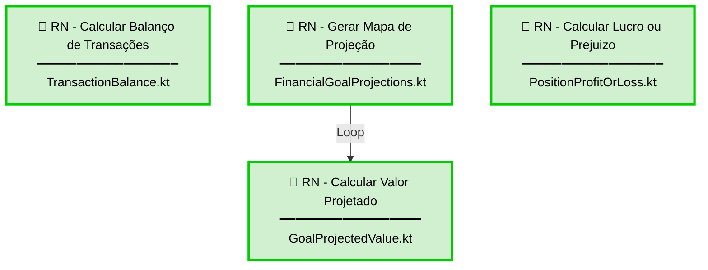

# Modelagem das Regras de Negócio

Este documento apresenta o mapa de relacionamento entre os documentos de regras de negócio do sistema e suas respectivas implementações em Kotlin.

---

## Diagrama de Relacionamento

**Legenda:**
- 🟢 Verde: Regra implementada
- 🔴 Vermelho: Regra não implementada

---

## Descrição das Regras de Negócio

### RN - Calcular Balanço de Transações
**Implementação:** `TransactionBalance.kt`

Calcula o balanço total de aportes e retiradas a partir de uma lista de transações de ativos. Retorna uma estrutura contendo o total de contribuições (aportes), total de retiradas e o balanço final (diferença entre aportes e retiradas).

---

### RN - Calcular Valor Projetado de Meta Financeira
**Implementação:** `GoalProjectedValue.kt`

Calcula o valor projetado de uma meta financeira para um único mês, aplicando a taxa de retorno sobre o valor atual e adicionando o aporte mensal. Esta é uma regra atômica que realiza apenas o cálculo matemático de um período, sem considerar iterações ou mapeamentos temporais.

---

### RN - Gerar Mapa de Projeção de Meta Financeira
**Implementação:** `FinancialGoalProjections.kt`

Gera um mapa completo de projeções mensais de uma meta financeira, calculando iterativamente os valores projetados desde o mês de início até atingir o objetivo ou completar o período máximo de projeção. Utiliza a regra "RN - Calcular Valor Projetado" repetidamente para cada mês em um loop.

---

### RN - Calculo do Lucro ou Prejuizo de uma Posição
**Implementação:** `PositionProfitOrLoss.kt`

Calcula o resultado financeiro (lucro ou prejuízo) e a rentabilidade percentual de uma posição de investimento em um mês de referência. Isola o desempenho do ativo das movimentações de caixa (aportes e retiradas), retornando o valor financeiro da variação e o percentual de retorno sobre o capital investido.

---

## Referências

- [Modelagem de Dominio](Modelagem%20de%20Dominio.md)
- [RN - Calcular Balanço de Transações](rules/RN%20-%20Calcular%20Balanço%20de%20Transações.md)
- [RN - Calcular Valor Projetado de Meta Financeira](rules/RN%20-%20Calcular%20Valor%20Projetado%20de%20Meta%20Financeira.md)
- [RN - Gerar Mapa de Projeção de Meta Financeira](rules/RN%20-%20Gerar%20Mapa%20de%20Projeção%20de%20Meta%20Financeira.md)
- [RN - Calculo do Lucro ou Prejuizo de uma Posição](rules/RN%20-%20Calcular%20Lucro%20ou%20Prejuizo%20de%20uma%20Posição.md)

