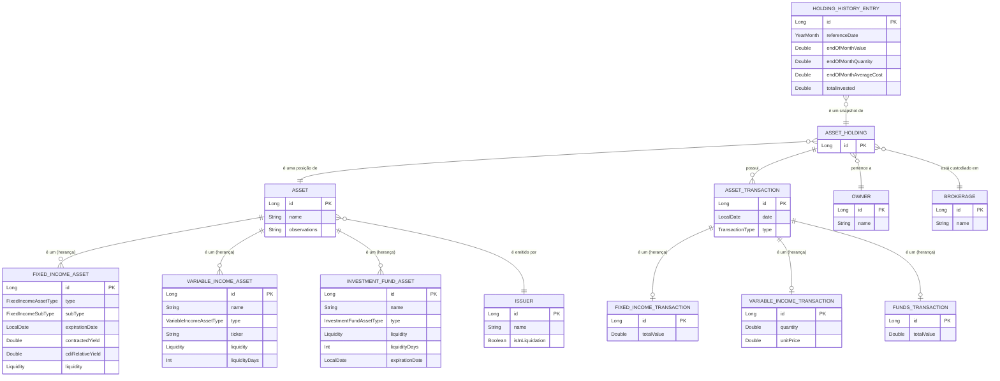

# Modelagem de Domínio - Ativos de Investimento

Este documento descreve a modelagem do domínio para as entidades de ativos de investimento, com base nos requisitos funcionais. A representação utiliza a sintaxe da linguagem Kotlin para ilustrar as regras e estruturas de dados.

## Arquitetura do Domínio

A modelagem é dividida em quatro camadas conceituais para garantir clareza, flexibilidade e escalabilidade:

1.  **`Asset` (O Ativo):** Representa as características **intrínsecas** de um ativo negociável (ex: a ação PETR4, um CDB específico). Descreve "o quê" é o ativo.
2.  **`AssetHolding` (A Posição):** Representa a **posse** de um `Asset` por um `Owner` em uma `Brokerage`. Armazena apenas os relacionamentos; os valores calculados (quantity, averageCost, investedValue) são obtidos dinamicamente a partir das transações.
3.  **`AssetTransaction` (As Transações):** Representa cada operação individual (compra/venda, aporte/resgate) relacionada a uma `AssetHolding`. É a fonte de verdade para cálculo de posições e histórico completo de movimentações.
4.  **`HoldingHistoryEntry` (O Histórico):** Representa um **snapshot mensal** do desempenho de uma `AssetHolding`, permitindo a análise da evolução da posição ao longo do tempo.

---

## Diagrama de Relacionamento entre Entidades

O diagrama abaixo ilustra os relacionamentos conceituais entre todas as entidades do domínio:



---

## Camada 1: Asset (O Ativo)

Esta camada define as propriedades imutáveis que caracterizam um ativo, independentemente de quem o possui.

```kotlin
import java.time.LocalDate

/**
 * Contrato para as características intrínsecas de um ativo de investimento.
 *
 * @property id O identificador único do ativo.
 * @property name O nome ou descrição principal do ativo.
 * @property issuer A entidade que emitiu o ativo.
 * @property observations Notas e observações adicionais sobre o ativo (opcional).
 */
sealed interface Asset {
    val id: Long
    val name: String
    val issuer: Issuer
    val observations: String?
}
```

### Subclasses de Asset

**Nota sobre `expirationDate`:** A disponibilidade do campo `expirationDate` varia conforme o tipo de ativo:
- **`FixedIncomeAsset`**: Sempre possui `expirationDate` (obrigatório), pois títulos de renda fixa têm data de vencimento definida.
- **`VariableIncomeAsset`**: Nunca possui `expirationDate`, pois ações e outros ativos de renda variável não têm data de vencimento.
- **`InvestmentFundAsset`**: Pode possuir `expirationDate` (opcional), pois alguns fundos podem ter prazo de duração definido.

```kotlin
/**
 * Representa um ativo de renda fixa. As suas propriedades definem o "contrato" do título.
 *
 * @property type O tipo de cálculo de rendimento (pós-fixado, pré-fixado, etc.).
 * @property subType O instrumento de renda fixa (CDB, LCI, etc.).
 * @property expirationDate Data de vencimento do título.
 * @property contractedYield Rentabilidade contratada no momento da aplicação.
 * @property cdiRelativeYield Rentabilidade relativa ao CDI (opcional).
 * @property liquidity A regra de liquidez que se aplica ao ativo.
 * @property observations Notas e observações adicionais sobre o ativo (opcional).
 * 
 * Nota: O campo `name` é calculado através de um getter, não é uma propriedade do construtor.
 */
data class FixedIncomeAsset(
    override val id: Long,
    override val issuer: Issuer,
    val type: FixedIncomeAssetType,
    val subType: FixedIncomeSubType,
    val expirationDate: LocalDate,
    val contractedYield: Double,
    val cdiRelativeYield: Double?,
    val liquidity: Liquidity,
    override val observations: String? = null
) : Asset {
    override val name: String
        get() {
            return when (type) {
                FixedIncomeAssetType.POST_FIXED -> "${subType.name} de $contractedYield% do CDI (venc: $expirationDate)"
                FixedIncomeAssetType.PRE_FIXED -> "${subType.name} de $contractedYield% a.a. (venc: $expirationDate)"
                FixedIncomeAssetType.INFLATION_LINKED -> "${subType.name} + $contractedYield% (venc: $expirationDate)"
            }
        }
}

/**
 * Representa um ativo de renda variável.
 *
 * @property type O tipo de ativo de renda variável (ação, FII, etc.).
 * @property ticker O código de negociação único do ativo (ex: "PETR4").
 * @property observations Notas e observações adicionais sobre o ativo (opcional).
 * 
 * Nota: Para ativos de renda variável, `liquidity` e `liquidityDays` são valores fixos:
 * - `liquidity` sempre será `Liquidity.D_PLUS_DAYS`
 * - `liquidityDays` sempre será `2`
 * Estes valores são hardcoded e não são propriedades do construtor.
 */
data class VariableIncomeAsset(
    override val id: Long,
    override val name: String,
    override val issuer: Issuer,
    val type: VariableIncomeAssetType,
    val ticker: String,
    override val observations: String? = null
) : Asset {
    val liquidity: Liquidity = Liquidity.D_PLUS_DAYS
    val liquidityDays: Int = 2
}

/**
 * Representa um fundo de investimento.
 *
 * @property type A categoria do fundo de investimento (ações, multimercado, etc.).
 * @property liquidity A regra de liquidez que se aplica ao ativo.
 * @property liquidityDays O número de dias para resgate quando liquidity é D_PLUS_DAYS.
 * @property expirationDate Data de vencimento do título (opcional para fundos).
 * @property observations Notas e observações adicionais sobre o ativo (opcional).
 */
data class InvestmentFundAsset(
    override val id: Long,
    override val name: String,
    override val issuer: Issuer,
    val type: InvestmentFundAssetType,
    val liquidity: Liquidity,
    val liquidityDays: Int,
    val expirationDate: LocalDate?,
    override val observations: String? = null
) : Asset
```

---

## Camada 2: AssetHolding (A Posição)

Esta entidade central conecta um `Asset` a um `Owner` e a uma `Brokerage`. Armazena apenas os relacionamentos fundamentais; os valores calculados (quantity, averageCost, investedValue) são obtidos dinamicamente a partir das transações (`AssetTransaction`) quando necessário.

```kotlin
/**
 * Representa a posse de um ativo por um proprietário em uma corretora.
 *
 * @property id O identificador único desta posição.
 * @property asset A referência para o ativo intrínseco (o "quê").
 * @property owner O proprietário desta posição (o "quem").
 * @property brokerage A corretora onde esta posição está custodiada (o "onde").
 * 
 * Nota: Os valores de quantity, averageCost, investedValue e currentValue
 * são calculados dinamicamente a partir das transações (AssetTransaction)
 * quando necessário, não sendo armazenados nesta entidade.
 */
data class AssetHolding(
    val id: Long,
    val asset: Asset,
    val owner: Owner,
    val brokerage: Brokerage
)
```

---

## Camada 3: HoldingHistoryEntry (O Histórico)

Esta entidade é um snapshot mensal de uma `AssetHolding`, armazenando dados de desempenho para permitir análises de evolução ao longo do tempo.

```kotlin
/**
 * Representa um registro de histórico mensal para uma `AssetHolding`.
 *
 * @property id O identificador único do registro de histórico (chave primária).
 * @property holding A referência direta para a `AssetHolding` a que este registro pertence.
 * @property referenceDate O mês e ano de referência para este snapshot (formato YYYY-MM).
 * @property endOfMonthValue O valor de mercado total da posição no final do mês.
 * @property endOfMonthQuantity A quantidade do ativo detida no final do mês.
 * @property endOfMonthAverageCost O custo médio do ativo na posição no final do mês.
 * @property totalInvested O valor total investido na posição até o final do mês.
 * 
 * Nota: 
 * - Valores monetários são armazenados como `Double` (Kotlin KMP não possui BigDecimal nativo).
 * - `referenceDate` utiliza uma classe customizada `YearMonth` (formato YYYY-MM).
 * - Esta entidade não possui propriedade `earnings`; rendimentos não são rastreados no histórico mensal.
 */
data class HoldingHistoryEntry(
    val id: Long,
    val holding: AssetHolding,
    val referenceDate: YearMonth,
    val endOfMonthValue: Double,
    val endOfMonthQuantity: Double,
    val endOfMonthAverageCost: Double,
    val totalInvested: Double
)
```

### Nota sobre a Chave Primária em `HoldingHistoryEntry`

Embora a combinação de `(holding, referenceDate)` seja naturalmente única, a entidade utiliza um campo `id` simples como chave primária (uma **chave substituta** ou *surrogate key*). Esta é uma decisão de design pragmática que traz benefícios significativos:

*   **Simplicidade:** Facilita a interação com frameworks de banco de dados (ORMs), que são altamente otimizados para chaves de coluna única em operações de busca, atualização e exclusão.
*   **Relacionamentos:** Simplifica a criação de chaves estrangeiras se, no futuro, outra entidade precisar referenciar um registro de histórico específico.
*   **Flexibilidade:** Permite maior liberdade para futuras alterações no modelo sem quebrar a identidade fundamental do registro.

---

## Camada 3: AssetTransaction (As Transações)

Esta entidade registra cada operação individual relacionada a uma `AssetHolding`. É a **fonte de verdade** para o cálculo de posições, permitindo rastrear todo o histórico de compras, vendas, aportes e resgates. A modelagem utiliza sealed interfaces para segregar as regras específicas de cada categoria de ativo.

### Tipo de Transação

```kotlin
/**
 * Tipo de transação (genérico para todos os tipos de ativos).
 */
enum class TransactionType {
    PURCHASE,  // Compra/Aporte - Aumenta a posição
    SALE       // Venda/Resgate - Diminui a posição
}
```

### Estrutura Base

```kotlin
import java.time.LocalDate

/**
 * Contrato base para todas as transações de ativos.
 * Cada categoria de ativo possui suas próprias subclasses com regras específicas.
 */
sealed interface AssetTransaction {
    val id: Long
    val holding: AssetHolding
    val date: LocalDate
    val type: TransactionType
    val observations: String?
}
```

### Transações de Renda Fixa

```kotlin
/**
 * Transações de Renda Fixa (CDB, LCI, LCA, Poupança, etc.).
 * Regra: Apenas valor total (não há quantidade unitária).
 */
data class FixedIncomeTransaction(
    override val id: Long,
    override val holding: AssetHolding,
    override val date: LocalDate,
    override val type: TransactionType,
    val totalValue: Double,
    override val observations: String? = null
) : AssetTransaction
```

**Exemplos de uso:**

```kotlin
// Aporte em CDB
val deposit = FixedIncomeTransaction(
    id = 1,
    holding = cdbHolding,
    date = LocalDate.of(2025, 1, 15),
    type = TransactionType.PURCHASE,
    totalValue = 2000.0
)

// Resgate no vencimento
val withdrawal = FixedIncomeTransaction(
    id = 2,
    holding = cdbHolding,
    date = LocalDate.of(2025, 12, 15),
    type = TransactionType.SALE,
    totalValue = 2500.0
)

// Aportes em poupança
val savingsDeposit1 = FixedIncomeTransaction(
    id = 3,
    holding = savingsHolding,
    date = LocalDate.of(2025, 1, 10),
    type = TransactionType.PURCHASE,
    totalValue = 1000.0
)

val savingsDeposit2 = FixedIncomeTransaction(
    id = 4,
    holding = savingsHolding,
    date = LocalDate.of(2025, 1, 15),
    type = TransactionType.PURCHASE,
    totalValue = 1000.0
)

// Resgate de poupança
val savingsWithdrawal = FixedIncomeTransaction(
    id = 5,
    holding = savingsHolding,
    date = LocalDate.of(2025, 2, 1),
    type = TransactionType.SALE,
    totalValue = 5000.0
)
```

### Transações de Renda Variável

```kotlin
/**
 * Transações de Renda Variável (Ações, FIIs, ETFs).
 * Regra: Quantidade e preço unitário (calcula valor total automaticamente).
 */
data class VariableIncomeTransaction(
    override val id: Long,
    override val holding: AssetHolding,
    override val date: LocalDate,
    override val type: TransactionType,
    val quantity: Double,
    val unitPrice: Double,
    override val observations: String? = null
) : AssetTransaction {
    val totalValue: Double
        get() = quantity * unitPrice
}
```

**Exemplos de uso:**

```kotlin
// Compra de 50 ações a R$ 56,36
val purchase1 = VariableIncomeTransaction(
    id = 1,
    holding = b3as3Holding,
    date = LocalDate.of(2025, 1, 20),
    type = TransactionType.PURCHASE,
    quantity = 50.0,
    unitPrice = 56.36
)

// Compra de mais 50 ações
val purchase2 = VariableIncomeTransaction(
    id = 2,
    holding = b3as3Holding,
    date = LocalDate.of(2025, 1, 20),
    type = TransactionType.PURCHASE,
    quantity = 50.0,
    unitPrice = 56.36
)

// Venda de 10 ações
val sale = VariableIncomeTransaction(
    id = 3,
    holding = b3as3Holding,
    date = LocalDate.of(2025, 1, 25),
    type = TransactionType.SALE,
    quantity = 10.0,
    unitPrice = 58.00
)
```

### Transações de Fundos de Investimento

```kotlin
/**
 * Transações de Fundos de Investimento.
 * Regra: Apenas valor total (não há quantidade unitária).
 */
data class FundsTransaction(
    override val id: Long,
    override val holding: AssetHolding,
    override val date: LocalDate,
    override val type: TransactionType,
    val totalValue: Double,
    override val observations: String? = null
) : AssetTransaction
```

**Exemplos de uso:**

```kotlin
// Aporte em fundo
val deposit = FundsTransaction(
    id = 1,
    holding = fundHolding,
    date = LocalDate.of(2025, 1, 10),
    type = TransactionType.PURCHASE,
    totalValue = 5000.0
)

// Resgate de fundo
val withdrawal = FundsTransaction(
    id = 2,
    holding = fundHolding,
    date = LocalDate.of(2025, 3, 15),
    type = TransactionType.SALE,
    totalValue = 2000.0
)
```

### Cálculo de Posições a partir de Transações

Os valores de `quantity`, `averageCost` e `investedValue` de uma `AssetHolding` são calculados dinamicamente a partir das transações:

*   **Para Renda Variável:**
    *   `quantity`: Soma de todas as compras (PURCHASE) menos soma de todas as vendas (SALE)
    *   `averageCost`: Custo médio ponderado calculado a partir das compras
    *   `investedValue`: Soma dos valores totais de todas as compras

*   **Para Renda Fixa e Fundos:**
    *   `quantity`: Sempre `1.0` (representa a posse do título/fundo)
    *   `averageCost`: Soma dos valores totais de todos os aportes (PURCHASE)
    *   `investedValue`: Igual ao `averageCost`

---

## Entidades Fundamentais

Esta seção detalha as entidades que, embora não façam parte das camadas principais da arquitetura, são conceitos de primeira classe no domínio. Elas representam atores ou instituições do mundo real, possuem identidade própria e ciclo de vida independente. Sua separação em entidades próprias é crucial para a reutilização e consistência dos dados, permitindo, por exemplo, que a mesma corretora (`Brokerage`) seja associada a múltiplas posições (`AssetHolding`).

### Owner (Proprietário)

Representa o "quem" do investimento. É a pessoa física ou jurídica detentora da posição. Esta entidade é fundamental para a organização da carteira e para a funcionalidade de visualização de ativos por proprietário.

```kotlin
/**
 * Representa o proprietário legal (pessoa física ou jurídica) de um ativo.
 * @property id O identificador único do proprietário.
 * @property name O nome do proprietário.
 */
data class Owner(val id: Long, val name: String)
```

### Brokerage (Corretora)

Representa o "onde" do investimento. É a instituição financeira que serve como intermediária e onde a posição está custodiada. A corretora é responsável por executar as ordens de compra e venda e manter o registro dos ativos.

```kotlin
/**
 * Representa a instituição financeira onde o ativo está custodiado.
 * @property id O identificador único da corretora.
 * @property name O nome da corretora.
 */
data class Brokerage(val id: Long, val name: String)
```

### Issuer (Emissor)

Representa o "criador" do ativo. É a entidade que emitiu o ativo financeiro. O emissor varia conforme a natureza do ativo: para um CDB, é um banco; para uma ação, é a própria companhia; para um fundo, é a gestora (asset management). Esta entidade é vital para a análise de risco e origem do ativo.

```kotlin
/**
 * Representa a entidade que emitiu o ativo.
 * @property id O identificador único do emissor.
 * @property name O nome do emissor.
 * @property isInLiquidation Indica se o emissor está em processo de liquidação por falência.
 */
data class Issuer(
    val id: Long, 
    val name: String,
    val isInLiquidation: Boolean = false
)
```

---

## Tipos de Valor e Classificações

Esta seção agrupa os blocos de construção e classificações que descrevem ou restringem as propriedades das entidades principais. Diferente das entidades fundamentais, estes tipos não possuem identidade ou ciclo de vida próprios; eles são **Value Objects** ou enumerações que adicionam significado e segurança ao modelo.

### Liquidez (Liquidity)

Modela as diferentes regras de conversão do ativo em dinheiro. O uso de um `enum class` fornece um vocabulário controlado para o domínio, ideal para lógicas de negócio, filtros de UI e para garantir a integridade dos dados, evitando o uso de strings arbitrárias.

```kotlin
enum class Liquidity {
    /**
     * Representa a liquidez diária, onde o resgate pode ser solicitado a qualquer momento.
     */
    DAILY,
    
    /**
     * Representa a liquidez apenas no vencimento do título.
     */
    AT_MATURITY,
    
    /**
     * Representa a liquidez onde o resgate ocorre um número específico de dias após a solicitação.
     * O número de dias deve ser armazenado separadamente na entidade que utiliza este tipo.
     */
    D_PLUS_DAYS
}
```

**Nota sobre `D_PLUS_DAYS`:** Para liquidez do tipo `D_PLUS_DAYS`, o número de dias deve ser armazenado separadamente nas entidades que utilizam este tipo de liquidez. Por exemplo, `InvestmentFundAsset` possui uma propriedade `liquidityDays: Int` que armazena o número de dias para resgate. Para `VariableIncomeAsset`, o valor de `liquidityDays` é sempre fixo (2 dias) e não é uma propriedade do construtor.

### Classificações de Ativos (Enums)

Representam conjuntos fixos e pré-definidos de opções para classificar os ativos. O uso de `enum class` fornece um vocabulário controlado para o domínio, ideal para lógicas de negócio, filtros de UI e para garantir a integridade dos dados, evitando o uso de strings arbitrárias.

```kotlin
enum class FixedIncomeAssetType { POST_FIXED, PRE_FIXED, INFLATION_LINKED }
enum class FixedIncomeSubType { CDB, LCI, LCA, CRA, CRI, DEBENTURE }
enum class VariableIncomeAssetType { NATIONAL_STOCK, INTERNATIONAL_STOCK, REAL_ESTATE_FUND, ETF }
enum class InvestmentFundAssetType { PENSION, STOCK_FUND, MULTIMARKET_FUND }
enum class TransactionType { PURCHASE, SALE }
```
