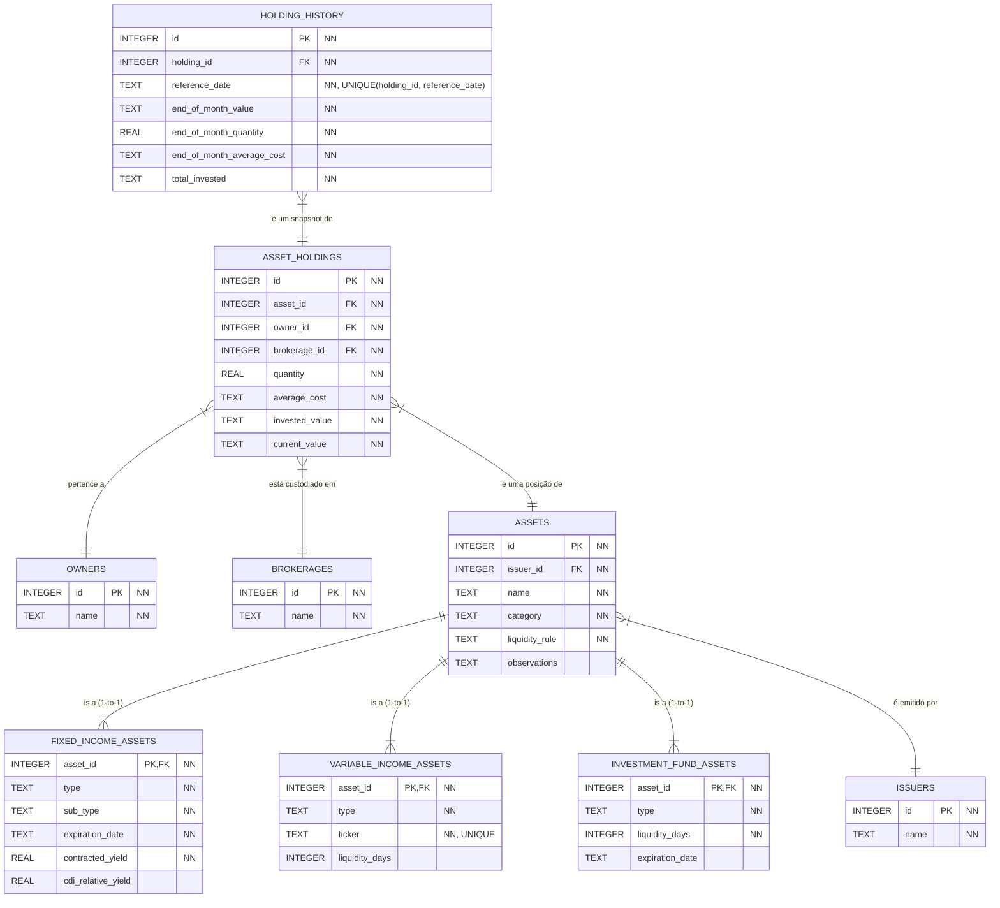

# Modelagem do Banco de Dados (SQL)

Este documento descreve a modelagem do banco de dados relacional para o sistema de investimentos. A estrutura utiliza uma abordagem polimórfica com "Tabela por Subclasse" para a entidade `Asset`, garantindo um design limpo, normalizado e independente de ORM.

## Diagrama de Relacionamento


*Legenda: `NN` indica que o campo é obrigatório (NOT NULL). A constraint `UNIQUE(holding_id, reference_date)` garante que não existam registros duplicados de histórico para a mesma posição no mesmo mês.* 

## 1. Tipos de Dados

### `INTEGER`
Utilizado para chaves primárias e estrangeiras. Fornece identificadores únicos e referências entre tabelas.

### `TEXT`
Utilizado para:
- **Strings**: Nomes, descrições e outros campos de texto.
- **Datas**: Armazenadas no formato ISO 8601:
  - `YYYY-MM-DD` para datas completas (ex: `expiration_date`)
  - `YYYY-MM` para referências mensais (ex: `reference_date` em `holding_history`)
- **Valores Monetários**: Armazenados como string para preservar a precisão decimal do tipo `BigDecimal` do domínio. Esta escolha evita perda de precisão que ocorreria com tipos numéricos de ponto flutuante, garantindo cálculos financeiros exatos.

### `REAL`
Utilizado para números de ponto flutuante onde a precisão decimal limitada é aceitável:
- **Quantidades**: Número de unidades (ações, cotas) em `quantity` e `end_of_month_quantity`
- **Taxas**: Valores percentuais como `contracted_yield` e `cdi_relative_yield` em ativos de renda fixa

## 2. Tabelas Fundamentais

### `owners`
```sql
CREATE TABLE owners (
    id INTEGER PRIMARY KEY AUTOINCREMENT,
    name TEXT NOT NULL
);
```

### `brokerages`
```sql
CREATE TABLE brokerages (
    id INTEGER PRIMARY KEY AUTOINCREMENT,
    name TEXT NOT NULL
);
```

### `issuers`
```sql
CREATE TABLE issuers (
    id INTEGER PRIMARY KEY AUTOINCREMENT,
    name TEXT NOT NULL
);
```

## 3. Tabela de Ativos (Estrutura Polimórfica)

Adotamos a estratégia **Table per Subclass**. Uma tabela base `assets` contém os campos comuns a todos os ativos, e tabelas específicas armazenam os atributos de cada subclasse.

### Tabela Base `assets`

```sql
CREATE TABLE assets (
    id INTEGER PRIMARY KEY AUTOINCREMENT,
    name TEXT NOT NULL,
    issuer_id INTEGER NOT NULL,
    
    -- Coluna discriminadora: 'FIXED_INCOME', 'VARIABLE_INCOME', 'INVESTMENT_FUND'
    category TEXT NOT NULL, 
    
    -- A regra de liquidez é comum, mas os dias específicos são movidos para as subclasses.
    liquidity_rule TEXT NOT NULL, -- Ex: 'DAILY', 'AT_MATURITY', 'D_PLUS_DAYS'
    
    -- Notas e observações adicionais sobre o ativo (opcional)
    observations TEXT,

    FOREIGN KEY (issuer_id) REFERENCES issuers(id) ON DELETE RESTRICT
);
```

### Tabelas de Subclasses

Cada tabela de subclasse usa o `asset_id` como chave primária e chave estrangeira, estabelecendo um relacionamento 1-para-1 com a tabela `assets`.

#### `fixed_income_assets`
```sql
CREATE TABLE fixed_income_assets (
    asset_id INTEGER PRIMARY KEY,
    type TEXT NOT NULL,
    sub_type TEXT NOT NULL,
    expiration_date TEXT NOT NULL, -- Formato 'YYYY-MM-DD'
    contracted_yield REAL NOT NULL,
    cdi_relative_yield REAL,

    FOREIGN KEY (asset_id) REFERENCES assets(id) ON DELETE CASCADE
);
```

#### `variable_income_assets`
```sql
CREATE TABLE variable_income_assets (
    asset_id INTEGER PRIMARY KEY,
    type TEXT NOT NULL,
    ticker TEXT NOT NULL UNIQUE,
    liquidity_days INTEGER, -- Apenas para regras como 'D_PLUS_DAYS'

    FOREIGN KEY (asset_id) REFERENCES assets(id) ON DELETE CASCADE
);
```

#### `investment_fund_assets`
```sql
CREATE TABLE investment_fund_assets (
    asset_id INTEGER PRIMARY KEY,
    type TEXT NOT NULL,
    liquidity_days INTEGER NOT NULL, -- Para regras como 'D_PLUS_DAYS'
    expiration_date TEXT, -- Formato 'YYYY-MM-DD' (Opcional)

    FOREIGN KEY (asset_id) REFERENCES assets(id) ON DELETE CASCADE
);
```

## 4. Tabelas de Posição e Histórico

### `asset_holdings`
```sql
CREATE TABLE asset_holdings (
    id INTEGER PRIMARY KEY AUTOINCREMENT,
    asset_id INTEGER NOT NULL,
    owner_id INTEGER NOT NULL,
    brokerage_id INTEGER NOT NULL,
    first_purchase_date TEXT NOT NULL, -- Formato 'YYYY-MM-DD'
    quantity REAL NOT NULL,
    average_cost TEXT NOT NULL,
    invested_value TEXT NOT NULL,
    current_value TEXT NOT NULL,

    FOREIGN KEY (asset_id) REFERENCES assets(id) ON DELETE CASCADE,
    FOREIGN KEY (owner_id) REFERENCES owners(id) ON DELETE RESTRICT,
    FOREIGN KEY (brokerage_id) REFERENCES brokerages(id) ON DELETE RESTRICT
);
```

### `holding_history`
```sql
CREATE TABLE holding_history (
    id INTEGER PRIMARY KEY AUTOINCREMENT,
    holding_id INTEGER NOT NULL,
    reference_date TEXT NOT NULL, -- Formato 'YYYY-MM'
    end_of_month_value TEXT NOT NULL,
    end_of_month_average_cost TEXT NOT NULL,
    total_invested TEXT NOT NULL,
    end_of_month_quantity REAL NOT NULL,

    FOREIGN KEY (holding_id) REFERENCES asset_holdings(id) ON DELETE CASCADE,
    UNIQUE (holding_id, reference_date)
);
```

## 5. Índices Recomendados

Os índices abaixo são recomendados para otimizar consultas frequentes no sistema. Eles melhoram significativamente a performance de buscas e joins, especialmente quando o volume de dados cresce.

### Índices em `asset_holdings`

```sql
-- Otimiza consultas por proprietário (ex: listar todos os ativos de um owner)
CREATE INDEX idx_asset_holdings_owner_id ON asset_holdings(owner_id);

-- Otimiza consultas por corretora (ex: listar posições em uma corretora específica)
CREATE INDEX idx_asset_holdings_brokerage_id ON asset_holdings(brokerage_id);

-- Otimiza consultas por ativo (ex: encontrar todas as posições de um ativo específico)
CREATE INDEX idx_asset_holdings_asset_id ON asset_holdings(asset_id);
```

### Índices em `holding_history`

```sql
-- Otimiza joins e consultas de histórico por posição
CREATE INDEX idx_holding_history_holding_id ON holding_history(holding_id);

-- Otimiza consultas por data de referência (ex: histórico de um mês específico)
CREATE INDEX idx_holding_history_reference_date ON holding_history(reference_date);
```

### Índices em `assets`

```sql
-- Otimiza consultas por emissor
CREATE INDEX idx_assets_issuer_id ON assets(issuer_id);

-- Otimiza filtros por categoria de ativo
CREATE INDEX idx_assets_category ON assets(category);
```

### Índices em Tabelas de Subclasses

```sql
-- Otimiza buscas por ticker em ativos de renda variável
-- Nota: O UNIQUE já cria um índice automaticamente, mas é documentado aqui para referência
-- CREATE UNIQUE INDEX já existe em variable_income_assets(ticker)
```

**Nota**: A criação de índices deve ser balanceada com o impacto em operações de escrita (INSERT, UPDATE, DELETE), que podem ficar mais lentas. Em sistemas com alta frequência de escrita, avalie a necessidade de cada índice individualmente.

## 6. Políticas de Integridade Referencial

As políticas de integridade referencial definem o comportamento do banco de dados quando registros referenciados são deletados. O modelo utiliza duas estratégias principais:

### `ON DELETE CASCADE`

Remove automaticamente os registros dependentes quando o registro pai é deletado. Utilizado quando a existência do registro filho não faz sentido sem o registro pai.

**Aplicado em:**
- `assets` → `fixed_income_assets`, `variable_income_assets`, `investment_fund_assets`
  - **Justificativa**: As tabelas de subclasse são extensões da tabela base. Se um ativo é removido, suas características específicas também devem ser removidas.
  
- `assets` → `asset_holdings`
  - **Justificativa**: Se um ativo é removido do sistema, todas as posições relacionadas a ele também devem ser removidas, pois não há como manter uma posição de um ativo inexistente.
  
- `asset_holdings` → `holding_history`
  - **Justificativa**: O histórico mensal é um snapshot de uma posição específica. Se a posição é removida, seu histórico também deve ser removido.

### `ON DELETE RESTRICT`

Impede a deleção do registro pai se existirem registros dependentes. Utilizado quando a integridade dos dados exige que o registro pai permaneça enquanto houver dependências.

**Aplicado em:**
- `issuers` → `assets`
  - **Justificativa**: Um emissor não pode ser removido enquanto existirem ativos emitidos por ele. Isso garante a integridade referencial e evita a perda de informações históricas importantes.
  
- `owners` → `asset_holdings`
  - **Justificativa**: Um proprietário não pode ser removido enquanto possuir posições ativas. Isso previne a perda acidental de dados de investimentos e garante rastreabilidade.
  
- `brokerages` → `asset_holdings`
  - **Justificativa**: Uma corretora não pode ser removida enquanto houver posições custodiadas nela. Isso mantém a integridade histórica dos dados de custódia.

### Resumo das Políticas

| Tabela Pai       | Tabela Filha             | Política | Motivo                                |
|------------------|--------------------------|----------|---------------------------------------|
| `issuers`        | `assets`                 | RESTRICT | Preservar integridade histórica       |
| `assets`         | `fixed_income_assets`    | CASCADE  | Extensão do ativo                     |
| `assets`         | `variable_income_assets` | CASCADE  | Extensão do ativo                     |
| `assets`         | `investment_fund_assets` | CASCADE  | Extensão do ativo                     |
| `assets`         | `asset_holdings`         | CASCADE  | Posição sem ativo não faz sentido     |
| `owners`         | `asset_holdings`         | RESTRICT | Preservar dados de investimento       |
| `brokerages`     | `asset_holdings`         | RESTRICT | Preservar dados de custódia           |
| `asset_holdings` | `holding_history`        | CASCADE  | Histórico sem posição não faz sentido |
