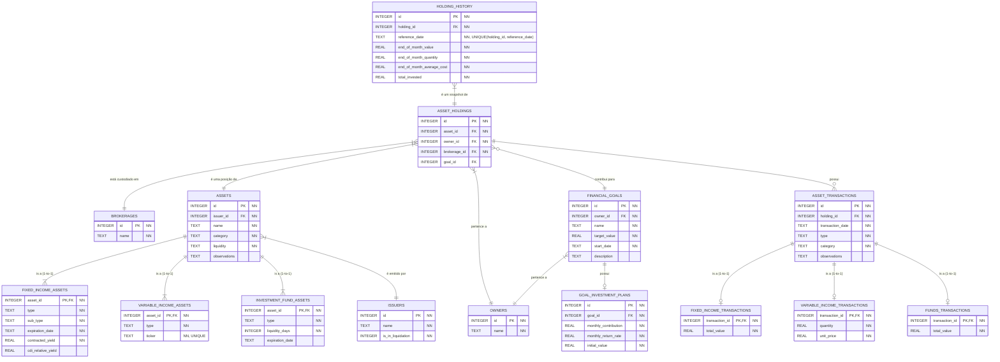

# Modelagem do Banco de Dados (SQL)

Este documento descreve a modelagem do banco de dados relacional para o sistema de investimentos. A estrutura utiliza uma abordagem polimórfica com "Tabela por Subclasse" para a entidade `Asset`, garantindo um design limpo, normalizado e independente de ORM.

## Diagrama de Relacionamento


*Legenda: `NN` indica que o campo é obrigatório (NOT NULL). A constraint `UNIQUE(holding_id, reference_date)` garante que não existam registros duplicados de histórico para a mesma posição no mesmo mês.* 

## 1. Tipos de Dados

### `INTEGER`
Utilizado para chaves primárias e estrangeiras. Fornece identificadores únicos e referências entre tabelas.

### `TEXT`
Utilizado para:
- **Strings**: Nomes, descrições e outros campos de texto.
- **Datas**: Armazenadas no formato ISO 8601:
  - `YYYY-MM-DD` para datas completas (ex: `expiration_date`)
  - `YYYY-MM` para referências mensais (ex: `reference_date` em `holding_history`)
- **Enums**: Valores de enum são armazenados como texto. O Room Database converte automaticamente enums Kotlin para strings no SQLite (ex: `liquidity`).

### `REAL`
Utilizado para números de ponto flutuante:
- **Quantidades**: Número de unidades (ações, cotas) em `quantity` e `end_of_month_quantity`
- **Taxas**: Valores percentuais como `contracted_yield` e `cdi_relative_yield` em ativos de renda fixa
- **Valores Monetários**: Valores monetários são armazenados como `REAL` (Double). Embora Kotlin KMP não possua BigDecimal nativo, o uso de Double é aceitável para a maioria dos casos de uso financeiros neste sistema.

## 2. Tabelas Fundamentais

### `owners`
```sql
CREATE TABLE owners (
    id INTEGER PRIMARY KEY AUTOINCREMENT,
    name TEXT NOT NULL
);
```

### `brokerages`
```sql
CREATE TABLE brokerages (
    id INTEGER PRIMARY KEY AUTOINCREMENT,
    name TEXT NOT NULL
);
```

### `issuers`
```sql
CREATE TABLE issuers (
    id INTEGER PRIMARY KEY AUTOINCREMENT,
    name TEXT NOT NULL,
    is_in_liquidation INTEGER NOT NULL DEFAULT 0
);
```

## 3. Tabela de Ativos (Estrutura Polimórfica)

Adotamos a estratégia **Table per Subclass**. Uma tabela base `assets` contém os campos comuns a todos os ativos, e tabelas específicas armazenam os atributos de cada subclasse.

### Tabela Base `assets`

```sql
CREATE TABLE assets (
    id INTEGER PRIMARY KEY AUTOINCREMENT,
    name TEXT NOT NULL,
    issuer_id INTEGER NOT NULL,
    
    -- Coluna discriminadora: 'FIXED_INCOME', 'VARIABLE_INCOME', 'INVESTMENT_FUND'
    category TEXT NOT NULL, 
    
    -- A regra de liquidez é comum. Armazenado como enum (Room converte para TEXT automaticamente).
    liquidity TEXT NOT NULL, -- Ex: 'DAILY', 'AT_MATURITY', 'D_PLUS_DAYS'
    
    -- Notas e observações adicionais sobre o ativo (opcional)
    observations TEXT,

    FOREIGN KEY (issuer_id) REFERENCES issuers(id) ON DELETE RESTRICT
);
```

### Tabelas de Subclasses

Cada tabela de subclasse usa o `asset_id` como chave primária e chave estrangeira, estabelecendo um relacionamento 1-para-1 com a tabela `assets`.

#### `fixed_income_assets`
```sql
CREATE TABLE fixed_income_assets (
    asset_id INTEGER PRIMARY KEY,
    type TEXT NOT NULL,
    sub_type TEXT NOT NULL,
    expiration_date TEXT NOT NULL, -- Formato 'YYYY-MM-DD'
    contracted_yield REAL NOT NULL,
    cdi_relative_yield REAL,

    FOREIGN KEY (asset_id) REFERENCES assets(id) ON DELETE CASCADE
);
```

#### `variable_income_assets`
```sql
CREATE TABLE variable_income_assets (
    asset_id INTEGER PRIMARY KEY,
    type TEXT NOT NULL,
    ticker TEXT NOT NULL UNIQUE,

    FOREIGN KEY (asset_id) REFERENCES assets(id) ON DELETE CASCADE
);
```

**Nota**: Para ativos de renda variável, `liquidity` e `liquidityDays` são valores fixos:
- `liquidity` sempre será `D_PLUS_DAYS` (definido na tabela `assets`)
- `liquidityDays` sempre será `2` (hardcoded no domínio, não armazenado no banco)

#### `investment_fund_assets`
```sql
CREATE TABLE investment_fund_assets (
    asset_id INTEGER PRIMARY KEY,
    type TEXT NOT NULL,
    liquidity_days INTEGER NOT NULL, -- Para regras como 'D_PLUS_DAYS'
    expiration_date TEXT, -- Formato 'YYYY-MM-DD' (Opcional)

    FOREIGN KEY (asset_id) REFERENCES assets(id) ON DELETE CASCADE
);
```

## 4. Tabelas de Posição e Histórico

### `asset_holdings`
```sql
CREATE TABLE asset_holdings (
    id INTEGER PRIMARY KEY AUTOINCREMENT,
    asset_id INTEGER NOT NULL,
    owner_id INTEGER NOT NULL,
    brokerage_id INTEGER NOT NULL,
    goal_id INTEGER,

    FOREIGN KEY (asset_id) REFERENCES assets(id) ON DELETE CASCADE,
    FOREIGN KEY (owner_id) REFERENCES owners(id) ON DELETE RESTRICT,
    FOREIGN KEY (brokerage_id) REFERENCES brokerages(id) ON DELETE RESTRICT,
    FOREIGN KEY (goal_id) REFERENCES financial_goals(id) ON DELETE RESTRICT
);
```

**Nota:** Os valores de `quantity`, `average_cost`, `invested_value` e `current_value` são calculados dinamicamente a partir das transações (`asset_transactions`) quando necessário, não sendo armazenados nesta tabela. O campo `goal_id` é opcional e permite associar uma posição a uma meta financeira específica.

### `holding_history`
```sql
CREATE TABLE holding_history (
    id INTEGER PRIMARY KEY AUTOINCREMENT,
    holding_id INTEGER NOT NULL,
    reference_date TEXT NOT NULL, -- Formato 'YYYY-MM'
    end_of_month_value REAL NOT NULL,
    end_of_month_quantity REAL NOT NULL,
    end_of_month_average_cost REAL NOT NULL,
    total_invested REAL NOT NULL,

    FOREIGN KEY (holding_id) REFERENCES asset_holdings(id) ON DELETE CASCADE,
    UNIQUE (holding_id, reference_date)
);
```

## 5. Tabelas de Metas Financeiras

### `financial_goals`
```sql
CREATE TABLE financial_goals (
    id INTEGER PRIMARY KEY AUTOINCREMENT,
    owner_id INTEGER NOT NULL,
    name TEXT NOT NULL,
    target_value REAL NOT NULL,
    start_date TEXT NOT NULL, -- Formato 'YYYY-MM-DD'
    description TEXT,

    FOREIGN KEY (owner_id) REFERENCES owners(id) ON DELETE RESTRICT
);
```

**Nota:** Representa uma meta financeira a ser alcançada. O valor atual da meta, a data de conclusão estimada, a média de aportes e a rentabilidade média são calculados dinamicamente a partir do histórico das posições (`asset_holdings`) associadas a esta meta.

### `goal_investment_plans`
```sql
CREATE TABLE goal_investment_plans (
    id INTEGER PRIMARY KEY AUTOINCREMENT,
    goal_id INTEGER NOT NULL,
    monthly_contribution REAL NOT NULL,
    monthly_return_rate REAL NOT NULL,
    initial_value REAL NOT NULL DEFAULT 0.0,

    FOREIGN KEY (goal_id) REFERENCES financial_goals(id) ON DELETE CASCADE
);
```

**Nota:** Representa o plano de investimento associado a uma meta financeira. Encapsula os parâmetros de aportes mensais e rentabilidade esperada, permitindo tanto simulações hipotéticas quanto o acompanhamento de um plano oficial. Uma meta pode ter no máximo um plano oficial associado (relacionamento 1:1 opcional).

## 6. Tabelas de Transações (Estrutura Polimórfica)

Adotamos a estratégia **Table per Subclass**, similar ao padrão utilizado para `assets`. Uma tabela base `asset_transactions` contém os campos comuns a todas as transações, e tabelas específicas armazenam os atributos de cada subclasse.

### Tabela Base `asset_transactions`

```sql
CREATE TABLE asset_transactions (
    id INTEGER PRIMARY KEY AUTOINCREMENT,
    holding_id INTEGER NOT NULL,
    transaction_date TEXT NOT NULL, -- Formato 'YYYY-MM-DD'
    
    -- Tipo de transação: 'PURCHASE' ou 'SALE'
    type TEXT NOT NULL,
    
    -- Coluna discriminadora: 'FIXED_INCOME', 'VARIABLE_INCOME', 'FUNDS'
    category TEXT NOT NULL,
    
    -- Notas e observações adicionais sobre a transação (opcional)
    observations TEXT,

    FOREIGN KEY (holding_id) REFERENCES asset_holdings(id) ON DELETE CASCADE
);
```

### Tabelas de Subclasses

Cada tabela de subclasse usa o `transaction_id` como chave primária e chave estrangeira, estabelecendo um relacionamento 1-para-1 com a tabela `asset_transactions`.

#### `fixed_income_transactions`

```sql
CREATE TABLE fixed_income_transactions (
    transaction_id INTEGER PRIMARY KEY,
    total_value REAL NOT NULL,

    FOREIGN KEY (transaction_id) REFERENCES asset_transactions(id) ON DELETE CASCADE
);
```

#### `variable_income_transactions`

```sql
CREATE TABLE variable_income_transactions (
    transaction_id INTEGER PRIMARY KEY,
    quantity REAL NOT NULL,
    unit_price REAL NOT NULL,

    FOREIGN KEY (transaction_id) REFERENCES asset_transactions(id) ON DELETE CASCADE
);
```

**Nota:** Para transações de renda variável, o valor total pode ser calculado como `quantity * unit_price`, mas não é armazenado explicitamente na tabela.

#### `funds_transactions`

```sql
CREATE TABLE funds_transactions (
    transaction_id INTEGER PRIMARY KEY,
    total_value REAL NOT NULL,

    FOREIGN KEY (transaction_id) REFERENCES asset_transactions(id) ON DELETE CASCADE
);
```

## 7. Índices Recomendados

Os índices abaixo são recomendados para otimizar consultas frequentes no sistema. Eles melhoram significativamente a performance de buscas e joins, especialmente quando o volume de dados cresce.

### Índices em `asset_holdings`

```sql
-- Otimiza consultas por proprietário (ex: listar todos os ativos de um owner)
CREATE INDEX idx_asset_holdings_owner_id ON asset_holdings(owner_id);

-- Otimiza consultas por corretora (ex: listar posições em uma corretora específica)
CREATE INDEX idx_asset_holdings_brokerage_id ON asset_holdings(brokerage_id);

-- Otimiza consultas por ativo (ex: encontrar todas as posições de um ativo específico)
CREATE INDEX idx_asset_holdings_asset_id ON asset_holdings(asset_id);

-- Otimiza consultas por meta financeira (ex: listar todas as posições de uma meta)
CREATE INDEX idx_asset_holdings_goal_id ON asset_holdings(goal_id);
```

### Índices em `holding_history`

```sql
-- Otimiza joins e consultas de histórico por posição
CREATE INDEX idx_holding_history_holding_id ON holding_history(holding_id);

-- Otimiza consultas por data de referência (ex: histórico de um mês específico)
CREATE INDEX idx_holding_history_reference_date ON holding_history(reference_date);
```

### Índices em `assets`

```sql
-- Otimiza consultas por emissor
CREATE INDEX idx_assets_issuer_id ON assets(issuer_id);

-- Otimiza filtros por categoria de ativo
CREATE INDEX idx_assets_category ON assets(category);
```

### Índices em Tabelas de Subclasses

```sql
-- Otimiza buscas por ticker em ativos de renda variável
-- Nota: O UNIQUE já cria um índice automaticamente, mas é documentado aqui para referência
-- CREATE UNIQUE INDEX já existe em variable_income_assets(ticker)
```

### Índices em `asset_transactions`

```sql
-- Otimiza consultas de transações por posição (ex: histórico de uma holding)
CREATE INDEX idx_asset_transactions_holding_id ON asset_transactions(holding_id);

-- Otimiza consultas por data (ex: transações de um período)
CREATE INDEX idx_asset_transactions_transaction_date ON asset_transactions(transaction_date);

-- Otimiza filtros por tipo de transação (ex: todas as compras)
CREATE INDEX idx_asset_transactions_type ON asset_transactions(type);

-- Otimiza filtros por categoria (ex: todas as transações de renda fixa)
CREATE INDEX idx_asset_transactions_category ON asset_transactions(category);

-- Índice composto para consultas frequentes: posição + data
CREATE INDEX idx_asset_transactions_holding_date ON asset_transactions(holding_id, transaction_date);
```

### Índices em `financial_goals`

```sql
-- Otimiza consultas por proprietário (ex: listar todas as metas de um owner)
CREATE INDEX idx_financial_goals_owner_id ON financial_goals(owner_id);
```

### Índices em `goal_investment_plans`

```sql
-- Otimiza consultas por meta (ex: buscar o plano de uma meta específica)
CREATE INDEX idx_goal_investment_plans_goal_id ON goal_investment_plans(goal_id);
```

**Nota**: A criação de índices deve ser balanceada com o impacto em operações de escrita (INSERT, UPDATE, DELETE), que podem ficar mais lentas. Em sistemas com alta frequência de escrita, avalie a necessidade de cada índice individualmente.

## 8. Políticas de Integridade Referencial

As políticas de integridade referencial definem o comportamento do banco de dados quando registros referenciados são deletados. O modelo utiliza duas estratégias principais:

### `ON DELETE CASCADE`

Remove automaticamente os registros dependentes quando o registro pai é deletado. Utilizado quando a existência do registro filho não faz sentido sem o registro pai.

**Aplicado em:**
- `assets` → `fixed_income_assets`, `variable_income_assets`, `investment_fund_assets`
  - **Justificativa**: As tabelas de subclasse são extensões da tabela base. Se um ativo é removido, suas características específicas também devem ser removidas.
  
- `assets` → `asset_holdings`
  - **Justificativa**: Se um ativo é removido do sistema, todas as posições relacionadas a ele também devem ser removidas, pois não há como manter uma posição de um ativo inexistente.
  
- `asset_holdings` → `asset_transactions`
  - **Justificativa**: As transações são registros históricos de uma posição específica. Se a posição é removida, todas as suas transações também devem ser removidas.
  
- `asset_transactions` → `fixed_income_transactions`, `variable_income_transactions`, `funds_transactions`
  - **Justificativa**: As tabelas de subclasse são extensões da tabela base. Se uma transação é removida, seus detalhes específicos também devem ser removidos.
  
- `asset_holdings` → `holding_history`
  - **Justificativa**: O histórico mensal é um snapshot de uma posição específica. Se a posição é removida, seu histórico também deve ser removido.
  
- `financial_goals` → `goal_investment_plans`
  - **Justificativa**: O plano de investimento é uma extensão da meta. Se uma meta é removida, seu plano também deve ser removido.

### `ON DELETE RESTRICT`

Impede a deleção do registro pai se existirem registros dependentes. Utilizado quando a integridade dos dados exige que o registro pai permaneça enquanto houver dependências.

**Aplicado em:**
- `issuers` → `assets`
  - **Justificativa**: Um emissor não pode ser removido enquanto existirem ativos emitidos por ele. Isso garante a integridade referencial e evita a perda de informações históricas importantes.
  
- `owners` → `asset_holdings`
  - **Justificativa**: Um proprietário não pode ser removido enquanto possuir posições ativas. Isso previne a perda acidental de dados de investimentos e garante rastreabilidade.
  
- `brokerages` → `asset_holdings`
  - **Justificativa**: Uma corretora não pode ser removida enquanto houver posições custodiadas nela. Isso mantém a integridade histórica dos dados de custódia.
  
- `owners` → `financial_goals`
  - **Justificativa**: Um proprietário não pode ser removido enquanto possuir metas financeiras ativas. Isso previne a perda acidental de dados de planejamento e garante rastreabilidade.
  
- `financial_goals` → `asset_holdings`
  - **Justificativa**: Uma meta financeira não pode ser removida enquanto houver posições associadas a ela. Isso mantém a integridade dos dados de planejamento e evita a perda de associações importantes.

### Resumo das Políticas

| Tabela Pai           | Tabela Filha                   | Política | Motivo                                |
|----------------------|--------------------------------|----------|---------------------------------------|
| `issuers`            | `assets`                       | RESTRICT | Preservar integridade histórica       |
| `assets`             | `fixed_income_assets`          | CASCADE  | Extensão do ativo                     |
| `assets`             | `variable_income_assets`       | CASCADE  | Extensão do ativo                     |
| `assets`             | `investment_fund_assets`       | CASCADE  | Extensão do ativo                     |
| `assets`             | `asset_holdings`               | CASCADE  | Posição sem ativo não faz sentido     |
| `owners`             | `asset_holdings`               | RESTRICT | Preservar dados de investimento       |
| `brokerages`         | `asset_holdings`               | RESTRICT | Preservar dados de custódia           |
| `asset_holdings`     | `asset_transactions`           | CASCADE  | Transação sem posição não faz sentido |
| `asset_transactions` | `fixed_income_transactions`    | CASCADE  | Extensão da transação                 |
| `asset_transactions` | `variable_income_transactions` | CASCADE  | Extensão da transação                 |
| `asset_transactions` | `funds_transactions`           | CASCADE  | Extensão da transação                 |
| `asset_holdings`     | `holding_history`              | CASCADE  | Histórico sem posição não faz sentido |
| `financial_goals`    | `goal_investment_plans`        | CASCADE  | Plano sem meta não faz sentido         |
| `owners`             | `financial_goals`              | RESTRICT | Preservar dados de planejamento       |
| `financial_goals`    | `asset_holdings`               | RESTRICT | Preservar associações de metas        |
