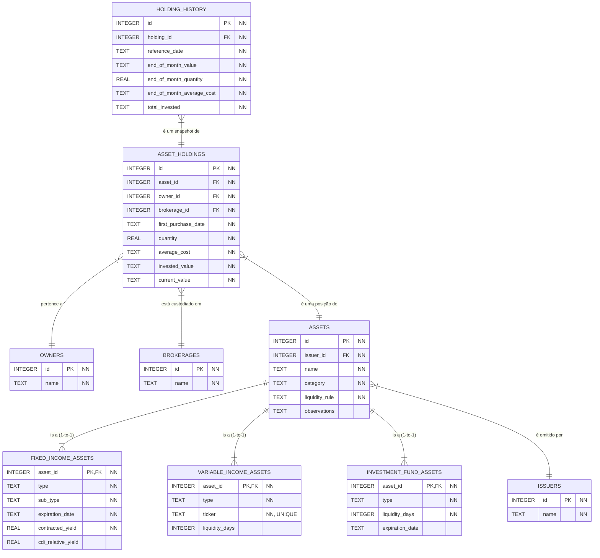

# Modelagem do Banco de Dados (SQL)

Este documento descreve a modelagem do banco de dados relacional para o sistema de investimentos. A estrutura utiliza uma abordagem polimórfica com "Tabela por Subclasse" para a entidade `Asset`, garantindo um design limpo, normalizado e independente de ORM.

## Diagrama de Relacionamento


*Legenda: `NN` indica que o campo é obrigatório (NOT NULL).* 

## 1. Tipos de Dados

- `INTEGER`: Chaves primárias e estrangeiras.
- `TEXT`: Strings, datas (`YYYY-MM-DD`), datas de referência (`YYYY-MM`) e valores monetários (armazenados como string para preservar a precisão).
- `REAL`: Números de ponto flutuante (quantidades, taxas).

## 2. Tabelas Fundamentais

### `owners`
```sql
CREATE TABLE owners (
    id INTEGER PRIMARY KEY AUTOINCREMENT,
    name TEXT NOT NULL
);
```

### `brokerages`
```sql
CREATE TABLE brokerages (
    id INTEGER PRIMARY KEY AUTOINCREMENT,
    name TEXT NOT NULL
);
```

### `issuers`
```sql
CREATE TABLE issuers (
    id INTEGER PRIMARY KEY AUTOINCREMENT,
    name TEXT NOT NULL
);
```

## 3. Tabela de Ativos (Estrutura Polimórfica)

Adotamos a estratégia **Table per Subclass**. Uma tabela base `assets` contém os campos comuns a todos os ativos, e tabelas específicas armazenam os atributos de cada subclasse.

### Tabela Base `assets`

```sql
CREATE TABLE assets (
    id INTEGER PRIMARY KEY AUTOINCREMENT,
    name TEXT NOT NULL,
    issuer_id INTEGER NOT NULL,
    
    -- Coluna discriminadora: 'FIXED_INCOME', 'VARIABLE_INCOME', 'INVESTMENT_FUND'
    category TEXT NOT NULL, 
    
    -- A regra de liquidez é comum, mas os dias específicos são movidos para as subclasses.
    liquidity_rule TEXT NOT NULL, -- Ex: 'DAILY', 'AT_MATURITY', 'D_PLUS_DAYS'
    
    -- Notas e observações adicionais sobre o ativo (opcional)
    observations TEXT,

    FOREIGN KEY (issuer_id) REFERENCES issuers(id) ON DELETE RESTRICT
);
```

### Tabelas de Subclasses

Cada tabela de subclasse usa o `asset_id` como chave primária e chave estrangeira, estabelecendo um relacionamento 1-para-1 com a tabela `assets`.

#### `fixed_income_assets`
```sql
CREATE TABLE fixed_income_assets (
    asset_id INTEGER PRIMARY KEY,
    type TEXT NOT NULL,
    sub_type TEXT NOT NULL,
    expiration_date TEXT NOT NULL, -- Formato 'YYYY-MM-DD'
    contracted_yield REAL NOT NULL,
    cdi_relative_yield REAL,

    FOREIGN KEY (asset_id) REFERENCES assets(id) ON DELETE CASCADE
);
```

#### `variable_income_assets`
```sql
CREATE TABLE variable_income_assets (
    asset_id INTEGER PRIMARY KEY,
    type TEXT NOT NULL,
    ticker TEXT NOT NULL UNIQUE,
    liquidity_days INTEGER, -- Apenas para regras como 'D_PLUS_DAYS'

    FOREIGN KEY (asset_id) REFERENCES assets(id) ON DELETE CASCADE
);
```

#### `investment_fund_assets`
```sql
CREATE TABLE investment_fund_assets (
    asset_id INTEGER PRIMARY KEY,
    type TEXT NOT NULL,
    liquidity_days INTEGER NOT NULL, -- Para regras como 'D_PLUS_DAYS'
    expiration_date TEXT, -- Formato 'YYYY-MM-DD' (Opcional)

    FOREIGN KEY (asset_id) REFERENCES assets(id) ON DELETE CASCADE
);
```

## 4. Tabelas de Posição e Histórico

### `asset_holdings`
```sql
CREATE TABLE asset_holdings (
    id INTEGER PRIMARY KEY AUTOINCREMENT,
    asset_id INTEGER NOT NULL,
    owner_id INTEGER NOT NULL,
    brokerage_id INTEGER NOT NULL,
    first_purchase_date TEXT NOT NULL, -- Formato 'YYYY-MM-DD'
    quantity REAL NOT NULL,
    average_cost TEXT NOT NULL,
    invested_value TEXT NOT NULL,
    current_value TEXT NOT NULL,

    FOREIGN KEY (asset_id) REFERENCES assets(id) ON DELETE CASCADE,
    FOREIGN KEY (owner_id) REFERENCES owners(id) ON DELETE RESTRICT,
    FOREIGN KEY (brokerage_id) REFERENCES brokerages(id) ON DELETE RESTRICT
);
```

### `holding_history`
```sql
CREATE TABLE holding_history (
    id INTEGER PRIMARY KEY AUTOINCREMENT,
    holding_id INTEGER NOT NULL,
    reference_date TEXT NOT NULL, -- Formato 'YYYY-MM'
    end_of_month_value TEXT NOT NULL,
    end_of_month_average_cost TEXT NOT NULL,
    total_invested TEXT NOT NULL,
    end_of_month_quantity REAL NOT NULL,

    FOREIGN KEY (holding_id) REFERENCES asset_holdings(id) ON DELETE CASCADE,
    UNIQUE (holding_id, reference_date)
);
```
