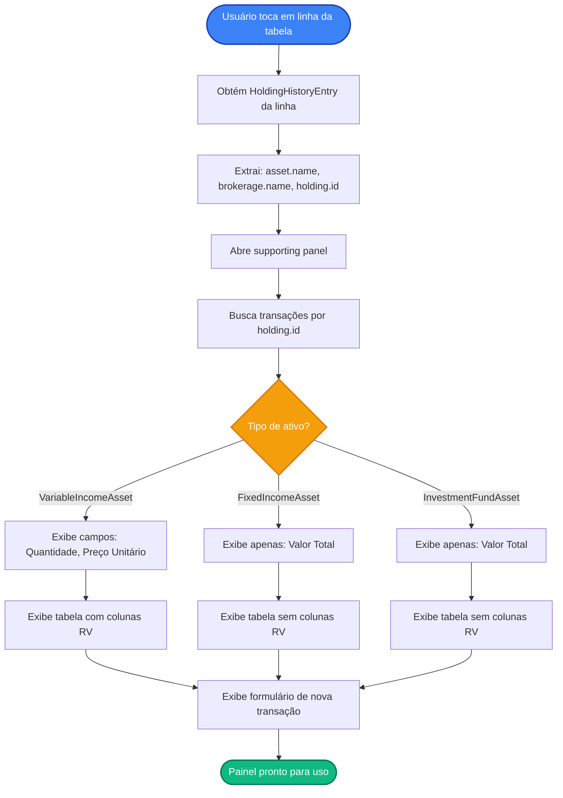
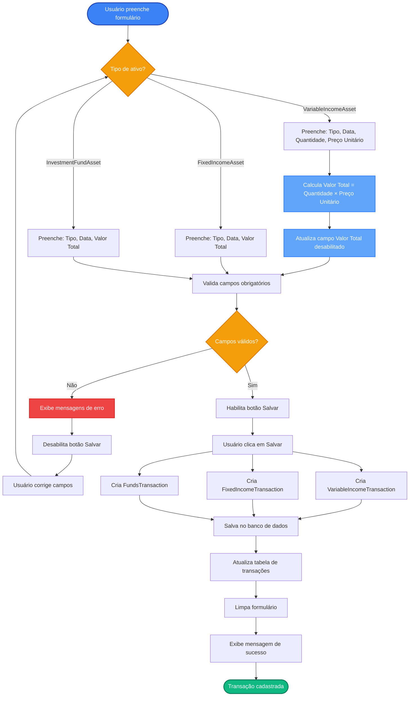

# Requisitos Funcionais - Tela de Cadastro de Transações

## Índice

1. [Objetivo](#1-objetivo)
2. [Composição e Ações da Tela](#2-composição-e-ações-da-tela)
3. [Estrutura do Supporting Panel](#3-estrutura-do-supporting-panel)
4. [Tabela de Transações](#4-tabela-de-transações)
5. [Formulário de Nova Transação](#5-formulário-de-nova-transação)
6. [Regras de Negócio](#6-regras-de-negócio)
7. [Casos de Uso](#7-casos-de-uso)

---

## 1. Objetivo

Permitir ao usuário visualizar e cadastrar transações (compras e vendas) relacionadas a uma posição de ativo (`AssetHolding`) específica. A funcionalidade é acessada através do supporting panel que se abre ao tocar em uma linha da tabela na tela de "Posicionamento no Período".

**Funcionalidade principal**: Exibir histórico de transações de uma posição e permitir cadastro de novas transações.

---

## 2. Composição e Ações da Tela

### 2.1. Acesso ao Supporting Panel

- **Ação**: Ao tocar em uma linha da tabela na tela de "Posicionamento no Período"
- **Comportamento**: O supporting panel se abre automaticamente no lado direito da tela
- **Conteúdo**: O painel exibe informações e transações da posição selecionada

### 2.2. Fechamento do Supporting Panel

- O painel pode ser fechado através do botão de fechar padrão do sistema ou navegação de volta
- Ao fechar, o painel retorna ao estado inicial (sem seleção)

---

## 3. Estrutura do Supporting Panel

O supporting panel é dividido em três seções principais:

### 3.1. Cabeçalho

#### 3.1.1. Título
- **Texto**: "Transações"
- **Posição**: No topo do painel
- **Estilo**: Título principal do painel

#### 3.1.2. Campo de Descrição do Ativo
- **Tipo**: Campo somente leitura
- **Label**: "Descrição" ou "Ativo"
- **Valor**: `HoldingHistoryEntry.holding.asset.name`
- **Posição**: Logo abaixo do título

#### 3.1.3. Campo de Corretora
- **Tipo**: Campo somente leitura
- **Label**: "Corretora"
- **Valor**: `HoldingHistoryEntry.holding.brokerage.name`
- **Posição**: Logo abaixo do campo de descrição do ativo

### 3.2. Tabela de Transações

Posicionada abaixo dos campos informativos, exibe o histórico de transações da posição selecionada.

### 3.3. Formulário de Nova Transação

Posicionado abaixo da tabela de transações, permite cadastrar uma nova transação.

---

## 4. Tabela de Transações

### 4.1. Dados Exibidos

A tabela exibe as seguintes colunas para cada transação:

| Coluna                | Descrição                                        | Fonte                                                                   |
|:----------------------|:-------------------------------------------------|:------------------------------------------------------------------------|
| **Tipo de Transação** | Compra ou Venda                                  | `AssetTransaction.type` (PURCHASE ou SALE)                              |
| **Data**              | Data da transação                                | `AssetTransaction.date`                                                 |
| **Quantidade**        | Quantidade transacionada (apenas Renda Variável) | `VariableIncomeTransaction.quantity`                                    |
| **Preço Unitário**    | Preço por unidade (apenas Renda Variável)        | `VariableIncomeTransaction.unitPrice`                                   |
| **Valor Total**       | Valor total da transação                         | `AssetTransaction.totalValue` ou `VariableIncomeTransaction.totalValue` |

### 4.2. Regras de Exibição

#### 4.2.1. Colunas Condicionais para Renda Variável

- **Para Renda Variável** (`VariableIncomeAsset`):
  - Exibe coluna "Quantidade"
  - Exibe coluna "Preço Unitário"
  - Exibe coluna "Valor Total"
  - Ordem das colunas: Tipo → Data → Quantidade → Preço Unitário → Valor Total

- **Para Renda Fixa e Fundos** (`FixedIncomeAsset` ou `InvestmentFundAsset`):
  - **Não exibe** coluna "Quantidade"
  - **Não exibe** coluna "Preço Unitário"
  - Exibe apenas coluna "Valor Total"
  - Ordem das colunas: Tipo → Data → Valor Total

#### 4.2.2. Ordenação

- As transações são ordenadas por data, da mais recente para a mais antiga (ordem decrescente)

#### 4.2.3. Formatação

- **Tipo de Transação**: 
  - `PURCHASE` → "Compra"
  - `SALE` → "Venda"
- **Data**: Formato brasileiro (ex: "01/12/2024")
- **Quantidade**: Número decimal formatado (ex: "100,00")
- **Preço Unitário**: Formato monetário brasileiro (ex: "R$ 25,50")
- **Valor Total**: Formato monetário brasileiro (ex: "R$ 2.550,00")

### 4.3. Estado Vazio

- Se não houver transações cadastradas, a tabela exibe uma mensagem indicando que não há transações registradas

---

## 5. Formulário de Nova Transação

### 5.1. Campos do Formulário

O formulário contém os seguintes campos:

| Campo | Tipo | UI | Obrigatório | Descrição | Valores Possíveis |
|:------|:-----|:---|:------------|:----------|:------------------|
| **Tipo de Transação** | Enum | DropDown | Sim | Define se é compra ou venda | `PURCHASE` (Compra), `SALE` (Venda) |
| **Data** | LocalDate | InputText | Sim | Data da transação | Data válida (passada, presente ou futura) |
| **Quantidade** | Double | InputText | Sim (apenas RV) | Quantidade de unidades transacionadas | Número decimal positivo |
| **Preço Unitário** | Double | InputText | Sim (apenas RV) | Preço por unidade | Número decimal positivo |
| **Valor Total** | Double | InputText | Sim | Valor total da transação | Número decimal positivo. **Para RV: campo desabilitado (somente leitura), calculado automaticamente como Quantidade × Preço Unitário** |

### 5.2. Exibição Dinâmica de Campos

#### 5.2.1. Para Renda Variável (`VariableIncomeAsset`)

O formulário exibe:
- Tipo de Transação (obrigatório)
- Data (obrigatório)
- Quantidade (obrigatório)
- Preço Unitário (obrigatório)
- Valor Total (obrigatório, **desabilitado/somente leitura**)

**Regra de Cálculo**: O campo "Valor Total" é **desabilitado** (somente leitura) e seu valor é calculado automaticamente como `Quantidade × Preço Unitário`. O valor é atualizado automaticamente sempre que a Quantidade ou o Preço Unitário forem alterados.

#### 5.2.2. Para Renda Fixa e Fundos (`FixedIncomeAsset` ou `InvestmentFundAsset`)

O formulário exibe:
- Tipo de Transação (obrigatório)
- Data (obrigatório)
- Valor Total (obrigatório)

**Campos ocultos**: Quantidade e Preço Unitário não são exibidos.

### 5.3. Validação

#### 5.3.1. Validações Gerais

- Todos os campos obrigatórios devem ser preenchidos
- A data deve ser uma data válida
- Valores numéricos devem ser números positivos

#### 5.3.2. Validações Específicas para Renda Variável

- Quantidade deve ser maior que zero
- Preço Unitário deve ser maior que zero
- Valor Total é calculado automaticamente e deve ser maior que zero (validado após o cálculo)

### 5.4. Botão Salvar

- **Posição**: Abaixo dos campos do formulário
- **Estado Desabilitado**: Quando houver campos obrigatórios vazios ou inválidos
- **Estado Habilitado**: Quando todos os campos obrigatórios estiverem válidos
- **Ação**: Ao clicar, salva a nova transação no banco de dados

### 5.5. Comportamento Após Salvar

- A transação é salva no banco de dados associada ao `AssetHolding` selecionado
- A tabela de transações é atualizada automaticamente para exibir a nova transação
- O formulário é limpo e retorna ao estado inicial (campos vazios)
- Sistema exibe mensagem de sucesso

---

## 6. Regras de Negócio

### 6.1. Identificação do Tipo de Ativo

O sistema identifica o tipo de ativo através de `HoldingHistoryEntry.holding.asset`:

- Se `asset` é instância de `VariableIncomeAsset` → Renda Variável
- Se `asset` é instância de `FixedIncomeAsset` → Renda Fixa
- Se `asset` é instância de `InvestmentFundAsset` → Fundos

### 6.2. Criação de Transações

#### 6.2.1. Renda Variável

Ao salvar uma transação de Renda Variável, o sistema cria uma instância de `VariableIncomeTransaction` com:
- `holding`: O `AssetHolding` da linha selecionada
- `date`: Data informada no formulário
- `type`: Tipo de transação selecionado (PURCHASE ou SALE)
- `quantity`: Quantidade informada no formulário
- `unitPrice`: Preço unitário informado no formulário
- `totalValue`: Calculado automaticamente como `quantity × unitPrice` (não é informado diretamente pelo usuário)
- `observations`: Opcional (não implementado no formulário inicial)

#### 6.2.2. Renda Fixa

Ao salvar uma transação de Renda Fixa, o sistema cria uma instância de `FixedIncomeTransaction` com:
- `holding`: O `AssetHolding` da linha selecionada
- `date`: Data informada no formulário
- `type`: Tipo de transação selecionado (PURCHASE ou SALE)
- `totalValue`: Valor total informado
- `observations`: Opcional (não implementado no formulário inicial)

#### 6.2.3. Fundos

Ao salvar uma transação de Fundos, o sistema cria uma instância de `FundsTransaction` com:
- `holding`: O `AssetHolding` da linha selecionada
- `date`: Data informada no formulário
- `type`: Tipo de transação selecionado (PURCHASE ou SALE)
- `totalValue`: Valor total informado
- `observations`: Opcional (não implementado no formulário inicial)

### 6.3. Busca de Transações

As transações são buscadas através do `AssetHolding.id` usando o use case `GetTransactionsByHoldingUseCase`, que retorna todas as transações associadas àquela posição, ordenadas por data (mais recente primeiro).

### 6.4. Persistência

As transações são salvas através do repositório `AssetTransactionRepository`, que persiste os dados no banco de dados seguindo a estrutura polimórfica (tabela base `asset_transactions` e tabelas específicas por tipo).

---

## 7. Casos de Uso

### UC-01: Visualizar Transações de uma Posição

**Ator**: Usuário do sistema

**Pré-condições**:
- Sistema inicializado
- Usuário na tela de "Posicionamento no Período"
- Pelo menos uma posição exibida na tabela

**Fluxo Principal**:

1. Usuário visualiza a tabela de posições na tela de "Posicionamento no Período"
2. Usuário toca em uma linha da tabela (seleciona uma posição)
3. Sistema abre o supporting panel no lado direito da tela
4. Sistema exibe o título "Transações"
5. Sistema exibe campo somente leitura com a descrição do ativo
6. Sistema exibe campo somente leitura com o nome da corretora
7. Sistema busca todas as transações da posição selecionada
8. Sistema exibe a tabela de transações com os dados encontrados
9. Sistema exibe o formulário de nova transação abaixo da tabela

**Fluxos Alternativos**:

**FA-01.1: Não há transações cadastradas**

1. No passo 7 do fluxo principal, sistema não encontra transações
2. Sistema exibe tabela vazia com mensagem indicando que não há transações
3. Retorna ao passo 9 do fluxo principal

**Pós-condições**:
- Supporting panel aberto
- Informações da posição exibidas
- Tabela de transações exibida (vazia ou com dados)
- Formulário de nova transação disponível

---

### UC-02: Cadastrar Nova Transação - Renda Variável

**Ator**: Usuário do sistema

**Pré-condições**:
- Usuário no supporting panel de transações
- Posição selecionada é de Renda Variável (`VariableIncomeAsset`)
- Formulário de nova transação visível

**Fluxo Principal**:

1. Usuário visualiza o formulário de nova transação
2. Sistema exibe campos: Tipo de Transação, Data, Quantidade, Preço Unitário, Valor Total (desabilitado)
3. Usuário seleciona o tipo de transação (Compra ou Venda)
4. Usuário informa a data da transação
5. Usuário informa a quantidade
6. Sistema calcula automaticamente o valor total (Quantidade × Preço Unitário) e atualiza o campo desabilitado
7. Usuário informa o preço unitário
8. Sistema calcula automaticamente o valor total (Quantidade × Preço Unitário) e atualiza o campo desabilitado
9. Sistema valida os dados informados
10. Usuário clica no botão "Salvar"
11. Sistema persiste a nova transação no banco de dados
12. Sistema atualiza a tabela de transações
13. Sistema limpa o formulário
14. Sistema exibe mensagem de sucesso

**Fluxos Alternativos**:

**FA-02.1: Validação de Campos Inválidos**

1. No passo 9 do fluxo principal, sistema identifica campos inválidos
2. Sistema exibe mensagens de erro abaixo dos campos inválidos
3. Sistema mantém o botão "Salvar" desabilitado
4. Usuário corrige os campos inválidos
5. Sistema recalcula o valor total automaticamente (se Quantidade ou Preço Unitário foram alterados)
6. Sistema revalida os campos
7. Retorna ao passo 10 do fluxo principal

**Pós-condições**:
- Nova transação cadastrada no banco de dados
- Tabela de transações atualizada
- Formulário limpo e pronto para nova entrada

---

### UC-03: Cadastrar Nova Transação - Renda Fixa ou Fundos

**Ator**: Usuário do sistema

**Pré-condições**:
- Usuário no supporting panel de transações
- Posição selecionada é de Renda Fixa (`FixedIncomeAsset`) ou Fundos (`InvestmentFundAsset`)
- Formulário de nova transação visível

**Fluxo Principal**:

1. Usuário visualiza o formulário de nova transação
2. Sistema exibe campos: Tipo de Transação, Data, Valor Total
3. Sistema não exibe campos de Quantidade e Preço Unitário
4. Usuário seleciona o tipo de transação (Compra ou Venda)
5. Usuário informa a data da transação
6. Usuário informa o valor total
7. Sistema valida os dados informados
8. Usuário clica no botão "Salvar"
9. Sistema persiste a nova transação no banco de dados
10. Sistema atualiza a tabela de transações
11. Sistema limpa o formulário
12. Sistema exibe mensagem de sucesso

**Fluxos Alternativos**:

**FA-03.1: Validação de Campos Inválidos**

1. No passo 7 do fluxo principal, sistema identifica campos inválidos
2. Sistema exibe mensagens de erro abaixo dos campos inválidos
3. Sistema mantém o botão "Salvar" desabilitado
4. Usuário corrige os campos inválidos
5. Sistema revalida os campos
6. Retorna ao passo 8 do fluxo principal

**Pós-condições**:
- Nova transação cadastrada no banco de dados
- Tabela de transações atualizada
- Formulário limpo e pronto para nova entrada

---

### UC-04: Fechar Supporting Panel

**Ator**: Usuário do sistema

**Pré-condições**:
- Supporting panel aberto
- Usuário visualizando transações de uma posição

**Fluxo Principal**:

1. Usuário clica no botão de fechar ou navega para voltar
2. Sistema fecha o supporting panel
3. Sistema retorna à visualização normal da tabela de posições
4. Nenhuma seleção de linha permanece ativa

**Pós-condições**:
- Supporting panel fechado
- Tela de "Posicionamento no Período" em estado normal
- Nenhuma posição selecionada

---

## 8. Diagramas

### 8.1. Fluxo de Abertura do Supporting Panel

### 8.2. Fluxo de Cadastro de Nova Transação

---

## 9. Referências

- [RF - Tela de Consulta de Posicionamento do Ativo no Período](RF%20-%20Tela%20de%20Consulta%20de%20Posicionamento%20do%20Ativo%20no%20Periodo.md)
- [Modelagem de Domínio](Modelagem%20de%20Dominio.md)
- [Modelagem do Banco de Dados](Modelagem%20do%20Banco%20de%20Dados.md)

