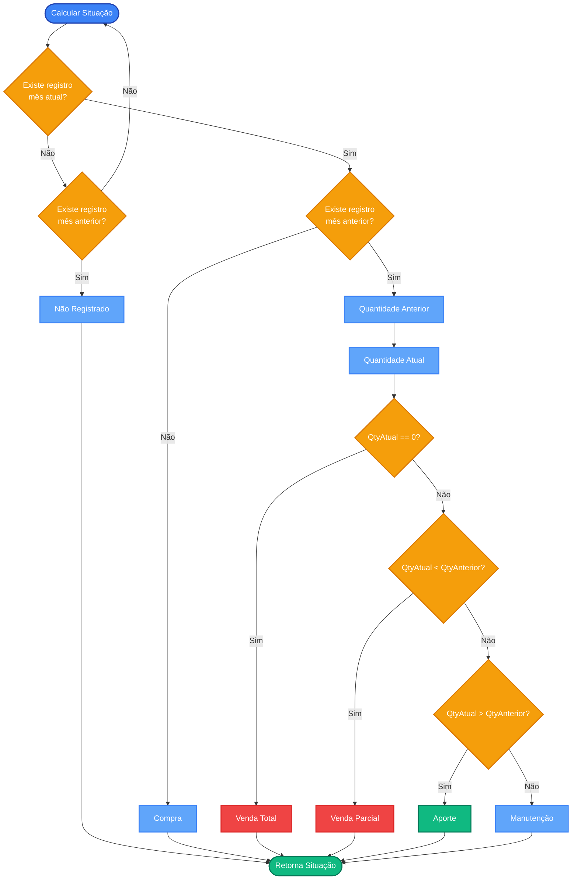
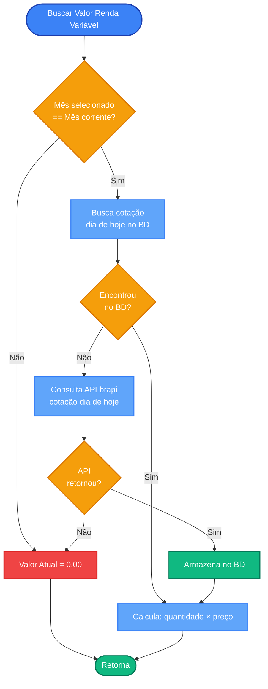
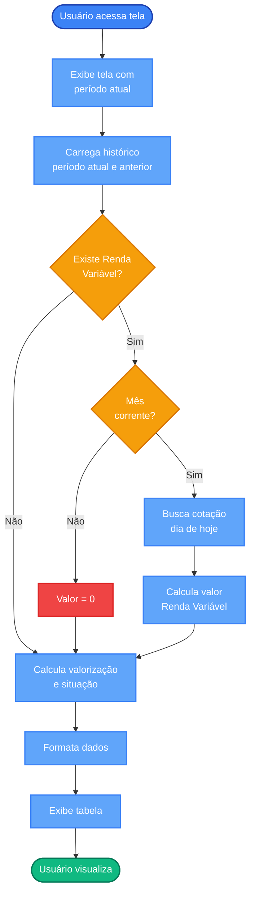
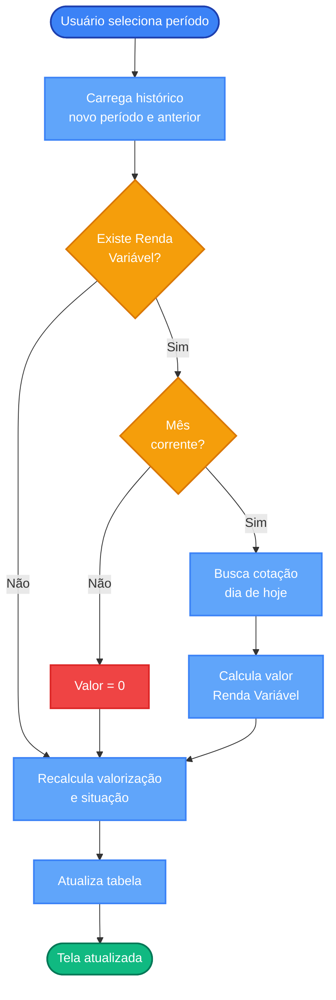
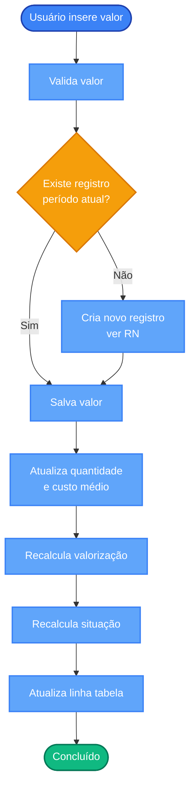

# Requisitos Funcionais - Tela de Consulta de Posição do Ativo por Período

## Índice

1. [Objetivo](#1-objetivo)
2. [Dados Exibidos na Tabela](#2-dados-exibidos-na-tabela)
3. [Composição e Ações da Tela](#3-composição-e-ações-da-tela)
4. [Regras de Negócio e Cálculos](#4-regras-de-negócio-e-cálculos)
5. [Exemplos](#5-exemplos)
6. [Casos de Uso](#6-casos-de-uso)

---

## 1. Objetivo

Apresentar uma visão consolidada das posições de ativos (`holdings`) em um período (mês/ano), permitindo comparar com o período anterior, analisar valorização e registrar movimentações.

**Funcionalidade principal**: Tabela que exibe posições do período selecionado comparadas com o período anterior.

---

## 2. Dados Exibidos na Tabela

A tabela exibe os seguintes dados para cada posição (`HoldingHistoryEntry`) do período:

| Coluna             | Descrição                              | Fonte                                                                                                                    |
|:-------------------|:---------------------------------------|:-------------------------------------------------------------------------------------------------------------------------|
| **Corretora**      | Nome da corretora                      | `HoldingHistoryEntry.holding.brokerage.name`                                                                             |
| **Categoria**      | Tipo de investimento                   | Calculado: `FixedIncomeAsset` → "Renda Fixa", `VariableIncomeAsset` → "Renda Variável", `InvestmentFundAsset` → "Fundos" |
| **SubCategoria**   | Subclassificação                       | `FixedIncomeAsset.subType.name` ou `VariableIncomeAsset.type.formated()` ou `InvestmentFundAsset.type.formated()`        |
| **Descrição**      | Nome do ativo                          | `HoldingHistoryEntry.holding.asset.name`                                                                                 |
| **Vencimento**     | Data de vencimento (se aplicável)      | `HoldingHistoryEntry.holding.asset.expirationDate`                                                                       |
| **Emissor**        | Nome do emissor                        | `HoldingHistoryEntry.holding.asset.issuer.name`                                                                          |
| **Observações**    | Notas adicionais                       | `HoldingHistoryEntry.holding.asset.observations`                                                                         |
| **Valor Anterior** | Valor no final do mês anterior         | `HoldingHistoryEntryAnterior.endOfMonthValue`                                                                            |
| **Valor Atual**    | Valor no final do mês atual (editável) | `HoldingHistoryEntryAtual.endOfMonthValue`                                                                               |
| **Valorização**    | Variação percentual no mês             | Calculado (ver seção 4.1)                                                                                                |
| **Situação**       | Classificação da movimentação          | Calculado (ver seção 4.2)                                                                                                |

**Regras de Exibição**:
- Se não houver dados no mês anterior: "Valor Anterior" = `""`
- Se não houver dados no mês atual: "Valor Atual" = vazio (permitindo entrada)
- Para Renda Variável: ver seção 4.3

---

## 3. Composição e Ações da Tela

### 3.1. Componentes

- **Título**: "Posicionamento no Período"
- **Seletor de Período**: Dropdown para seleção de mês/ano
- **Tabela Principal**: Exibe posições conforme seção 2

### 3.2. Ações Disponíveis

#### Selecionar Período
Ao selecionar um novo período, a tabela é atualizada com dados do período escolhido e do período anterior.

#### Editar Posição do Ativo
- **Campo editável**: Apenas "Valor Atual"
- **Restrições**: 
  - Não editável para ativos de Renda Variável (`VariableIncomeAsset`)
  - Não há campo editável para quantidade
- **Ação**: Ao inserir valor, o sistema:
  1. Salva em `HoldingHistoryEntryAtual.endOfMonthValue`
  2. Atualiza automaticamente `endOfMonthQuantity` e `endOfMonthAverageCost`
  3. Recalcula valorização e situação
- **Criação de registro**: Se não existir registro para o período, cria automaticamente seguindo [RN - Criar novo registro de histórico.md](RN%20-%20Criar%20novo%20registro%20de%20histórico.md)

---

## 4. Regras de Negócio e Cálculos

### 4.1. Cálculo de Valorização

**Fórmula**: `Valorização = (Valor Atual / Valor Anterior) - 1`

**Regras**:
- Calcula apenas se houver posição no mês anterior com valor > 0
- Exibe `""` se:
  - `Valor Atual == 0` (Venda Total)
  - Não houver dados no mês anterior

### 4.2. Cálculo da Situação

A situação é determinada comparando quantidades (`endOfMonthQuantity`) entre período atual e anterior:

### 4.3. Busca de Valores para Renda Variável

Para ativos de Renda Variável (`VariableIncomeAsset`), o sistema busca valores atuais através de cotações:

**Detalhes**:
- **Mês corrente**: Busca cotação do dia de hoje no BD. Se não encontrar, consulta API brapi. Valor = `quantidade × preço_atual` (usa `close` ou `adjustedClose`).
- **Outros meses**: Valor = `0,00`. Não consulta API.

**Referência**: Para detalhes de implementação, consulte [RN - Criar novo registro de histórico.md](RN%20-%20Criar%20novo%20registro%20de%20histórico.md#32-renda-variável).

---

## 5. Exemplos

### Exemplo de Tabela

| Corretora | Categoria | SubCategoria | Descrição | Valor Anterior | Valor Atual | Valorização | Situação |
|:----------|:----------|:-------------|:----------|:---------------|:------------|:------------|:---------|
| NuBank | Renda Fixa | CDB | CDB 100% CDI | R$ 1.000,00 | R$ 1.010,00 | 1,0% | Manutenção |
| BTG | Renda Variável | ETF | ETF IVVB11 | — | R$ 26.000,00 | — | Compra |
| XP | Renda Variável | Ação | Ação AAPL | R$ 3.200,00 | R$ 3.456,00 | 8,0% | Aporte |
| Clear | Renda Variável | Ação | Ação MGLU3 | R$ 5.500,00 | R$ 2.200,00 | -60,0% | Venda Parcial |
| Rico | Renda Variável | Ação | Ação B3SA3 | R$ 1.400,00 | R$ 0,00 | — | Venda Total |
| Rico | Renda Variável | Ação | Ação B3SA3 | R$ 1.400,00 | — | — | Não Registrado |

---

## 6. Casos de Uso

**Referência**: Para criação de registros históricos, consulte [RN - Criar novo registro de histórico.md](RN%20-%20Criar%20novo%20registro%20de%20histórico.md).

### UC-01: Consultar Posicionamento do Período

**Pré-condições**: Sistema inicializado, acesso ao repositório, pelo menos um período com dados.

**Pós-condições**: Tela exibindo posições do período com valorização e situação calculadas.

---

### UC-02: Selecionar Período de Referência

**Pré-condições**: Usuário na tela, existem dados históricos para outros períodos.

**Pós-condições**: Tela atualizada com dados do novo período.

---

### UC-03: Editar Posição do Ativo

**Pré-condições**: Usuário na tela, existe posição ou deseja criar nova.

**Restrições**: Não editável para Renda Variável.

**Pós-condições**: Valor salvo, tabela atualizada com cálculos recalculados.
