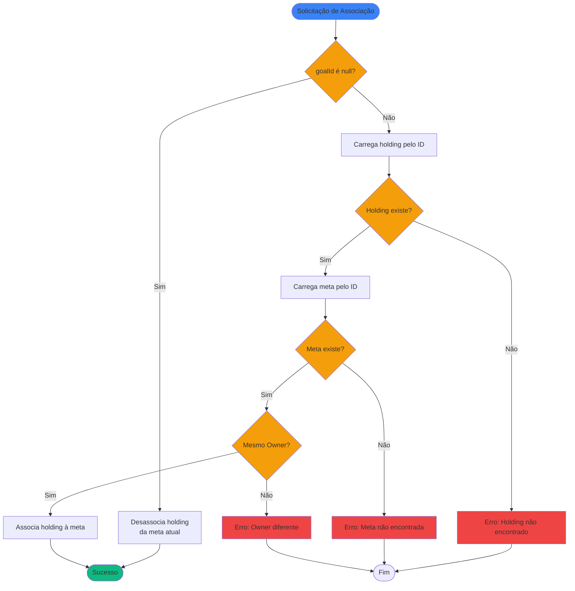

# Regras de Negócio - Associar Posição a Meta Financeira

## Índice

1. [Objetivo](#1-objetivo)
2. [Entradas e Saídas](#2-entradas-e-saídas)
3. [Fluxo Principal](#3-fluxo-principal)
4. [Regras de Negócio](#4-regras-de-negócio)

---

## 1. Objetivo

Associar uma posição de ativo (`AssetHolding`) a uma meta financeira (`FinancialGoal`), permitindo que o valor daquela posição contribua para o
progresso da meta.

Uma posição pode estar associada a no máximo uma meta, mas uma meta pode ter várias posições associadas.

---

## 2. Entradas e Saídas

### Entradas

| Campo       | Tipo  | Descrição                                     |
|-------------|-------|-----------------------------------------------|
| `holdingId` | Long  | Identificador da posição a ser associada      |
| `goalId`    | Long? | Identificador da meta (null para desassociar) |

### Saídas

| Campo   | Tipo      | Descrição                    |
|---------|-----------|------------------------------|
| Sucesso | Unit      | Operação concluída sem erros |
| Erro    | Exception | Violação de regra de negócio |

---

## 3. Fluxo Principal



---

## 4. Regras de Negócio

### 4.1. Validação de Existência do Holding

**Regra:** O holding deve existir no sistema.

**Comportamento:**

- Se holding não existe: retorna erro `"Holding não encontrado: {holdingId}"`
- Se holding existe: prossegue com validações

### 4.2. Validação de Existência da Meta

**Regra:** A meta deve existir no sistema (quando `goalId` não é null).

**Comportamento:**

- Se meta não existe: retorna erro `"Meta não encontrada: {goalId}"`
- Se meta existe: prossegue com validações
- Se `goalId` é null: operação de desassociação, pula validação

### 4.3. Validação de Owner (Regra Principal)

**Regra:** O Owner da posição deve ser o mesmo Owner da meta.

**Justificativa:** Uma pessoa não pode usar os investimentos de outra pessoa para atingir sua própria meta. Isto garante a integridade e isolamento
dos dados por proprietário.

**Comportamento:**

- Se `holding.owner.id != goal.owner.id`: retorna erro `"Holding e Goal devem pertencer ao mesmo Owner"`
- Se owners são iguais: prossegue com a associação

**Exemplo de violação:**

```
Holding: CDB do Enir (ownerId = 1)
Meta: Aposentadoria da Maria (ownerId = 2)
Resultado: ERRO - Owners diferentes
```

**Exemplo válido:**

```
Holding: CDB do Enir (ownerId = 1)
Meta: Aposentadoria do Enir (ownerId = 1)
Resultado: SUCESSO - Mesmo owner
```

### 4.4. Desassociação

**Regra:** Passar `goalId = null` remove a associação da posição com qualquer meta.

**Comportamento:**

- Não requer validações de meta ou owner
- Atualiza `holding.goalId` para null
- Posição passa a não contribuir para nenhuma meta

### 4.5. Reassociação

**Regra:** Uma posição já associada a uma meta pode ser reassociada a outra.

**Comportamento:**

- Valida a nova meta normalmente
- Se válido: substitui a associação anterior
- Não há confirmação adicional necessária

### 4.6. Uma Posição, Uma Meta

**Regra:** Cada posição só pode estar associada a uma meta por vez.

**Justificativa:** Evita contagem dupla do mesmo valor em múltiplas metas. O valor da posição contribui 100% para a meta associada.

**Alternativa não suportada:** Percentual de alocação (ex: 50% para meta A, 50% para meta B) foi descartado para manter a simplicidade do modelo.

### 4.7. Impacto no Histórico

**Regra:** A associação não altera o histórico existente.

**Comportamento:**

- O histórico mensal (`HoldingHistoryEntry`) continua sendo registrado normalmente
- O cálculo de progresso da meta utilizará o histórico a partir da `startDate` da meta
- Meses anteriores à associação ainda contam, desde que estejam após a `startDate` da meta

---

## Referências

- [Modelagem de Dominio.md](Modelagem%20de%20Dominio.md) - Definição das entidades FinancialGoal e AssetHolding
- [RN - Calcular Histórico de Meta Financeira.md](RN%20-%20Calcular%20Histórico%20de%20Meta%20Financeira.md) - Como o histórico é calculado
- [RN - Calcular Projeção de Meta Financeira.md](RN%20-%20Calcular%20Projeção%20de%20Meta%20Financeira.md) - Como as projeções são calculadas
