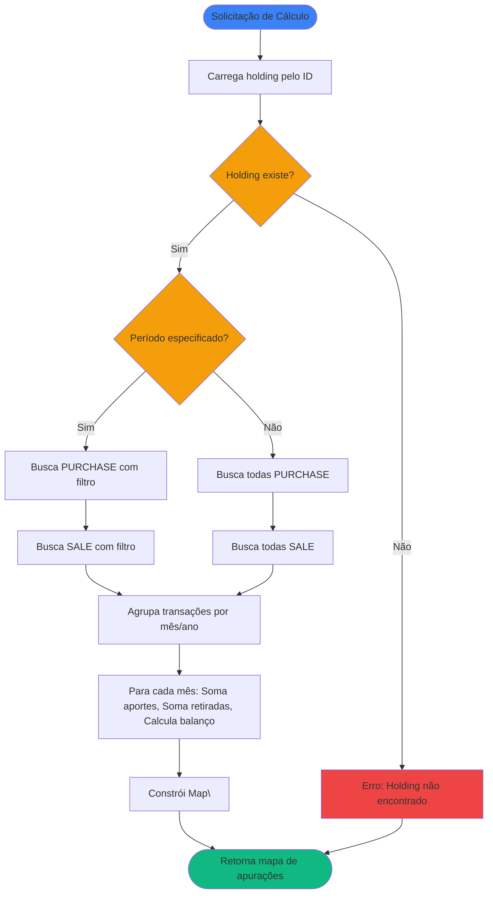

# Regras de Negócio - Calcular Aportes de Investimento

## Índice

1. [Objetivo](#1-objetivo)
2. [Entradas e Saídas](#2-entradas-e-saídas)
3. [Fluxo Principal](#3-fluxo-principal)
4. [Regras de Negócio](#4-regras-de-negócio)
5. [Fórmulas de Cálculo](#5-fórmulas-de-cálculo)
6. [Exemplos Numéricos](#6-exemplos-numéricos)

---

## 1. Objetivo

Calcular as apurações mensais de aportes e retiradas de uma posição de investimento (`AssetHolding`) a partir das transações registradas (`AssetTransaction`). O resultado é um mapa agrupado por mês/ano, onde cada entrada contém a soma dos aportes, a soma das retiradas e o balanço do mês.

O cálculo considera transações do tipo `PURCHASE` (compra/aporte) para aportes e transações do tipo `SALE` (venda/resgate) para retiradas, utilizando estratégias específicas baseadas no tipo de ativo (Renda Fixa, Renda Variável ou Fundos).

---

## 2. Entradas e Saídas

### Entradas

| Campo       | Tipo        | Descrição                                                      | Obrigatório |
|-------------|-------------|----------------------------------------------------------------|-------------|
| `holdingId` | Long        | Identificador da posição (`AssetHolding`)                      | Sim         |
| `startDate` | LocalDate?  | Data inicial do período (inclusive). Se null, considera desde a primeira transação | Não         |
| `endDate`   | LocalDate?  | Data final do período (inclusive). Se null, considera até a última transação | Não         |

### Saídas

| Campo              | Tipo                                    | Descrição                                                      |
|--------------------|-----------------------------------------|----------------------------------------------------------------|
| `monthlySettlements` | Map\<YearMonth, MonthlySettlement\> | Mapa de apurações mensais agrupadas por mês/ano              |

### Estruturas de Dados

```kotlin
data class MonthlySettlement(
    val referenceDate: YearMonth,
    val totalContributions: Double,
    val totalWithdrawals: Double,
    val balance: Double
)
```

**Onde:**

- `referenceDate`: Mês e ano de referência da apuração
- `totalContributions`: Soma de todos os aportes do mês
- `totalWithdrawals`: Soma de todas as retiradas do mês
- `balance`: Balanço do mês (totalContributions - totalWithdrawals)

---

## 3. Fluxo Principal



**Etapas:**

1. **Validação**: Verifica se a posição existe no sistema
2. **Carregamento com Filtro**: Busca transações do tipo `PURCHASE` e `SALE` da posição, aplicando o filtro de período diretamente na query do banco de dados (se especificado)
3. **Agrupamento**: Agrupa todas as transações retornadas por mês/ano (`YearMonth`)
4. **Cálculo Mensal**: Para cada mês, calcula:
   - Soma dos aportes (transações PURCHASE)
   - Soma das retiradas (transações SALE)
   - Balanço do mês (aportes - retiradas)
5. **Construção do Map**: Cria o mapa com `YearMonth` como chave e `MonthlySettlement` como valor

---

## 4. Regras de Negócio

### 4.1. Validação da Posição

**Regra:** A posição (`AssetHolding`) deve existir no sistema.

**Comportamento:**

- Se posição não existe: retorna erro `"Holding não encontrado: {holdingId}"`
- Se posição existe: prossegue com o cálculo

### 4.2. Filtro por Tipo de Transação

**Regra:** Transações são separadas por tipo para cálculo de aportes e retiradas.

**Comportamento:**

- **Transações `PURCHASE`**: Consideradas como aportes (entradas de dinheiro)
- **Transações `SALE`**: Consideradas como retiradas (saídas de dinheiro)
- Se um mês não tiver transações `PURCHASE`: `totalContributions = 0` para aquele mês
- Se um mês não tiver transações `SALE`: `totalWithdrawals = 0` para aquele mês

### 4.3. Cálculo por Tipo de Ativo

**Regra:** O valor do aporte ou retirada varia conforme o tipo de ativo da posição. As mesmas regras se aplicam tanto para transações `PURCHASE` quanto `SALE`.

#### 4.3.1. Renda Variável (Ações, FIIs, ETFs)

**Fórmula:** `valor = quantity × unitPrice`

**Fonte:** Propriedades `quantity` e `unitPrice` de `VariableIncomeTransaction`

**Exemplo de Aporte:**
- Compra de 50 ações a R$ 56,36
- Aporte = 50 × 56,36 = R$ 2.818,00

**Exemplo de Retirada:**
- Venda de 10 ações a R$ 60,00
- Retirada = 10 × 60,00 = R$ 600,00

#### 4.3.2. Renda Fixa (CDB, LCI, LCA, etc.)

**Fórmula:** `valor = totalValue`

**Fonte:** Propriedade `totalValue` de `FixedIncomeTransaction`

**Exemplo de Aporte:**
- Aporte de R$ 5.000,00 em CDB
- Aporte = R$ 5.000,00

**Exemplo de Retirada:**
- Resgate de R$ 3.000,00 do CDB
- Retirada = R$ 3.000,00

#### 4.3.3. Fundos de Investimento

**Fórmula:** `valor = totalValue`

**Fonte:** Propriedade `totalValue` de `FundsTransaction`

**Exemplo de Aporte:**
- Aporte de R$ 3.000,00 em fundo multimercado
- Aporte = R$ 3.000,00

**Exemplo de Retirada:**
- Resgate de R$ 2.000,00 do fundo
- Retirada = R$ 2.000,00

### 4.4. Filtro por Período

**Regra:** Se `startDate` e/ou `endDate` forem fornecidos, o filtro é aplicado diretamente na busca das transações no banco de dados.

**Comportamento:**

- O filtro de período é aplicado na query de busca das transações, não após o carregamento
- `startDate` (inclusive): A query busca apenas transações com `date >= startDate`
- `endDate` (inclusive): A query busca apenas transações com `date <= endDate`
- Se apenas `startDate` fornecido: a query busca transações desde `startDate` em diante
- Se apenas `endDate` fornecido: a query busca transações até `endDate`
- Se ambos fornecidos: a query busca apenas transações no intervalo `[startDate, endDate]`
- Se nenhum fornecido: a query busca todas as transações da posição (sem filtro de data)

**Validação:**

- Se `startDate > endDate`: retorna erro `"Data inicial não pode ser posterior à data final"` antes de executar a busca

**Otimização:**

- Aplicar o filtro na query do banco de dados é mais eficiente do que buscar todas as transações e filtrar em memória, especialmente para posições com muitas transações

### 4.5. Agrupamento Mensal

**Regra:** Todas as transações são agrupadas por mês/ano (`YearMonth`) para criar as apurações mensais.

**Comportamento:**

- Cada transação é agrupada pelo mês/ano de sua data (`transaction.date`)
- Para cada mês, são calculados separadamente:
  - Soma de todas as transações `PURCHASE` (aportes)
  - Soma de todas as transações `SALE` (retiradas)
  - Balanço do mês (aportes - retiradas)
- Meses sem transações não aparecem no mapa
- O mapa é ordenado cronologicamente por chave (`YearMonth`)

**Exemplo:**

```
Transações:
- 2025-01-15: PURCHASE R$ 1.000,00
- 2025-01-20: PURCHASE R$ 500,00
- 2025-01-25: SALE R$ 200,00
- 2025-02-10: PURCHASE R$ 2.000,00

Resultado:
- 2025-01: 
  - totalContributions: R$ 1.500,00
  - totalWithdrawals: R$ 200,00
  - balance: R$ 1.300,00
- 2025-02:
  - totalContributions: R$ 2.000,00
  - totalWithdrawals: R$ 0,00
  - balance: R$ 2.000,00
```

### 4.6. Cálculo do Balanço Mensal

**Regra:** O balanço de cada mês é calculado como a diferença entre aportes e retiradas daquele mês.

**Fórmula:** `balance = totalContributions - totalWithdrawals`

**Comportamento:**

- Se `balance > 0`: mais dinheiro entrou do que saiu no mês (saldo positivo)
- Se `balance < 0`: mais dinheiro saiu do que entrou no mês (saldo negativo)
- Se `balance = 0`: entradas e saídas se equilibram no mês

### 4.7. Posição sem Transações

**Regra:** Uma posição sem transações retorna um mapa vazio.

**Comportamento:**

- `monthlySettlements`: Map vazio (sem entradas)

### 4.8. Precisão e Arredondamento

**Regra:** Precisão e arredondamento de valores calculados.

**Comportamento:**

- Valores monetários: 2 casas decimais
- Contadores: números inteiros
- Médias: 2 casas decimais

### 4.9. Ordenação do Map

**Regra:** O mapa de apurações é ordenado cronologicamente por chave.

**Comportamento:**

- As chaves do mapa (`YearMonth`) são ordenadas em ordem crescente (do mais antigo para o mais recente)
- Facilita iteração e análise temporal das apurações

---

## 5. Fórmulas de Cálculo

### 5.1. Cálculo do Valor da Transação

O valor de uma transação varia conforme o tipo de ativo:

**Para Renda Variável (`VariableIncomeTransaction`):**
```
valor = quantity × unitPrice
```

**Para Renda Fixa (`FixedIncomeTransaction`):**
```
valor = totalValue
```

**Para Fundos (`FundsTransaction`):**
```
valor = totalValue
```

### 5.2. Apuração Mensal

Para cada mês `m` (YearMonth), calcula-se:

```
totalContributions(m) = Σ valor(transaction) 
                        para todas as transações PURCHASE 
                        onde YearMonth(transaction.date) = m

totalWithdrawals(m) = Σ valor(transaction) 
                      para todas as transações SALE 
                      onde YearMonth(transaction.date) = m

balance(m) = totalContributions(m) - totalWithdrawals(m)
```

**Resultado:** Uma entrada no mapa `Map<YearMonth, MonthlySettlement>` para cada mês que possui pelo menos uma transação.

---

## 6. Exemplos Numéricos

### 6.1. Exemplo: Renda Variável (Ações)

**Cenário:** Posição de ações PETR4 com as seguintes transações:

| Data       | Tipo     | Quantidade | Preço Unitário | Valor Total |
|------------|----------|------------|----------------|-------------|
| 2025-01-15 | PURCHASE | 50         | R$ 56,36       | R$ 2.818,00 |
| 2025-01-20 | PURCHASE | 50         | R$ 56,36       | R$ 2.818,00 |
| 2025-02-10 | PURCHASE | 30         | R$ 58,00       | R$ 1.740,00 |
| 2025-03-05 | SALE     | 10         | R$ 60,00       | R$ 600,00   |

**Resultado - Map de Apurações:**

```kotlin
Map(
    2025-01 -> MonthlySettlement(
        referenceDate = 2025-01,
        totalContributions = 5636.00,  // 2.818,00 + 2.818,00
        totalWithdrawals = 0.00,
        balance = 5636.00
    ),
    2025-02 -> MonthlySettlement(
        referenceDate = 2025-02,
        totalContributions = 1740.00,
        totalWithdrawals = 0.00,
        balance = 1740.00
    ),
    2025-03 -> MonthlySettlement(
        referenceDate = 2025-03,
        totalContributions = 0.00,
        totalWithdrawals = 600.00,
        balance = -600.00
    )
)
```

### 6.2. Exemplo: Renda Fixa (CDB)

**Cenário:** Posição de CDB com as seguintes transações:

| Data       | Tipo     | Valor Total |
|------------|----------|-------------|
| 2025-01-10 | PURCHASE | R$ 5.000,00 |
| 2025-02-15 | PURCHASE | R$ 3.000,00 |
| 2025-03-20 | PURCHASE | R$ 2.000,00 |
| 2025-12-15 | SALE     | R$ 11.500,00|

**Resultado - Map de Apurações:**

```kotlin
Map(
    2025-01 -> MonthlySettlement(
        referenceDate = 2025-01,
        totalContributions = 5000.00,
        totalWithdrawals = 0.00,
        balance = 5000.00
    ),
    2025-02 -> MonthlySettlement(
        referenceDate = 2025-02,
        totalContributions = 3000.00,
        totalWithdrawals = 0.00,
        balance = 3000.00
    ),
    2025-03 -> MonthlySettlement(
        referenceDate = 2025-03,
        totalContributions = 2000.00,
        totalWithdrawals = 0.00,
        balance = 2000.00
    ),
    2025-12 -> MonthlySettlement(
        referenceDate = 2025-12,
        totalContributions = 0.00,
        totalWithdrawals = 11500.00,
        balance = -11500.00
    )
)
```

**Interpretação:** O mês de dezembro apresenta saldo negativo porque o resgate (R$ 11.500,00) inclui rendimentos acumulados além do valor investido (R$ 10.000,00).

### 6.3. Exemplo: Fundos de Investimento

**Cenário:** Posição de fundo multimercado com as seguintes transações:

| Data       | Tipo     | Valor Total |
|------------|----------|-------------|
| 2025-01-05 | PURCHASE | R$ 10.000,00|
| 2025-01-15 | PURCHASE | R$ 5.000,00 |
| 2025-02-10 | PURCHASE | R$ 8.000,00 |
| 2025-03-01 | PURCHASE | R$ 7.000,00 |
| 2025-06-15 | SALE     | R$ 12.000,00|

**Resultado - Map de Apurações:**

```kotlin
Map(
    2025-01 -> MonthlySettlement(
        referenceDate = 2025-01,
        totalContributions = 15000.00,  // 10.000,00 + 5.000,00
        totalWithdrawals = 0.00,
        balance = 15000.00
    ),
    2025-02 -> MonthlySettlement(
        referenceDate = 2025-02,
        totalContributions = 8000.00,
        totalWithdrawals = 0.00,
        balance = 8000.00
    ),
    2025-03 -> MonthlySettlement(
        referenceDate = 2025-03,
        totalContributions = 7000.00,
        totalWithdrawals = 0.00,
        balance = 7000.00
    ),
    2025-06 -> MonthlySettlement(
        referenceDate = 2025-06,
        totalContributions = 0.00,
        totalWithdrawals = 12000.00,
        balance = -12000.00
    )
)
```

**Interpretação:** O mês de junho apresenta saldo negativo devido ao resgate. O balanço líquido acumulado dos meses anteriores (R$ 30.000,00) menos o resgate (R$ 12.000,00) resulta em R$ 18.000,00 líquidos.

### 6.4. Exemplo: Posição sem Aportes

**Cenário:** Posição que possui apenas transações de venda (SALE).

| Data       | Tipo | Quantidade | Preço Unitário | Valor Total |
|------------|------|------------|----------------|-------------|
| 2025-01-20 | SALE | 100        | R$ 50,00       | R$ 5.000,00 |

**Resultado - Map de Apurações:**

```kotlin
Map(
    2025-01 -> MonthlySettlement(
        referenceDate = 2025-01,
        totalContributions = 0.00,
        totalWithdrawals = 5000.00,
        balance = -5000.00
    )
)
```

**Interpretação:** Esta posição possui apenas retiradas no mês de janeiro, sem aportes. O saldo negativo indica que todo o valor foi retirado (possivelmente de uma posição anterior ou transferência).

### 6.5. Exemplo: Posição sem Transações

**Cenário:** Posição que não possui nenhuma transação.

**Resultado - Map de Apurações:**

```kotlin
Map()  // Map vazio
```

**Interpretação:** Posição sem movimentações financeiras. O mapa retornado está vazio.

---

## Referências

- [Modelagem de Dominio.md](Modelagem%20de%20Dominio.md) - Definição das entidades `AssetHolding`, `AssetTransaction` e seus subtipos
- [RN - Calcular Progresso de Meta Financeira.md](RN%20-%20Calcular%20Progresso%20de%20Meta%20Financeira.md) - Utiliza aportes mensais para calcular progresso de metas
- [RN - Criar novo registro de histórico.md](RN%20-%20Criar%20novo%20registro%20de%20histórico.md) - Contexto sobre histórico mensal de posições

