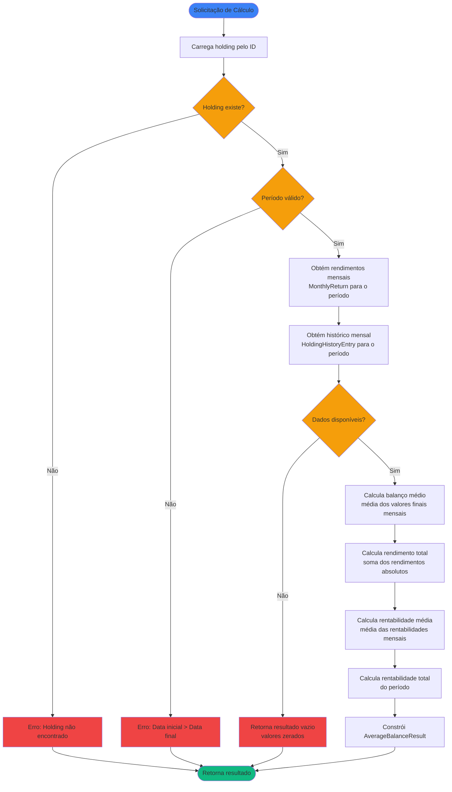

# Regras de Negócio - Calcular Balanço Médio e Rentabilidade Média

## Índice

1. [Objetivo](#1-objetivo)
2. [Entradas e Saídas](#2-entradas-e-saídas)
3. [Fluxo Principal](#3-fluxo-principal)
4. [Regras de Negócio](#4-regras-de-negócio)
5. [Fórmulas de Cálculo](#5-fórmulas-de-cálculo)
6. [Exemplos Numéricos](#6-exemplos-numéricos)

---

## 1. Objetivo

Calcular o balanço médio (valor médio investido) e a rentabilidade média de uma posição de investimento (`AssetHolding`) em um período especificado. O balanço médio representa o valor médio que esteve investido durante o período, enquanto a rentabilidade média representa a taxa de retorno média obtida no período.

O cálculo utiliza os dados mensais de histórico (`HoldingHistoryEntry`) e rendimentos mensais (ver [RN - Calcular Rendimento Mensal de Investimento.md](RN%20-%20Calcular%20Rendimento%20Mensal%20de%20Investimento.md)) para calcular médias ponderadas que refletem adequadamente o tempo e o valor investido em cada mês.

---

## 2. Entradas e Saídas

### Entradas

| Campo       | Tipo        | Descrição                                                      | Obrigatório |
|-------------|-------------|----------------------------------------------------------------|-------------|
| `holdingId` | Long        | Identificador da posição (`AssetHolding`)                      | Sim         |
| `startDate` | LocalDate?  | Data inicial do período (inclusive). Se null, considera desde a primeira transação/histórico | Não         |
| `endDate`   | LocalDate?  | Data final do período (inclusive). Se null, considera até a última transação/histórico | Não         |

### Saídas

| Campo              | Tipo                                    | Descrição                                                      |
|--------------------|-----------------------------------------|----------------------------------------------------------------|
| `averageBalanceResult` | `AverageBalanceResult` | Resultado contendo balanço médio e rentabilidade média do período              |

### Estruturas de Dados

```kotlin
data class AverageBalanceResult(
    val periodStart: YearMonth,
    val periodEnd: YearMonth,
    val averageBalance: Double,
    val averageReturnRate: Double,
    val totalAbsoluteReturn: Double,
    val totalPercentageReturn: Double,
    val monthsCount: Int
)
```

**Onde:**

- `periodStart`: Mês e ano inicial do período analisado
- `periodEnd`: Mês e ano final do período analisado
- `averageBalance`: Balanço médio do período (valor médio investido)
- `averageReturnRate`: Rentabilidade média mensal do período (em percentual)
- `totalAbsoluteReturn`: Rendimento absoluto total acumulado no período
- `totalPercentageReturn`: Rentabilidade total do período (em percentual)
- `monthsCount`: Número de meses considerados no cálculo

---

## 3. Fluxo Principal



**Etapas:**

1. **Validação**: Verifica se a posição existe no sistema e se o período é válido
2. **Obtenção de Dados Mensais**: Busca rendimentos mensais (`MonthlyReturn`) e histórico mensal (`HoldingHistoryEntry`) para o período
3. **Cálculo do Balanço Médio**: Calcula a média aritmética dos valores finais de cada mês do período
4. **Cálculo do Rendimento Total**: Soma todos os rendimentos absolutos mensais do período
5. **Cálculo da Rentabilidade Média**: Calcula a média aritmética das rentabilidades mensais (percentuais)
6. **Cálculo da Rentabilidade Total**: Calcula a rentabilidade total do período baseada no valor inicial e final
7. **Construção do Resultado**: Cria o objeto `AverageBalanceResult` com todos os valores calculados

---

## 4. Regras de Negócio

### 4.1. Validação da Posição

**Regra:** A posição (`AssetHolding`) deve existir no sistema.

**Comportamento:**

- Se posição não existe: retorna erro `"Holding não encontrado: {holdingId}"`
- Se posição existe: prossegue com o cálculo

### 4.2. Validação do Período

**Regra:** O período especificado deve ser válido.

**Comportamento:**

- Se `startDate > endDate`: retorna erro `"Data inicial não pode ser posterior à data final"` antes de executar o cálculo
- Se apenas `startDate` fornecido: considera desde `startDate` até a última data disponível
- Se apenas `endDate` fornecido: considera desde a primeira data disponível até `endDate`
- Se ambos fornecidos: considera apenas o intervalo `[startDate, endDate]`
- Se nenhum fornecido: considera todo o período disponível (desde a primeira transação/histórico até a última)

### 4.3. Disponibilidade de Dados

**Regra:** O cálculo requer dados mensais para pelo menos um mês do período.

**Comportamento:**

- Se não houver dados mensais (histórico ou rendimentos) para nenhum mês do período: retorna resultado com valores zerados
- Se houver dados para pelo menos um mês: calcula usando apenas os meses com dados disponíveis
- Meses sem dados são ignorados no cálculo (não são considerados no `monthsCount`)

### 4.4. Cálculo do Balanço Médio

**Regra:** O balanço médio é calculado como a média aritmética dos valores finais de cada mês do período.

**Fórmula:** `balançoMédio = (Σ valorFinal(m)) / n`

**Onde:**
- `valorFinal(m)`: Valor final do mês `m` (obtido de `HoldingHistoryEntry.endOfMonthValue` ou calculado)
- `n`: Número de meses com dados disponíveis no período

**Comportamento:**

- Considera apenas meses que possuem dados de histórico ou rendimento
- Se um mês não possui valor final disponível, não é incluído no cálculo
- O balanço médio representa o valor médio que esteve investido durante o período

**Exemplo:**

```
Valores finais mensais:
- 2025-01: R$ 10.000,00
- 2025-02: R$ 12.000,00
- 2025-03: R$ 15.000,00

Balanço médio = (10.000 + 12.000 + 15.000) / 3 = R$ 12.333,33
```

### 4.5. Cálculo do Rendimento Total Absoluto

**Regra:** O rendimento total absoluto é a soma de todos os rendimentos absolutos mensais do período.

**Fórmula:** `rendimentoTotal = Σ rendimentoAbsoluto(m)`

**Onde:**
- `rendimentoAbsoluto(m)`: Rendimento absoluto do mês `m` (obtido de `MonthlyReturn.absoluteReturn`)

**Comportamento:**

- Soma todos os rendimentos absolutos dos meses com dados disponíveis
- Rendimentos negativos (perdas) são somados normalmente (resultando em valores negativos)
- Representa o ganho ou perda total em reais no período

**Exemplo:**

```
Rendimentos absolutos mensais:
- 2025-01: R$ 500,00
- 2025-02: R$ -200,00
- 2025-03: R$ 800,00

Rendimento total = 500 + (-200) + 800 = R$ 1.100,00
```

### 4.6. Cálculo da Rentabilidade Média Mensal

**Regra:** A rentabilidade média mensal é calculada como a média aritmética das rentabilidades mensais (percentuais) do período.

**Fórmula:** `rentabilidadeMédia = (Σ rentabilidadePercentual(m)) / n`

**Onde:**
- `rentabilidadePercentual(m)`: Rentabilidade percentual do mês `m` (obtido de `MonthlyReturn.percentageReturn`)
- `n`: Número de meses com rentabilidade válida (excluindo meses com valor inicial zero)

**Comportamento:**

- Considera apenas meses com rentabilidade calculável (valor inicial > 0)
- Meses com valor inicial zero são excluídos do cálculo da média
- Se nenhum mês tiver rentabilidade válida: `rentabilidadeMédia = 0`
- A rentabilidade média representa a taxa de retorno média mensal do período

**Exemplo:**

```
Rentabilidades mensais:
- 2025-01: 5,00% (valor inicial = 0, excluído)
- 2025-02: 2,50%
- 2025-03: 3,00%

Rentabilidade média = (2,50 + 3,00) / 2 = 2,75% ao mês
```

### 4.7. Cálculo da Rentabilidade Total do Período

**Regra:** A rentabilidade total do período é calculada comparando o valor inicial e final do período.

**Fórmula:** `rentabilidadeTotal = ((valorFinal - valorInicial - aportesTotais + retiradasTotais) / valorInicial) × 100`

**Onde:**
- `valorInicial`: Valor final do mês anterior ao início do período (ou zero se for o primeiro mês)
- `valorFinal`: Valor final do último mês do período
- `aportesTotais`: Soma de todos os aportes do período
- `retiradasTotais`: Soma de todas as retiradas do período

**Comportamento:**

- Se `valorInicial = 0`: `rentabilidadeTotal = 0` (não calculável)
- A rentabilidade total representa o retorno percentual do período completo, considerando aportes e retiradas
- Diferente da rentabilidade média, que é a média das rentabilidades mensais

**Exemplo:**

```
Período: 2025-01 a 2025-03
Valor inicial (final de 2024-12): R$ 8.000,00
Valor final (final de 2025-03): R$ 15.000,00
Aportes totais: R$ 5.000,00
Retiradas totais: R$ 0,00

Rentabilidade total = ((15.000 - 8.000 - 5.000 + 0) / 8.000) × 100 = 25,00%
```

### 4.8. Tratamento de Meses sem Dados

**Regra:** Meses sem dados de histórico ou rendimento são ignorados no cálculo.

**Comportamento:**

- Meses sem `HoldingHistoryEntry` e sem `MonthlyReturn` não são incluídos no cálculo
- O `monthsCount` reflete apenas os meses com dados disponíveis
- O cálculo considera apenas os meses válidos, não preenchendo valores faltantes

### 4.9. Primeiro Mês do Período

**Regra:** O primeiro mês pode ter valor inicial zero, o que afeta o cálculo da rentabilidade.

**Comportamento:**

- Se o primeiro mês tem `valorInicial = 0`: sua rentabilidade percentual não é calculável
- O primeiro mês é excluído do cálculo da rentabilidade média mensal
- O primeiro mês é incluído no cálculo do balanço médio (usa `valorFinal`)
- O primeiro mês é incluído no cálculo do rendimento total absoluto

### 4.10. Precisão e Arredondamento

**Regra:** Precisão e arredondamento de valores calculados.

**Comportamento:**

- Valores monetários (balanço médio, rendimento total): 2 casas decimais
- Percentuais (rentabilidades): 2 casas decimais
- Contadores (número de meses): números inteiros
- Valores zero são representados como `0.00`

### 4.11. Integração com Outros Cálculos

**Regra:** O cálculo de balanço médio e rentabilidade média depende de outros cálculos do sistema.

**Dependências:**

- **Rendimentos Mensais**: Utiliza `MonthlyReturn` (ver [RN - Calcular Rendimento Mensal de Investimento.md](RN%20-%20Calcular%20Rendimento%20Mensal%20de%20Investimento.md))
- **Histórico Mensal**: Utiliza `HoldingHistoryEntry` para obter valores finais mensais
- **Aportes Mensais**: Utiliza `MonthlySettlement` (ver [RN - Calcular Aportes de Investimento.md](RN%20-%20Calcular%20Aportes%20de%20Investimento.md))

**Comportamento:**

- O cálculo de balanço médio e rentabilidade média é uma camada superior que agrega dados de outras fontes
- Não recalcula dados que já foram calculados por outros use cases
- Reutiliza resultados de cálculos anteriores para eficiência

---

## 5. Fórmulas de Cálculo

### 5.1. Balanço Médio

O balanço médio é calculado como a média aritmética dos valores finais de cada mês:

```
balançoMédio = (Σ valorFinal(m)) / n

Onde:
- valorFinal(m): Valor final do mês m (endOfMonthValue de HoldingHistoryEntry)
- n: Número de meses com dados disponíveis no período
- m ∈ [periodStart, periodEnd]
```

### 5.2. Rendimento Total Absoluto

O rendimento total absoluto é a soma de todos os rendimentos absolutos mensais:

```
rendimentoTotal = Σ rendimentoAbsoluto(m)

Onde:
- rendimentoAbsoluto(m): Rendimento absoluto do mês m (absoluteReturn de MonthlyReturn)
- m ∈ [periodStart, periodEnd]
```

### 5.3. Rentabilidade Média Mensal

A rentabilidade média mensal é a média aritmética das rentabilidades mensais válidas:

```
rentabilidadeMédia = (Σ rentabilidadePercentual(m)) / n

Onde:
- rentabilidadePercentual(m): Rentabilidade percentual do mês m (percentageReturn de MonthlyReturn)
- n: Número de meses com rentabilidade válida (valorInicial > 0)
- m ∈ [periodStart, periodEnd] onde valorInicial(m) > 0
```

### 5.4. Rentabilidade Total do Período

A rentabilidade total do período é calculada comparando valor inicial e final:

```
Se valorInicial > 0:
    rentabilidadeTotal = ((valorFinal - valorInicial - aportesTotais + retiradasTotais) / valorInicial) × 100

Se valorInicial = 0:
    rentabilidadeTotal = 0 (não calculável)

Onde:
- valorInicial: Valor final do mês anterior ao início do período
- valorFinal: Valor final do último mês do período
- aportesTotais: Σ totalContributions(m) para todos os meses do período
- retiradasTotais: Σ totalWithdrawals(m) para todos os meses do período
```

### 5.5. Número de Meses

O número de meses considerados no cálculo:

```
monthsCount = |{m : m ∈ [periodStart, periodEnd] e existe dados para m}|

Onde:
- |{...}|: Cardinalidade do conjunto (número de elementos)
- m: Mês (YearMonth) com dados disponíveis (histórico ou rendimento)
```

---

## 6. Exemplos Numéricos

### 6.1. Exemplo: Período Completo com Valorização

**Cenário:** Posição com histórico completo de 3 meses:

| Mês      | Valor Final | Rendimento Absoluto | Rentabilidade Mensal |
|----------|-------------|---------------------|----------------------|
| 2025-01  | R$ 10.000,00 | R$ 500,00 | 5,00% |
| 2025-02  | R$ 12.000,00 | R$ 1.500,00 | 15,00% |
| 2025-03  | R$ 15.000,00 | R$ 2.000,00 | 16,67% |

**Dados adicionais:**
- Valor inicial (final de 2024-12): R$ 9.500,00
- Aportes totais: R$ 0,00
- Retiradas totais: R$ 0,00

**Cálculos:**

```
Balanço médio = (10.000 + 12.000 + 15.000) / 3 = R$ 12.333,33

Rendimento total = 500 + 1.500 + 2.000 = R$ 4.000,00

Rentabilidade média = (5,00 + 15,00 + 16,67) / 3 = 12,22% ao mês

Rentabilidade total = ((15.000 - 9.500 - 0 + 0) / 9.500) × 100 = 57,89%
```

**Resultado:**

```kotlin
AverageBalanceResult(
    periodStart = 2025-01,
    periodEnd = 2025-03,
    averageBalance = 12333.33,
    averageReturnRate = 12.22,
    totalAbsoluteReturn = 4000.00,
    totalPercentageReturn = 57.89,
    monthsCount = 3
)
```

**Interpretação:** O investimento teve um balanço médio de R$ 12.333,33, com rentabilidade média mensal de 12,22% e rentabilidade total de 57,89% no período de 3 meses.

### 6.2. Exemplo: Período com Aportes

**Cenário:** Posição com aportes durante o período:

| Mês      | Valor Final | Rendimento Absoluto | Rentabilidade Mensal | Aportes | Retiradas |
|----------|-------------|---------------------|----------------------|---------|-----------|
| 2025-01  | R$ 10.000,00 | R$ 0,00 | 0,00%* | R$ 10.000,00 | R$ 0,00 |
| 2025-02  | R$ 12.500,00 | R$ 2.000,00 | 20,00% | R$ 0,00 | R$ 0,00 |
| 2025-03  | R$ 16.000,00 | R$ 3.000,00 | 24,00% | R$ 0,00 | R$ 0,00 |

*Primeiro mês com valor inicial zero, rentabilidade não calculável

**Dados adicionais:**
- Valor inicial (final de 2024-12): R$ 0,00
- Aportes totais: R$ 10.000,00
- Retiradas totais: R$ 0,00

**Cálculos:**

```
Balanço médio = (10.000 + 12.500 + 16.000) / 3 = R$ 12.833,33

Rendimento total = 0 + 2.000 + 3.000 = R$ 5.000,00

Rentabilidade média = (20,00 + 24,00) / 2 = 22,00% ao mês
(Excluindo o primeiro mês que não tem rentabilidade calculável)

Rentabilidade total = ((16.000 - 0 - 10.000 + 0) / 0) × 100 = 0
(Não calculável pois valor inicial = 0)
```

**Resultado:**

```kotlin
AverageBalanceResult(
    periodStart = 2025-01,
    periodEnd = 2025-03,
    averageBalance = 12833.33,
    averageReturnRate = 22.00,
    totalAbsoluteReturn = 5000.00,
    totalPercentageReturn = 0.00,
    monthsCount = 3
)
```

**Interpretação:** O investimento teve um balanço médio de R$ 12.833,33, com rentabilidade média mensal de 22,00% (excluindo o primeiro mês). A rentabilidade total não é calculável pois começou do zero.

### 6.3. Exemplo: Período com Perdas

**Cenário:** Posição com perdas em alguns meses:

| Mês      | Valor Final | Rendimento Absoluto | Rentabilidade Mensal |
|----------|-------------|---------------------|----------------------|
| 2025-01  | R$ 20.000,00 | R$ 1.000,00 | 5,00% |
| 2025-02  | R$ 18.000,00 | R$ -2.000,00 | -10,00% |
| 2025-03  | R$ 19.500,00 | R$ 1.500,00 | 8,33% |

**Dados adicionais:**
- Valor inicial (final de 2024-12): R$ 19.000,00
- Aportes totais: R$ 0,00
- Retiradas totais: R$ 0,00

**Cálculos:**

```
Balanço médio = (20.000 + 18.000 + 19.500) / 3 = R$ 19.166,67

Rendimento total = 1.000 + (-2.000) + 1.500 = R$ 500,00

Rentabilidade média = (5,00 + (-10,00) + 8,33) / 3 = 1,11% ao mês

Rentabilidade total = ((19.500 - 19.000 - 0 + 0) / 19.000) × 100 = 2,63%
```

**Resultado:**

```kotlin
AverageBalanceResult(
    periodStart = 2025-01,
    periodEnd = 2025-03,
    averageBalance = 19166.67,
    averageReturnRate = 1.11,
    totalAbsoluteReturn = 500.00,
    totalPercentageReturn = 2.63,
    monthsCount = 3
)
```

**Interpretação:** Apesar de ter tido perda no mês de fevereiro, o investimento terminou o período com ganho total de R$ 500,00 (2,63%), com rentabilidade média mensal de 1,11%.

### 6.4. Exemplo: Período com Aportes e Retiradas

**Cenário:** Posição com movimentações durante o período:

| Mês      | Valor Final | Rendimento Absoluto | Rentabilidade Mensal | Aportes | Retiradas |
|----------|-------------|---------------------|----------------------|---------|-----------|
| 2025-01  | R$ 15.000,00 | R$ 500,00 | 3,33% | R$ 0,00 | R$ 0,00 |
| 2025-02  | R$ 18.000,00 | R$ 2.500,00 | 16,67% | R$ 1.000,00 | R$ 0,00 |
| 2025-03  | R$ 16.500,00 | R$ -1.000,00 | -5,71% | R$ 0,00 | R$ 500,00 |

**Dados adicionais:**
- Valor inicial (final de 2024-12): R$ 14.500,00
- Aportes totais: R$ 1.000,00
- Retiradas totais: R$ 500,00

**Cálculos:**

```
Balanço médio = (15.000 + 18.000 + 16.500) / 3 = R$ 16.500,00

Rendimento total = 500 + 2.500 + (-1.000) = R$ 2.000,00

Rentabilidade média = (3,33 + 16,67 + (-5,71)) / 3 = 4,76% ao mês

Rentabilidade total = ((16.500 - 14.500 - 1.000 + 500) / 14.500) × 100 = 13,79%
```

**Resultado:**

```kotlin
AverageBalanceResult(
    periodStart = 2025-01,
    periodEnd = 2025-03,
    averageBalance = 16500.00,
    averageReturnRate = 4.76,
    totalAbsoluteReturn = 2000.00,
    totalPercentageReturn = 13.79,
    monthsCount = 3
)
```

**Interpretação:** O investimento teve um balanço médio de R$ 16.500,00, com rentabilidade média mensal de 4,76% e rentabilidade total de 13,79% no período, considerando os aportes e retiradas realizados.

### 6.5. Exemplo: Período Longo (12 meses)

**Cenário:** Posição com histórico de 12 meses:

| Mês      | Valor Final | Rendimento Absoluto | Rentabilidade Mensal |
|----------|-------------|---------------------|----------------------|
| 2025-01  | R$ 10.000,00 | R$ 100,00 | 1,00% |
| 2025-02  | R$ 10.200,00 | R$ 200,00 | 2,00% |
| 2025-03  | R$ 10.500,00 | R$ 300,00 | 2,94% |
| 2025-04  | R$ 10.600,00 | R$ 100,00 | 0,95% |
| 2025-05  | R$ 10.800,00 | R$ 200,00 | 1,89% |
| 2025-06  | R$ 11.000,00 | R$ 200,00 | 1,85% |
| 2025-07  | R$ 11.200,00 | R$ 200,00 | 1,82% |
| 2025-08  | R$ 11.400,00 | R$ 200,00 | 1,79% |
| 2025-09  | R$ 11.600,00 | R$ 200,00 | 1,75% |
| 2025-10  | R$ 11.800,00 | R$ 200,00 | 1,72% |
| 2025-11  | R$ 12.000,00 | R$ 200,00 | 1,69% |
| 2025-12  | R$ 12.200,00 | R$ 200,00 | 1,67% |

**Dados adicionais:**
- Valor inicial (final de 2024-12): R$ 9.900,00
- Aportes totais: R$ 0,00
- Retiradas totais: R$ 0,00

**Cálculos:**

```
Balanço médio = (10.000 + 10.200 + ... + 12.200) / 12 = R$ 11.100,00

Rendimento total = 100 + 200 + ... + 200 = R$ 2.300,00

Rentabilidade média = (1,00 + 2,00 + ... + 1,67) / 12 = 1,75% ao mês

Rentabilidade total = ((12.200 - 9.900 - 0 + 0) / 9.900) × 100 = 23,23%
```

**Resultado:**

```kotlin
AverageBalanceResult(
    periodStart = 2025-01,
    periodEnd = 2025-12,
    averageBalance = 11100.00,
    averageReturnRate = 1.75,
    totalAbsoluteReturn = 2300.00,
    totalPercentageReturn = 23.23,
    monthsCount = 12
)
```

**Interpretação:** Em um período de 12 meses, o investimento teve um balanço médio de R$ 11.100,00, com rentabilidade média mensal de 1,75% e rentabilidade total anual de 23,23%.

### 6.6. Exemplo: Período sem Dados

**Cenário:** Posição sem histórico ou rendimentos no período especificado.

**Cálculos:**

```
Balanço médio = 0,00 (sem dados)
Rendimento total = 0,00 (sem dados)
Rentabilidade média = 0,00 (sem dados)
Rentabilidade total = 0,00 (sem dados)
monthsCount = 0
```

**Resultado:**

```kotlin
AverageBalanceResult(
    periodStart = 2025-01,
    periodEnd = 2025-03,
    averageBalance = 0.00,
    averageReturnRate = 0.00,
    totalAbsoluteReturn = 0.00,
    totalPercentageReturn = 0.00,
    monthsCount = 0
)
```

**Interpretação:** Não há dados disponíveis para o período especificado. O resultado retorna valores zerados.

---

## Referências

- [Modelagem de Dominio.md](Modelagem%20de%20Dominio.md) - Definição das entidades `AssetHolding`, `HoldingHistoryEntry` e seus subtipos
- [RN - Calcular Rendimento Mensal de Investimento.md](RN%20-%20Calcular%20Rendimento%20Mensal%20de%20Investimento.md) - Utiliza rendimentos mensais para calcular médias
- [RN - Calcular Aportes de Investimento.md](RN%20-%20Calcular%20Aportes%20de%20Investimento.md) - Utiliza aportes mensais para cálculos de rentabilidade total
- [RN - Criar novo registro de histórico.md](RN%20-%20Criar%20novo%20registro%20de%20histórico.md) - Contexto sobre histórico mensal de posições

