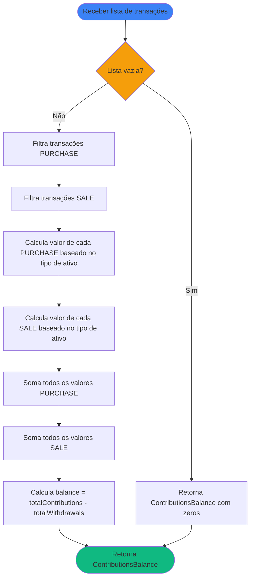

# Regras de Negócio - Calcular Balanço dos Aportes

## Índice

1. [Objetivo](#1-objetivo)
2. [Entradas e Saídas](#2-entradas-e-saídas)
3. [Fluxo Principal](#3-fluxo-principal)
4. [Regras de Negócio](#4-regras-de-negócio)
5. [Fórmulas de Cálculo](#5-fórmulas-de-cálculo)
6. [Exemplos Numéricos](#6-exemplos-numéricos)

---

## 1. Objetivo

Calcular o balanço total de aportes e retiradas a partir de uma lista de transações de ativos (`AssetTransaction`). O resultado é uma estrutura contendo:

- **Total de contribuições (aportes)**: Soma de todas as compras
- **Total de retiradas**: Soma de todas as vendas
- **Balanço**: Diferença entre aportes e retiradas

Este cálculo considera transações do tipo `PURCHASE` (compra/aporte) para aportes e transações do tipo `SALE` (venda/resgate) para retiradas, utilizando estratégias específicas baseadas no tipo de ativo (Renda Fixa, Renda Variável ou Fundos).

---

## 2. Entradas e Saídas

### Entradas

| Campo          | Tipo                     | Descrição                               | Obrigatório |
|----------------|--------------------------|-----------------------------------------|-------------|
| `transactions` | List\<AssetTransaction\> | Lista de transações a serem processadas | Sim         |

### Saídas

| Campo                | Tipo   | Descrição                                             |
|----------------------|--------|-------------------------------------------------------|
| `totalContributions` | Double | Soma total de todos os aportes                        |
| `totalWithdrawals`   | Double | Soma total de todas as retiradas                      |
| `balance`            | Double | Balanço final (totalContributions - totalWithdrawals) |

### Estruturas de Dados

```kotlin
data class ContributionsBalance(
    val totalContributions: Double,
    val totalWithdrawals: Double,
    val balance: Double
)
```

**Onde:**

- `totalContributions`: Soma de todos os aportes (transações PURCHASE)
- `totalWithdrawals`: Soma de todas as retiradas (transações SALE)
- `balance`: Balanço final (totalContributions - totalWithdrawals)

---

## 3. Fluxo Principal



**Etapas:**

1. **Validação**: Verifica se a lista de transações está vazia
2. **Filtro por Tipo**: Separa transações em dois grupos: `PURCHASE` e `SALE`
3. **Cálculo de Valores**: Para cada transação, calcula o valor baseado no tipo de ativo
4. **Soma de Aportes**: Soma todos os valores das transações `PURCHASE`
5. **Soma de Retiradas**: Soma todos os valores das transações `SALE`
6. **Cálculo do Balanço**: Calcula `balance = totalContributions - totalWithdrawals`
7. **Retorno**: Retorna `ContributionsBalance` com os três valores calculados

---

## 4. Regras de Negócio

### 4.1. Validação da Lista

**Regra:** Lista vazia ou nula deve retornar valores zerados.

**Comportamento:**

- Se lista vazia ou nula: retorna `ContributionsBalance(0.0, 0.0, 0.0)`
- Se lista não vazia: prossegue com o cálculo

### 4.2. Filtro por Tipo de Transação

**Regra:** Transações são separadas por tipo para cálculo de aportes e retiradas.

**Comportamento:**

- **Transações `PURCHASE`**: Consideradas como aportes (entradas de dinheiro)
- **Transações `SALE`**: Consideradas como retiradas (saídas de dinheiro)
- Se lista não tiver transações `PURCHASE`: `totalContributions = 0.0`
- Se lista não tiver transações `SALE`: `totalWithdrawals = 0.0`

### 4.3. Cálculo por Tipo de Ativo

**Regra:** O valor do aporte ou retirada varia conforme o tipo de ativo da transação. As mesmas regras se aplicam tanto para transações `PURCHASE` quanto `SALE`.

#### 4.3.1. Renda Variável (Ações, FIIs, ETFs)

**Fórmula:** `valor = quantity × unitPrice`

**Fonte:** Propriedades `quantity` e `unitPrice` de `VariableIncomeTransaction`

**Exemplo de Aporte:**
- Compra de 50 ações a R$ 56,36
- Aporte = 50 × 56,36 = R$ 2.818,00

**Exemplo de Retirada:**
- Venda de 10 ações a R$ 60,00
- Retirada = 10 × 60,00 = R$ 600,00

#### 4.3.2. Renda Fixa (CDB, LCI, LCA, etc.)

**Fórmula:** `valor = totalValue`

**Fonte:** Propriedade `totalValue` de `FixedIncomeTransaction`

**Exemplo de Aporte:**
- Aporte de R$ 5.000,00 em CDB
- Aporte = R$ 5.000,00

**Exemplo de Retirada:**
- Resgate de R$ 3.000,00 do CDB
- Retirada = R$ 3.000,00

#### 4.3.3. Fundos de Investimento

**Fórmula:** `valor = totalValue`

**Fonte:** Propriedade `totalValue` de `FundsTransaction`

**Exemplo de Aporte:**
- Aporte de R$ 3.000,00 em fundo multimercado
- Aporte = R$ 3.000,00

**Exemplo de Retirada:**
- Resgate de R$ 2.000,00 do fundo
- Retirada = R$ 2.000,00

### 4.4. Cálculo do Balanço

**Regra:** O balanço é calculado como a diferença entre aportes e retiradas.

**Fórmula:** `balance = totalContributions - totalWithdrawals`

**Comportamento:**

- Se `balance > 0`: mais dinheiro entrou do que saiu (saldo positivo)
- Se `balance < 0`: mais dinheiro saiu do que entrou (saldo negativo)
- Se `balance = 0`: entradas e saídas se equilibram

### 4.5. Precisão e Arredondamento

**Regra:** Precisão de valores calculados.

**Comportamento:**

- Valores monetários: 2 casas decimais
- Cálculos intermediários mantêm precisão máxima de Double
- Arredondamento final para apresentação: 2 casas decimais

---

## 5. Fórmulas de Cálculo

### 5.1. Cálculo do Valor da Transação

O valor de uma transação varia conforme o tipo de ativo:

**Para Renda Variável (`VariableIncomeTransaction`):**
```
valor = quantity × unitPrice
```

**Para Renda Fixa (`FixedIncomeTransaction`):**
```
valor = totalValue
```

**Para Fundos (`FundsTransaction`):**
```
valor = totalValue
```

### 5.2. Cálculo dos Totais

```
totalContributions = Σ valor(transaction) 
                     para todas as transações onde type = PURCHASE

totalWithdrawals = Σ valor(transaction) 
                   para todas as transações onde type = SALE

balance = totalContributions - totalWithdrawals
```

**Onde:**
- `Σ` representa a soma de todos os valores
- `valor(transaction)` é calculado conforme regra 5.1 baseado no tipo de ativo

---

## 6. Exemplos Numéricos

### 6.1. Exemplo: Renda Variável (Ações)

**Cenário:** Lista de transações de ações PETR4:

| Data       | Tipo     | Quantidade | Preço Unitário | Valor Total |
|------------|----------|------------|----------------|-------------|
| 2025-01-15 | PURCHASE | 50         | R$ 56,36       | R$ 2.818,00 |
| 2025-01-20 | PURCHASE | 50         | R$ 56,36       | R$ 2.818,00 |
| 2025-02-10 | PURCHASE | 30         | R$ 58,00       | R$ 1.740,00 |
| 2025-03-05 | SALE     | 10         | R$ 60,00       | R$ 600,00   |

**Cálculo:**
- Total de aportes: R$ 2.818,00 + R$ 2.818,00 + R$ 1.740,00 = R$ 7.376,00
- Total de retiradas: R$ 600,00
- Balanço: R$ 7.376,00 - R$ 600,00 = R$ 6.776,00

**Resultado:**

```kotlin
ContributionsBalance(
    totalContributions = 7376.00,
    totalWithdrawals = 600.00,
    balance = 6776.00
)
```

### 6.2. Exemplo: Renda Fixa (CDB)

**Cenário:** Lista de transações de CDB:

| Data       | Tipo     | Valor Total  |
|------------|----------|--------------|
| 2025-01-10 | PURCHASE | R$ 5.000,00  |
| 2025-02-15 | PURCHASE | R$ 3.000,00  |
| 2025-03-20 | PURCHASE | R$ 2.000,00  |
| 2025-12-15 | SALE     | R$ 11.500,00 |

**Cálculo:**
- Total de aportes: R$ 5.000,00 + R$ 3.000,00 + R$ 2.000,00 = R$ 10.000,00
- Total de retiradas: R$ 11.500,00
- Balanço: R$ 10.000,00 - R$ 11.500,00 = -R$ 1.500,00

**Resultado:**

```kotlin
ContributionsBalance(
    totalContributions = 10000.00,
    totalWithdrawals = 11500.00,
    balance = -1500.00
)
```

**Interpretação:** O saldo negativo indica que o resgate (R$ 11.500,00) incluiu rendimentos acumulados (R$ 1.500,00) além do valor investido (R$ 10.000,00).

### 6.3. Exemplo: Fundos de Investimento

**Cenário:** Lista de transações de fundo multimercado:

| Data       | Tipo     | Valor Total  |
|------------|----------|--------------|
| 2025-01-05 | PURCHASE | R$ 10.000,00 |
| 2025-01-15 | PURCHASE | R$ 5.000,00  |
| 2025-02-10 | PURCHASE | R$ 8.000,00  |
| 2025-03-01 | PURCHASE | R$ 7.000,00  |
| 2025-06-15 | SALE     | R$ 12.000,00 |

**Cálculo:**
- Total de aportes: R$ 10.000,00 + R$ 5.000,00 + R$ 8.000,00 + R$ 7.000,00 = R$ 30.000,00
- Total de retiradas: R$ 12.000,00
- Balanço: R$ 30.000,00 - R$ 12.000,00 = R$ 18.000,00

**Resultado:**

```kotlin
ContributionsBalance(
    totalContributions = 30000.00,
    totalWithdrawals = 12000.00,
    balance = 18000.00
)
```

**Interpretação:** O balanço positivo de R$ 18.000,00 representa o valor líquido ainda investido após o resgate parcial.

### 6.4. Exemplo: Lista com Apenas Retiradas

**Cenário:** Lista contendo apenas transações de venda (SALE):

| Data       | Tipo | Quantidade | Preço Unitário | Valor Total |
|------------|------|------------|----------------|-------------|
| 2025-01-20 | SALE | 100        | R$ 50,00       | R$ 5.000,00 |

**Cálculo:**
- Total de aportes: R$ 0,00
- Total de retiradas: R$ 5.000,00
- Balanço: R$ 0,00 - R$ 5.000,00 = -R$ 5.000,00

**Resultado:**

```kotlin
ContributionsBalance(
    totalContributions = 0.00,
    totalWithdrawals = 5000.00,
    balance = -5000.00
)
```

**Interpretação:** Lista possui apenas retiradas. O saldo negativo indica que todo o valor foi retirado (possivelmente de uma posição anterior ou transferência).

### 6.5. Exemplo: Lista Vazia

**Cenário:** Lista vazia de transações.

**Resultado:**

```kotlin
ContributionsBalance(
    totalContributions = 0.00,
    totalWithdrawals = 0.00,
    balance = 0.00
)
```

**Interpretação:** Sem transações, todos os valores são zero.

### 6.6. Exemplo: Transações Mistas (Múltiplos Tipos de Ativos)

**Cenário:** Lista com diferentes tipos de ativos:

| Data       | Tipo Ativo  | Tipo     | Quantidade | Preço Unit. | Valor Total |
|------------|-------------|----------|------------|-------------|-------------|
| 2025-01-10 | Ações       | PURCHASE | 50         | R$ 20,00    | R$ 1.000,00 |
| 2025-01-15 | CDB         | PURCHASE | -          | -           | R$ 5.000,00 |
| 2025-02-01 | Fundo       | PURCHASE | -          | -           | R$ 3.000,00 |
| 2025-02-20 | Ações       | SALE     | 10         | R$ 25,00    | R$ 250,00   |

**Cálculo:**
- Total de aportes: R$ 1.000,00 + R$ 5.000,00 + R$ 3.000,00 = R$ 9.000,00
- Total de retiradas: R$ 250,00
- Balanço: R$ 9.000,00 - R$ 250,00 = R$ 8.750,00

**Resultado:**

```kotlin
ContributionsBalance(
    totalContributions = 9000.00,
    totalWithdrawals = 250.00,
    balance = 8750.00
)
```

**Interpretação:** O cálculo funciona independentemente do tipo de ativo, aplicando a regra apropriada para cada um.

---

## Referências

- [AssetTransaction.kt](file:///Users/enirferraz/AndroidStudioProjects/Investments-KMP/core/domain/entity/src/commonMain/kotlin/com/eferraz/entities/AssetTransaction.kt) - Definição da interface base de transações
- [RN - Calcular Aportes de Investimento.md](RN%20-%20Calcular%20Aportes%20de%20Investimento.md) - Documento que utiliza este cálculo para apurações mensais
- [Modelagem de Dominio.md](Modelagem%20de%20Dominio.md) - Definição das entidades e subtipos de transações
