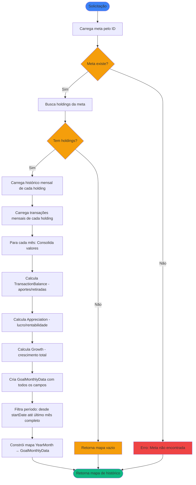

# Regras de Negócio - Calcular Histórico de Meta Financeira

## Índice

1. [Objetivo](#1-objetivo)
2. [Entradas e Saídas](#2-entradas-e-saídas)
3. [Fluxo Principal](#3-fluxo-principal)
4. [Regras de Negócio](#4-regras-de-negócio)
5. [Fórmulas de Cálculo](#5-fórmulas-de-cálculo)
6. [Exemplos Numéricos](#6-exemplos-numéricos)

---

## 1. Objetivo

Calcular o histórico consolidado mensal de uma meta financeira desde o início da meta até o presente, incluindo valor, aportes, retiradas, crescimento, lucro e suas respectivas rentabilidades, com base no histórico de valores e transações das posições (`AssetHolding`) associadas à meta.

O sistema consolida o histórico mensal de todas as posições vinculadas, calculando para cada mês:
- **Valor total**: Soma dos valores finais de todas as posições
- **Aportes e retiradas**: Consolidação de movimentações (ver [RN - Calcular Balanço de Transações.md](rules/RN%20-%20Calcular%20Balanço%20de%20Transações.md))
- **Crescimento**: Variação total do patrimônio (lucro + aportes - retiradas) (ver [RN - Calcular Crescimento de uma Posição.md](rules/RN%20-%20Calcular%20Crescimento%20de%20uma%20Posição.md))
- **Lucro**: Desempenho do ativo isolado de aportes (ver [RN - Calcular Apreciação de uma Posição.md](rules/RN%20-%20Calcular%20Apreciação%20de%20uma%20Posição.md))

**Nota:** Para projeções futuras e estimativa de data de conclusão, ver [RN - Calcular Projeção de Meta Financeira.md](RN%20-%20Calcular%20Projeção%20de%20Meta%20Financeira.md).

---

## 2. Entradas e Saídas

### Entradas

| Campo    | Tipo | Descrição                        |
|----------|------|----------------------------------|
| `goalId` | Long | Identificador da meta financeira |

### Saídas

A saída é um **mapa de `YearMonth` para `GoalMonthlyData`**, onde cada entrada representa um mês do histórico consolidado desde `startDate` até o último mês completo:

**Estrutura do Mapa:**
```kotlin
Map<YearMonth, GoalMonthlyData>
```

**Estrutura de `GoalMonthlyData`:**

| Campo              | Tipo   | Descrição                                                                 |
|--------------------|--------|---------------------------------------------------------------------------|
| `value`            | Double | Valor consolidado no final do mês                                         |
| `contributions`    | Double | Aportes consolidados do mês                                               |
| `withdrawals`      | Double | Retiradas consolidadas do mês                                             |
| `growth`           | Double | Variação total do patrimônio (`value(m) - value(m-1)`)                   |
| `growthRate`       | Double | Percentual de crescimento sobre o valor inicial                           |
| `appreciation`     | Double | Lucro/prejuízo isolado (sem considerar aportes/retiradas)                 |
| `appreciationRate` | Double | Rentabilidade sobre o capital investido                                   |

**Referências sobre campos:**
- Aportes/Retiradas: Ver [RN - Calcular Balanço de Transações.md](rules/RN%20-%20Calcular%20Balanço%20de%20Transações.md)
- Apreciação: Ver [RN - Calcular Apreciação de uma Posição.md](rules/RN%20-%20Calcular%20Apreciação%20de%20uma%20Posição.md)
- Crescimento: Ver [RN - Calcular Crescimento de uma Posição.md](rules/RN%20-%20Calcular%20Crescimento%20de%20uma%20Posição.md)

**Nota:** Esta estrutura é compartilhada com projeções (ver [RN - Calcular Projeção de Meta Financeira.md](RN%20-%20Calcular%20Projeção%20de%20Meta%20Financeira.md)).

---

## 3. Fluxo Principal



---

## 4. Regras de Negócio

### 4.1. Consolidação por Mês

**Regra:** Os valores mensais são consolidados somando os valores de todas as posições associadas à meta.

**Fórmulas por mês:**

Para cada mês `m`, consolidamos:

- `value(m)` = Σ `endOfMonthValue(m)` de todos os holdings
- `contributions(m)` = Σ `contributions(m)` de todos os holdings (obtido de `TransactionBalance` - ver [RN - Calcular Balanço de Transações.md](rules/RN%20-%20Calcular%20Balanço%20de%20Transações.md))
- `withdrawals(m)` = Σ `withdrawals(m)` de todos os holdings (obtido de `TransactionBalance`)
- `appreciation(m)` = Σ `appreciation.value(m)` de todos os holdings (obtido de `Appreciation` - ver [RN - Calcular Apreciação de uma Posição.md](rules/RN%20-%20Calcular%20Apreciação%20de%20uma%20Posição.md))
- `appreciationRate(m)` = calculado consolidadamente (ver seção 5.2)
- `growth(m)` = Σ `growth.value(m)` de todos os holdings (obtido de `Growth` - ver [RN - Calcular Crescimento de uma Posição.md](rules/RN%20-%20Calcular%20Crescimento%20de%20uma%20Posição.md))
- `growthRate(m)` = calculado consolidadamente (ver seção 5.3)

**Comportamento:**

- Holdings sem dados para um mês contribuem com valores zero
- Metas sem posições retornam mapa vazio

### 4.2. Período de Análise

**Regra:** O histórico considera desde a `startDate` da meta até o último mês completo com histórico disponível.

**Comportamento:**

- Meses anteriores a `startDate`: ignorados
- Último mês disponível: último mês completo com histórico
- Meses futuros (parciais) não são considerados no histórico
- O mapa começa no mês de `startDate` da meta


---

## 5. Fórmulas de Cálculo

### 5.1. Valor Consolidado

```
value(m) = Σ endOfMonthValue(m) de todos os holdings
```

**Onde:**
- `value(m)`: Valor total da meta no final do mês `m`
- Soma-se o valor final de todas as posições associadas à meta

### 5.2. Consolidação de Campos

Para cada campo de `GoalMonthlyData`, aplica-se consolidação por soma:

```
value(m) = Σ endOfMonthValue(m)
contributions(m) = Σ contributions(m) 
withdrawals(m) = Σ withdrawals(m)
appreciation(m) = Σ appreciation.value(m)
growth(m) = Σ growth.value(m)
```

**Cálculo de percentuais consolidados:**

```
appreciationRate(m) = (appreciation(m) / (value(m-1) + contributions(m))) × 100
growthRate(m) = (growth(m) / value(m-1)) × 100
```

**Referências:** Ver documentos específicos de cada regra nas Referências

---

## 6. Exemplos Numéricos

### 6.1. Exemplo: Meta com Uma Posição

**Cenário:** Meta financeira com uma única posição (CDB):

- Meta: R$ 100.000,00
- Período: Jan/2025 a Mar/2025
- Valor inicial (Dez/2024): R$ 17.000,00

**Histórico consolidado:**

| Mês (YearMonth) | value        | contributions | withdrawals | appreciation | appreciationRate | growth       | growthRate |
|-----------------|--------------|---------------|-------------|--------------|------------------|--------------|------------|
| 2025-01         | R$ 20.000,00 | R$ 1.500,00   | R$ 0,00     | R$ 1.500,00  | 8,11%            | R$ 3.000,00  | 17,65%     |
| 2025-02         | R$ 22.000,00 | R$ 1.500,00   | R$ 0,00     | R$ 500,00    | 2,27%            | R$ 2.000,00  | 10,00%     |
| 2025-03         | R$ 25.000,00 | R$ 1.500,00   | R$ 0,00     | R$ 1.500,00  | 6,38%            | R$ 3.000,00  | 13,64%     |

**Cálculo detalhado para 2025-01:**

```
valorInicial = 17.000,00 (valor do mês anterior)
valorFinal = 20.000,00
aportes = 1.500,00
retiradas = 0,00

appreciation = 20.000 - 17.000 - 1.500 + 0 = 1.500,00
appreciationRate = (1.500 / (17.000 + 1.500)) × 100 = 8,11%

growth = 1.500 + 1.500 = 3.000,00
growthRate = (3.000 / 17.000) × 100 = 17,65%
```

**Interpretação:**
- Em Jan/2025, o patrimônio cresceu R$ 3.000 (17,65%), sendo R$ 1.500 de aportes e R$ 1.500 de lucro
- O lucro de 8,11% foi calculado sobre o capital investido (valor inicial + aportes)

### 6.2. Exemplo: Meta com Múltiplas Posições

**Cenário:** Meta financeira com três posições:

- Meta: R$ 200.000,00
- Posições: CDB, Ações PETR4, Fundo Multimercado
- Período: Jan/2025 a Mar/2025
- Valor inicial (Dez/2024): R$ 44.000,00

**Histórico consolidado:**

| Mês (YearMonth) | value        | contributions | withdrawals | appreciation | appreciationRate | growth       | growthRate |
|-----------------|--------------|---------------|-------------|--------------|------------------|--------------|------------|
| 2025-01         | R$ 50.000,00 | R$ 3.000,00   | R$ 0,00     | R$ 3.000,00  | 6,38%            | R$ 6.000,00  | 13,64%     |
| 2025-02         | R$ 55.000,00 | R$ 3.000,00   | R$ 0,00     | R$ 2.000,00  | 3,77%            | R$ 5.000,00  | 10,00%     |
| 2025-03         | R$ 60.000,00 | R$ 3.000,00   | R$ 0,00     | R$ 2.000,00  | 3,45%            | R$ 5.000,00  | 9,09%      |

**Cálculo detalhado para 2025-02:**

```
valorInicial = 50.000,00 (valor de Jan/2025)
valorFinal = 55.000,00
aportes = 3.000,00 (soma de todas as posições)
retiradas = 0,00

appreciation = 55.000 - 50.000 - 3.000 + 0 = 2.000,00
appreciationRate = (2.000 / (50.000 + 3.000)) × 100 = 3,77%

growth = 2.000 + 3.000 = 5.000,00
growthRate = (5.000 / 50.000) × 100 = 10,00%
```

**Interpretação:**
- Em Fev/2025, o patrimônio cresceu R$ 5.000 (10%), sendo R$ 3.000 de aportes e R$ 2.000 de lucro
- As três posições foram consolidadas somando seus valores individuais

### 6.3. Exemplo: Meta com Retiradas

**Cenário:** Meta financeira com histórico de retiradas:

- Meta: R$ 150.000,00
- Período: Jan/2025 a Mar/2025
- Valor inicial (Dez/2024): R$ 72.000,00

**Histórico consolidado:**

| Mês (YearMonth) | value        | contributions | withdrawals | appreciation | appreciationRate | growth       | growthRate |
|-----------------|--------------|---------------|-------------|--------------|------------------|--------------|------------|
| 2025-01         | R$ 75.000,00 | R$ 2.000,00   | R$ 0,00     | R$ 1.000,00  | 1,35%            | R$ 3.000,00  | 4,17%      |
| 2025-02         | R$ 78.000,00 | R$ 1.000,00   | R$ 500,00   | R$ 2.500,00  | 3,29%            | R$ 3.000,00  | 4,00%      |
| 2025-03         | R$ 80.000,00 | R$ 2.000,00   | R$ 0,00     | R$ 0,00      | 0,00%            | R$ 2.000,00  | 2,56%      |

**Cálculo detalhado para 2025-02:**

```
valorInicial = 75.000,00 (valor de Jan/2025)
valorFinal = 78.000,00
aportes = 1.000,00
retiradas = 500,00

appreciation = 78.000 - 75.000 - 1.000 + 500 = 2.500,00
appreciationRate = (2.500 / (75.000 + 1.000)) × 100 = 3,29%

growth = 2.500 + 1.000 - 500 = 3.000,00
growthRate = (3.000 / 75.000) × 100 = 4,00%
```

**Interpretação:**
- Em Fev/2025, houve retirada de R$ 500 que reduziu o crescimento
- O crescimento líquido foi de R$ 3.000 (lucro R$ 2.500 + aportes R$ 1.000 - retiradas R$ 500)
- As retiradas são rastreadas separadamente no campo `withdrawals` e subtraídas do crescimento

### 6.4. Exemplo: Estrutura do Mapa Retornado

**Representação em Kotlin:**

```kotlin
val goalHistory: Map<YearMonth, GoalMonthlyData> = mapOf(
    YearMonth.of(2025, 1) to GoalMonthlyData(
        value = 75000.00,
        contributions = 2000.00,
        withdrawals = 0.00,
        growth = 3000.00,
        growthRate = 4.17,
        appreciation = 1000.00,
        appreciationRate = 1.35
    ),
    YearMonth.of(2025, 2) to GoalMonthlyData(
        value = 78000.00,
        contributions = 1000.00,
        withdrawals = 500.00,
        growth = 3000.00,
        growthRate = 4.00,
        appreciation = 2500.00,
        appreciationRate = 3.29
    ),
    YearMonth.of(2025, 3) to GoalMonthlyData(
        value = 80000.00,
        contributions = 2000.00,
        withdrawals = 0.00,
        growth = 2000.00,
        growthRate = 2.56,
        appreciation = 0.00,
        appreciationRate = 0.00
    )
)

// Acesso direto a um mês específico
val februaryData = goalHistory[YearMonth.of(2025, 2)]
println("Valor em Fev/2025: R$ ${februaryData?.value}")

// Iteração pelos meses
goalHistory.forEach { (yearMonth, data) ->
    println("$yearMonth: Valor = R$ ${data.value}, Crescimento = R$ ${data.growth}")
}
```

**Vantagens da estrutura de mapa:**
- Acesso direto e eficiente a qualquer mês específico via chave `YearMonth`
- Fácil verificação de existência de dados para um mês (`contains`, `get` com null safety)
- Iteração ordenada pelos meses (se usando `LinkedHashMap` ou `SortedMap`)
- Facilita combinação com dados de projeção futura

---

## Referências

- [Modelagem de Dominio.md](Modelagem%20de%20Dominio.md) - Definição das entidades `FinancialGoal`, `AssetHolding`, `HoldingHistoryEntry` e seus subtipos
- [RN - Calcular Balanço de Transações.md](rules/RN%20-%20Calcular%20Balanço%20de%20Transações.md) - Cálculo de aportes e retiradas mensais
- [RN - Calcular Apreciação de uma Posição.md](rules/RN%20-%20Calcular%20Apreciação%20de%20uma%20Posição.md) - Cálculo de lucro/prejuízo e rentabilidade
- [RN - Calcular Crescimento de uma Posição.md](rules/RN%20-%20Calcular%20Crescimento%20de%20uma%20Posição.md) - Cálculo de crescimento total (lucro + aportes)
- [RN - Criar novo registro de histórico.md](RN%20-%20Criar%20novo%20registro%20de%20histórico.md) - Como o histórico mensal (`HoldingHistoryEntry`) é gerado
- [RN - Associar Posição a Meta Financeira.md](RN%20-%20Associar%20Posição%20a%20Meta%20Financeira.md) - Regras de associação de posições a metas
- [RN - Calcular Projeção de Meta Financeira.md](RN%20-%20Calcular%20Projeção%20de%20Meta%20Financeira.md) - Para projeções futuras e estimativa de data de conclusão

