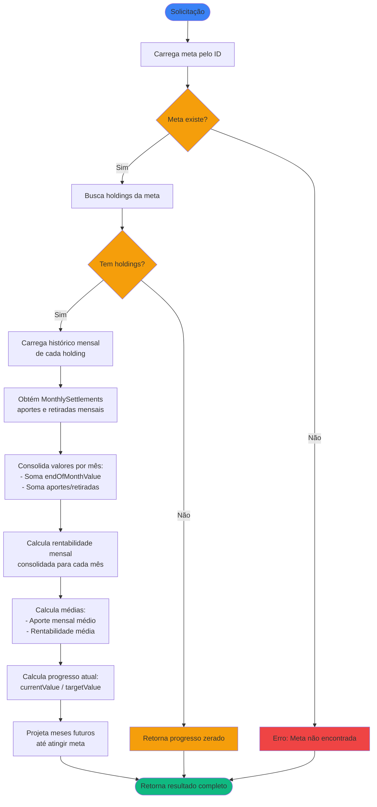

# Regras de Negócio - Calcular Progresso de Meta Financeira

## Índice

1. [Objetivo](#1-objetivo)
2. [Entradas e Saídas](#2-entradas-e-saídas)
3. [Fluxo Principal](#3-fluxo-principal)
4. [Regras de Negócio](#4-regras-de-negócio)
5. [Fórmulas de Cálculo](#5-fórmulas-de-cálculo)
6. [Exemplos Numéricos](#6-exemplos-numéricos)

---

## 1. Objetivo

Calcular o progresso atual de uma meta financeira e projetar quando ela será atingida, com base no histórico de valores e aportes das posições (`AssetHolding`) associadas à meta.

O sistema consolida o histórico mensal de todas as posições vinculadas, calcula médias de aporte e rentabilidade, e projeta valores futuros até atingir o objetivo. O cálculo utiliza os dados de histórico mensal (`HoldingHistoryEntry`) e apurações mensais (ver [RN - Calcular Aportes de Investimento.md](RN%20-%20Calcular%20Aportes%20de%20Investimento.md)) para cada posição, consolidando os valores para a meta como um todo.

---

## 2. Entradas e Saídas

### Entradas

| Campo    | Tipo | Descrição                        |
|----------|------|----------------------------------|
| `goalId` | Long | Identificador da meta financeira |

### Saídas

| Campo                     | Tipo                          | Descrição                                              |
|---------------------------|-------------------------------|--------------------------------------------------------|
| `goal`                    | FinancialGoal                 | A meta financeira                                      |
| `holdings`                | List\<AssetHolding\>          | Lista de posições associadas à meta                    |
| `currentValue`            | Double                        | Valor atual consolidado de todas as posições           |
| `progressPercentage`      | Double                        | Percentual de progresso em direção ao objetivo         |
| `avgMonthlyContribution`  | Double                        | Média de aportes mensais                               |
| `avgMonthlyReturnRate`    | Double                        | Taxa média de rentabilidade mensal                     |
| `estimatedCompletionDate` | YearMonth?                    | Data estimada para atingir a meta (null se impossível) |
| `monthlyHistory`          | List\<GoalMonthlySnapshot\>   | Histórico mensal consolidado                           |
| `projections`             | List\<GoalMonthlyProjection\> | Projeções para meses futuros                           |

### Estruturas de Dados

```kotlin
data class GoalMonthlySnapshot(
    val referenceDate: YearMonth,
    val totalValue: Double,
    val totalInvested: Double,
    val totalContributions: Double,
    val totalWithdrawals: Double,
    val monthlyReturnRate: Double
)

data class GoalMonthlyProjection(
    val referenceDate: YearMonth,
    val projectedValue: Double,
    val projectedContribution: Double,
    val projectedReturn: Double
)
```

**Onde:**

- `referenceDate`: Mês e ano de referência do snapshot
- `totalValue`: Valor consolidado de todas as posições no final do mês
- `totalInvested`: Valor total investido consolidado de todas as posições no final do mês
- `totalContributions`: Soma de todos os aportes consolidados do mês
- `totalWithdrawals`: Soma de todas as retiradas consolidadas do mês
- `monthlyReturnRate`: Rentabilidade mensal consolidada (em percentual)
- `projectedValue`: Valor projetado para o mês futuro
- `projectedContribution`: Aporte projetado para o mês futuro
- `projectedReturn`: Rendimento projetado para o mês futuro

---

## 3. Fluxo Principal



---

## 4. Regras de Negócio

### 4.1. Validação da Meta

**Regra:** A meta deve existir no sistema e ter `targetValue` > 0.

**Comportamento:**

- Se meta não existe: retorna erro
- Se `targetValue` ≤ 0: retorna erro
- Se meta existe e `targetValue` > 0: prossegue com o cálculo

### 4.2. Validação de Owner

**Regra:** Todas as posições associadas a uma meta devem pertencer ao mesmo Owner da meta.

**Contexto:** Esta validação é aplicada no momento da associação (
ver [RN - Associar Posição a Meta Financeira](RN%20-%20Associar%20Posição%20a%20Meta%20Financeira.md)), não durante o cálculo.

### 4.3. Metas sem Posições

**Regra:** Uma meta pode existir sem posições associadas.

**Comportamento:** Retorna resultado com valores zerados:

- `currentValue`: 0,00
- `progressPercentage`: 0,00
- `avgMonthlyContribution`: 0,00
- `avgMonthlyReturnRate`: 0,00
- `estimatedCompletionDate`: null
- `monthlyHistory`: lista vazia
- `projections`: lista vazia

### 4.4. Consolidação por Mês

**Regra:** Os valores mensais são consolidados somando os valores de todas as posições associadas à meta.

**Fórmulas por mês:**

- `totalValue(m)` = Σ `endOfMonthValue(m)` de todos os holdings
- `totalInvested(m)` = Σ `totalInvested(m)` de todos os holdings
- `totalContributions(m)` = Σ `totalContributions(m)` de todos os holdings (obtido de `MonthlySettlement` - ver [RN - Calcular Aportes de Investimento.md](RN%20-%20Calcular%20Aportes%20de%20Investimento.md))
- `totalWithdrawals(m)` = Σ `totalWithdrawals(m)` de todos os holdings (obtido de `MonthlySettlement`)

**Comportamento:**

- Se um holding não possui histórico ou apurações para um mês, considera-se valores zero para aquele holding naquele mês
- A consolidação soma todos os holdings disponíveis, mesmo que alguns não tenham dados para o período

### 4.5. Cálculo de Rentabilidade Mensal Consolidada

**Regra:** A rentabilidade mensal consolidada utiliza a mesma lógica do cálculo de rendimento mensal individual (ver [RN - Calcular Rendimento Mensal de Investimento.md](RN%20-%20Calcular%20Rendimento%20Mensal%20de%20Investimento.md)), mas consolidada para todas as posições.

**Fórmula:** Ver seção [5.2. Rentabilidade Mensal Consolidada](#52-rentabilidade-mensal-consolidada)

**Comportamento:**

- O valor inicial do mês é o valor final consolidado do mês anterior (ou zero se for o primeiro mês)
- O valor final do mês é a soma dos valores finais de todas as posições
- Os aportes e retiradas são consolidados de todas as posições
- Se `valorInicial = 0` ou não houver dados para nenhuma posição: o mês não é incluído no histórico (rentabilidade = 0)

### 4.6. Cálculo de Médias

**Regra:** As médias são calculadas sobre meses válidos com histórico consolidado, seguindo a mesma lógica do cálculo de balanço médio e rentabilidade média (ver [RN - Calcular Balanço Médio e Rentabilidade Média.md](RN%20-%20Calcular%20Balanço%20Médio%20e%20Rentabilidade%20Média.md)).

**Fórmulas:**

- `avgMonthlyContribution` = média aritmética de todos os `totalContributions` mensais consolidados
- `avgMonthlyReturnRate` = média aritmética de todas as rentabilidades mensais válidas (excluindo meses com `valorInicial = 0`)

**Comportamento:**

- Se não houver meses válidos para rentabilidade, `avgMonthlyReturnRate = 0`
- A média de aportes considera todos os meses com dados, incluindo meses com aporte zero

### 4.7. Projeção de Valores Futuros

**Regra:** A projeção utiliza as médias históricas para simular meses futuros até atingir a meta.

**Fórmula:** Ver seção [5.3. Projeção de Conclusão](#53-projeção-de-conclusão)

**Comportamento:**

- Projeções iniciam a partir do mês seguinte ao último histórico
- Projeção máxima: 120 meses (10 anos)
- Encerra ao atingir `targetValue` ou ao completar 120 meses

### 4.8. Meta Inalcançável

**Regra:** Se após 120 meses a meta não for atingida, considera-se que a projeção é incerta.

**Comportamento:**

- `estimatedCompletionDate`: null
- `projections`: contém os 120 meses projetados
- Meta pode ser alcançada se houver aumento nos aportes ou rentabilidade

### 4.9. Período de Análise

**Regra:** O histórico considera desde a `startDate` da meta até o último mês completo com histórico disponível.

**Comportamento:**

- Meses anteriores a `startDate`: ignorados
- `currentValue` é o valor consolidado do último mês com histórico completo
- Meses futuros (parciais) não são considerados no histórico

### 4.10. Tratamento de Retiradas

**Regra:** Retiradas são consideradas no cálculo de rentabilidade mensal, mas não nas projeções futuras.

**Comportamento:**

- Retiradas são obtidas através de `totalWithdrawals` de `MonthlySettlement` e consideradas no cálculo de rentabilidade mensal
- A média de aportes mensais (`avgMonthlyContribution`) considera apenas aportes (`totalContributions`), não descontando retiradas
- Projeções utilizam apenas `avgMonthlyContribution` (aportes), não considerando retiradas futuras


---

## 5. Fórmulas de Cálculo

### 5.1. Progresso Atual

```
progressPercentage = (currentValue / targetValue) × 100
```

**Tratamento especial:**

- Se `targetValue` = 0: progressPercentage = 0

### 5.2. Rentabilidade Mensal Consolidada

A rentabilidade mensal consolidada segue a mesma lógica do cálculo de rendimento mensal individual (ver [RN - Calcular Rendimento Mensal de Investimento.md](RN%20-%20Calcular%20Rendimento%20Mensal%20de%20Investimento.md)), mas consolidada para todas as posições:

```
rendimentoAbsoluto(m) = valorFinal(m) - valorInicial(m) - totalContributions(m) + totalWithdrawals(m)

Se valorInicial(m) > 0:
    rentabilidadeMensal(m) = (rendimentoAbsoluto(m) / valorInicial(m)) × 100
```

**Onde:**

- `valorFinal(m)`: Soma de `endOfMonthValue` de todas as posições no mês `m`
- `valorInicial(m)`: Valor final consolidado do mês anterior (ou zero se for o primeiro mês)
- `totalContributions(m)`: Soma de aportes consolidados do mês `m` (de `MonthlySettlement`)
- `totalWithdrawals(m)`: Soma de retiradas consolidadas do mês `m` (de `MonthlySettlement`)

### 5.3. Projeção de Conclusão

Para cada mês futuro `n`, a partir do mês seguinte ao último histórico:

```
projectedValue(0) = currentValue
projectedValue(n) = projectedValue(n-1) × (1 + avgMonthlyReturnRate/100) + avgMonthlyContribution
projectedReturn(n) = projectedValue(n-1) × (avgMonthlyReturnRate/100)
```

**Onde:**

- `projectedValue(0)`: `currentValue` (valor final consolidado do último mês com histórico)
- `avgMonthlyReturnRate`: Rentabilidade média mensal em percentual (ex: 1,5% = 1.5)
- `avgMonthlyContribution`: Aporte médio mensal em R$
- `projectedReturn(n)`: Rendimento projetado do mês `n` (apenas valorização, sem aporte)

**Critério de conclusão:**

O mês em que `projectedValue(n) >= targetValue` é a `estimatedCompletionDate`.

**Limites:**

- Projeção máxima: 120 meses (10 anos)
- Se após 120 meses a meta não for atingida: `estimatedCompletionDate = null`

---

## 6. Exemplos Numéricos

### 6.1. Exemplo: Meta com Uma Posição

**Cenário:** Meta financeira com uma única posição (CDB):

- Meta: R$ 100.000,00
- Valor atual: R$ 25.000,00
- Aporte médio mensal: R$ 1.500,00
- Rentabilidade média mensal: 0,80%

**Histórico consolidado (últimos 3 meses):**

| Mês      | Valor Final | Aportes | Retiradas | Rentabilidade Mensal |
|----------|-------------|---------|------------|----------------------|
| 2025-01  | R$ 20.000,00 | R$ 1.500,00 | R$ 0,00 | 0,75% |
| 2025-02  | R$ 22.000,00 | R$ 1.500,00 | R$ 0,00 | 0,82% |
| 2025-03  | R$ 25.000,00 | R$ 1.500,00 | R$ 0,00 | 0,83% |

**Cálculo de progresso:**

```
progressPercentage = (25.000 / 100.000) × 100 = 25,00%
```

**Projeção:**

| Mês | Valor Inicial | Rendimento | Aporte | Valor Final |
|-----|---------------|------------|--------|-------------|
| 1   | 25.000,00     | 200,00     | 1.500  | 26.700,00   |
| 2   | 26.700,00     | 213,60     | 1.500  | 28.413,60   |
| 3   | 28.413,60     | 227,31     | 1.500  | 30.140,91   |
| ... | ...           | ...        | ...    | ...         |
| 35  | 98.234,56     | 785,88     | 1.500  | 100.520,44  |

**Cálculo do mês 35:**
- Valor Inicial: R$ 98.234,56 (do mês 34)
- Rendimento: 98.234,56 × (0,80 / 100) = R$ 785,88
- Aporte: R$ 1.500,00
- Valor Final: 98.234,56 + 785,88 + 1.500,00 = R$ 100.520,44

**Resultado:** Meta alcançada no mês 35, quando o valor projetado (R$ 100.520,44) ultrapassa o objetivo (R$ 100.000,00).

### 6.2. Exemplo: Meta com Múltiplas Posições

**Cenário:** Meta financeira com três posições:

- Meta: R$ 200.000,00
- Posições: CDB, Ações PETR4, Fundo Multimercado

**Histórico consolidado (últimos 3 meses):**

| Mês      | Valor Final | Aportes | Retiradas | Rentabilidade Mensal |
|----------|-------------|---------|-----------|----------------------|
| 2025-01  | R$ 50.000,00 | R$ 3.000,00 | R$ 0,00 | 1,20% |
| 2025-02  | R$ 55.000,00 | R$ 3.000,00 | R$ 0,00 | 1,50% |
| 2025-03  | R$ 60.000,00 | R$ 3.000,00 | R$ 0,00 | 1,67% |

**Cálculo de médias:**

```
avgMonthlyContribution = (3.000 + 3.000 + 3.000) / 3 = R$ 3.000,00
avgMonthlyReturnRate = (1,20 + 1,50 + 1,67) / 3 = 1,46% ao mês
```

**Cálculo de progresso:**

```
progressPercentage = (60.000 / 200.000) × 100 = 30,00%
```

**Projeção:**

| Mês | Valor Inicial | Rendimento | Aporte | Valor Final |
|-----|---------------|------------|--------|-------------|
| 1   | 60.000,00     | 876,00     | 3.000  | 63.876,00   |
| 2   | 63.876,00     | 932,59     | 3.000  | 67.808,59   |
| ... | ...           | ...        | ...    | ...         |
| 28  | 198.234,56    | 2.894,22   | 3.000  | 204.128,78  |

**Resultado:** Meta alcançada no mês 28, quando o valor projetado (R$ 204.128,78) ultrapassa o objetivo (R$ 200.000,00).

### 6.3. Exemplo: Meta com Retiradas

**Cenário:** Meta financeira com histórico de retiradas:

- Meta: R$ 150.000,00
- Valor atual: R$ 80.000,00

**Histórico consolidado (últimos 3 meses):**

| Mês      | Valor Final | Aportes | Retiradas | Rentabilidade Mensal |
|----------|-------------|---------|-----------|----------------------|
| 2025-01  | R$ 75.000,00 | R$ 2.000,00 | R$ 0,00 | 1,00% |
| 2025-02  | R$ 78.000,00 | R$ 1.000,00 | R$ 500,00 | 1,28% |
| 2025-03  | R$ 80.000,00 | R$ 2.000,00 | R$ 0,00 | 0,00% |

**Cálculo de médias:**

```
avgMonthlyContribution = (2.000 + 1.000 + 2.000) / 3 = R$ 1.666,67
avgMonthlyReturnRate = (1,00 + 1,28 + 0,00) / 3 = 0,76% ao mês
(Nota: mês 3 teve rentabilidade 0% pois valor inicial = 0 após considerar retirada)
```

**Cálculo de progresso:**

```
progressPercentage = (80.000 / 150.000) × 100 = 53,33%
```

**Projeção:**

| Mês | Valor Inicial | Rendimento | Aporte | Valor Final |
|-----|---------------|------------|--------|-------------|
| 1   | 80.000,00     | 608,00     | 1.666,67 | 82.274,67 |
| 2   | 82.274,67     | 625,29     | 1.666,67 | 84.566,63 |
| ... | ...           | ...        | ...    | ...         |
| 38  | 148.234,56    | 1.126,58   | 1.666,67 | 151.027,81 |

**Resultado:** Meta alcançada no mês 38, considerando apenas aportes médios (retiradas não são projetadas).

### 6.4. Exemplo: Meta Inalcançável

**Cenário:** Meta financeira com aportes insuficientes:

- Meta: R$ 500.000,00
- Valor atual: R$ 50.000,00
- Aporte médio mensal: R$ 500,00
- Rentabilidade média mensal: 0,50%

**Cálculo de progresso:**

```
progressPercentage = (50.000 / 500.000) × 100 = 10,00%
```

**Projeção (primeiros e últimos meses):**

| Mês | Valor Inicial | Rendimento | Aporte | Valor Final |
|-----|---------------|------------|--------|-------------|
| 1   | 50.000,00     | 250,00     | 500    | 50.750,00   |
| 2   | 50.750,00     | 253,75     | 500    | 51.503,75   |
| ... | ...           | ...        | ...    | ...         |
| 120 | 108.234,56    | 541,17     | 500    | 109.275,73  |

**Resultado:** Após 120 meses (10 anos), o valor projetado (R$ 109.275,73) ainda está abaixo da meta (R$ 500.000,00). `estimatedCompletionDate = null`, indicando que a meta não é alcançável com os aportes e rentabilidade atuais.

**Nota:** A meta pode ser alcançada se houver aumento nos aportes mensais ou melhoria na rentabilidade média.

---

## Referências

- [Modelagem de Dominio.md](Modelagem%20de%20Dominio.md) - Definição das entidades `FinancialGoal`, `AssetHolding`, `HoldingHistoryEntry` e seus subtipos
- [RN - Calcular Aportes de Investimento.md](RN%20-%20Calcular%20Aportes%20de%20Investimento.md) - Utiliza aportes mensais (`MonthlySettlement`) para consolidação
- [RN - Calcular Rendimento Mensal de Investimento.md](RN%20-%20Calcular%20Rendimento%20Mensal%20de%20Investimento.md) - Base para cálculo de rentabilidade mensal consolidada
- [RN - Calcular Balanço Médio e Rentabilidade Média.md](RN%20-%20Calcular%20Balanço%20Médio%20e%20Rentabilidade%20Média.md) - Base para cálculo de médias
- [RN - Criar novo registro de histórico.md](RN%20-%20Criar%20novo%20registro%20de%20histórico.md) - Como o histórico mensal (`HoldingHistoryEntry`) é gerado
- [RN - Associar Posição a Meta Financeira.md](RN%20-%20Associar%20Posição%20a%20Meta%20Financeira.md) - Regras de associação de posições a metas
