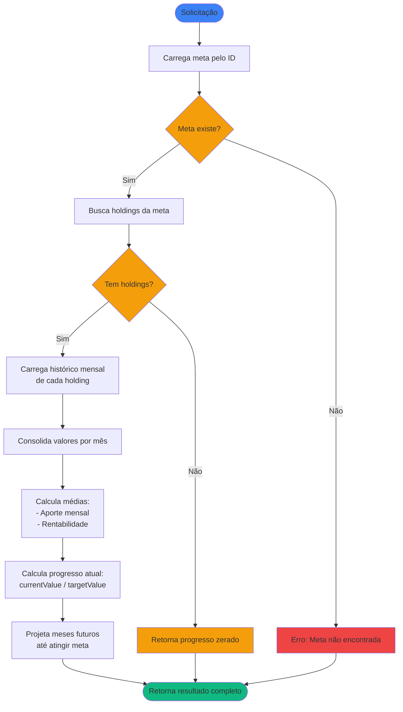

# Regras de Negócio - Calcular Progresso de Meta Financeira

## Índice

1. [Objetivo](#1-objetivo)
2. [Entradas e Saídas](#2-entradas-e-saídas)
3. [Fluxo Principal](#3-fluxo-principal)
4. [Regras de Negócio](#4-regras-de-negócio)
5. [Fórmulas de Cálculo](#5-fórmulas-de-cálculo)

---

## 1. Objetivo

Calcular o progresso atual de uma meta financeira e projetar quando ela será atingida, com base no histórico de valores e aportes das posições (
`AssetHolding`) associadas à meta.

O sistema consolida o histórico mensal de todas as posições vinculadas, calcula médias de aporte e rentabilidade, e projeta valores futuros até
atingir o objetivo.

---

## 2. Entradas e Saídas

### Entradas

| Campo    | Tipo | Descrição                        |
|----------|------|----------------------------------|
| `goalId` | Long | Identificador da meta financeira |

### Saídas

| Campo                     | Tipo                          | Descrição                                              |
|---------------------------|-------------------------------|--------------------------------------------------------|
| `goal`                    | FinancialGoal                 | A meta financeira                                      |
| `holdings`                | List\<AssetHolding\>          | Lista de posições associadas à meta                    |
| `currentValue`            | Double                        | Valor atual consolidado de todas as posições           |
| `progressPercentage`      | Double                        | Percentual de progresso em direção ao objetivo         |
| `avgMonthlyContribution`  | Double                        | Média de aportes mensais                               |
| `avgMonthlyReturnRate`    | Double                        | Taxa média de rentabilidade mensal                     |
| `estimatedCompletionDate` | YearMonth?                    | Data estimada para atingir a meta (null se impossível) |
| `monthlyHistory`          | List\<GoalMonthlySnapshot\>   | Histórico mensal consolidado                           |
| `projections`             | List\<GoalMonthlyProjection\> | Projeções para meses futuros                           |

### Estruturas de Dados

```kotlin
data class GoalMonthlySnapshot(
    val referenceDate: YearMonth,
    val totalValue: Double,
    val totalInvested: Double,
    val contribution: Double,
    val monthlyReturnRate: Double
)

data class GoalMonthlyProjection(
    val referenceDate: YearMonth,
    val projectedValue: Double,
    val projectedContribution: Double,
    val projectedReturn: Double
)
```

---

## 3. Fluxo Principal



---

## 4. Regras de Negócio

### 4.1. Validação da Meta

**Regra:** A meta deve existir no sistema e ter `targetValue` > 0.

**Comportamento:**

- Se meta não existe: retorna erro
- Se `targetValue` ≤ 0: retorna erro
- Se meta existe e `targetValue` > 0: prossegue com o cálculo

### 4.2. Validação de Owner

**Regra:** Todas as posições associadas a uma meta devem pertencer ao mesmo Owner da meta.

**Contexto:** Esta validação é aplicada no momento da associação (
ver [RN - Associar Posição a Meta Financeira](RN%20-%20Associar%20Posição%20a%20Meta%20Financeira.md)), não durante o cálculo.

### 4.3. Metas sem Posições

**Regra:** Uma meta pode existir sem posições associadas.

**Comportamento:** Retorna resultado com valores zerados:

- `currentValue`: 0,00
- `progressPercentage`: 0,00
- `avgMonthlyContribution`: 0,00
- `avgMonthlyReturnRate`: 0,00
- `estimatedCompletionDate`: null
- `monthlyHistory`: lista vazia
- `projections`: lista vazia

### 4.4. Consolidação por Mês

**Regra:** Os valores mensais são consolidados somando os valores de todas as posições.

**Fórmulas por mês:**

- `totalValue` = Σ `endOfMonthValue` de todos os holdings
- `totalInvested` = Σ `totalInvested` de todos os holdings
- `contribution` = `totalInvested[mês atual]` - `totalInvested[mês anterior]`

**Comportamento:**

- Se um holding não possui histórico para um mês específico, considera-se valor zero para aquele holding naquele mês
- A consolidação soma todos os holdings disponíveis, mesmo que alguns não tenham dados históricos para o período

### 4.5. Cálculo de Rentabilidade Mensal

**Regra:** A rentabilidade de um mês é calculada isolando o rendimento do aporte.

**Fórmula:** Ver seção [5.2. Rentabilidade Mensal](#52-rentabilidade-mensal)

**Casos especiais:**

- Se `previousValue` = 0: rentabilidade = 0
- Primeiro mês do histórico: rentabilidade = 0

### 4.6. Cálculo de Médias

**Regra:** As médias são calculadas sobre meses válidos com histórico.

**Fórmulas:**

- `avgMonthlyContribution` = média aritmética de todos os aportes mensais
- `avgMonthlyReturnRate` = média aritmética de todas as rentabilidades mensais válidas

**Comportamento:**

- Meses com `previousValue = 0` são excluídos do cálculo de média de rentabilidade
- Apenas meses com rentabilidade válida (denominador > 0) são considerados
- Se não houver meses válidos para rentabilidade, `avgMonthlyReturnRate = 0`

### 4.7. Projeção de Valores Futuros

**Regra:** A projeção utiliza as médias históricas para simular meses futuros.

**Fórmula de projeção:**

```
V(0) = currentValue
V(n+1) = V(n) × (1 + rentabilidadeMédia) + aporteMédio
```

**Onde:**

- `V(0)` = `currentValue` (valor consolidado do último mês com histórico)
- Projeções iniciam a partir do mês seguinte ao último histórico

**Limites:**

- Projeção máxima: 120 meses (10 anos)
- Encerra ao atingir `targetValue`

### 4.8. Meta Inalcançável

**Regra:** Se após 120 meses a meta não for atingida, considera-se que a projeção é incerta.

**Comportamento:**

- `estimatedCompletionDate`: null
- `projections`: contém os 120 meses projetados
- Meta pode ser alcançada se houver aumento nos aportes ou rentabilidade

### 4.9. Período de Análise

**Regra:** O histórico considera desde a `startDate` da meta até o último mês completo com histórico disponível.

**Comportamento:**

- Meses anteriores a `startDate`: ignorados
- "Mês atual" refere-se ao último mês completo com histórico disponível
- `currentValue` é o valor consolidado do último mês com histórico completo
- Meses futuros (parciais) não são considerados no histórico
- Meses sem histórico para algum holding: considera valor zero para aquele holding
- Holdings adicionados à meta posteriormente: histórico consolidado considera apenas meses onde pelo menos um holding tem dados
- Médias são calculadas apenas sobre meses com dados válidos de todos os holdings considerados

### 4.10. Tratamento de Resgates

**Regra:** Tratamento de aportes negativos (resgates).

**Comportamento:**

- Se `contribution < 0` (resgate), o cálculo de rentabilidade permanece válido
- A média de aportes mensais pode ser negativa se houver mais resgates que aportes
- Projeções consideram aporte médio negativo (meta pode não ser alcançável)

### 4.11. Precisão e Arredondamento

**Regra:** Precisão e arredondamento de valores calculados.

**Comportamento:**

- Valores monetários: 2 casas decimais
- Percentuais: 2 casas decimais
- Rentabilidades: 4 casas decimais (0,0000)

---

## 5. Fórmulas de Cálculo

### 5.1. Progresso Atual

```
progressPercentage = (currentValue / targetValue) × 100
```

**Tratamento especial:**

- Se `targetValue` = 0: progressPercentage = 0

### 5.2. Rentabilidade Mensal

```
growthWithoutContribution = endOfMonthValue - contribution
monthlyReturn = (growthWithoutContribution - previousValue) / previousValue
```

**Onde:**

- `endOfMonthValue`: Valor consolidado no final do mês
- `contribution`: Aporte realizado no mês
- `previousValue`: Valor consolidado no final do mês anterior

### 5.3. Projeção de Conclusão

Para cada mês futuro `n`:

```
projectedValue(n) = projectedValue(n-1) × (1 + avgMonthlyReturnRate) + avgMonthlyContribution
```

O mês em que `projectedValue(n) >= targetValue` é a `estimatedCompletionDate`.

### 5.4. Exemplo Numérico

**Cenário:**

- Meta: R$ 100.000
- Valor atual: R$ 25.000
- Aporte médio mensal: R$ 1.500
- Rentabilidade média mensal: 0,8% (0,008)

**Projeção:**

| Mês | Valor Inicial | Rendimento | Aporte | Valor Final |
|-----|---------------|------------|--------|-------------|
| 1   | 25.000,00     | 200,00     | 1.500  | 26.700,00   |
| 2   | 26.700,00     | 213,60     | 1.500  | 28.413,60   |
| 3   | 28.413,60     | 227,31     | 1.500  | 30.140,91   |
| ... | ...           | ...        | ...    | ...         |
| 35  | 98.234,56     | 785,88     | 1.500  | 100.520,44  |

**Cálculo do mês 35:**
- Valor Inicial: R$ 98.234,56 (do mês 34)
- Rendimento: 98.234,56 × 0,008 = R$ 785,88
- Aporte: R$ 1.500,00
- Valor Final: 98.234,56 + 785,88 + 1.500,00 = R$ 100.520,44

**Resultado:** Meta alcançada no mês 35, quando o valor projetado (R$ 100.520,44) ultrapassa o objetivo (R$ 100.000,00).

**Nota:** Se a meta for atingida no meio de um mês, considera-se o mês completo em que o valor projetado ultrapassa o objetivo.

---

## Referências

- [Modelagem de Dominio.md](Modelagem%20de%20Dominio.md) - Definição das entidades FinancialGoal e AssetHolding
- [RN - Criar novo registro de histórico.md](RN%20-%20Criar%20novo%20registro%20de%20histórico.md) - Como o histórico mensal é gerado
- [RN - Associar Posição a Meta Financeira.md](RN%20-%20Associar%20Posição%20a%20Meta%20Financeira.md) - Regras de associação
