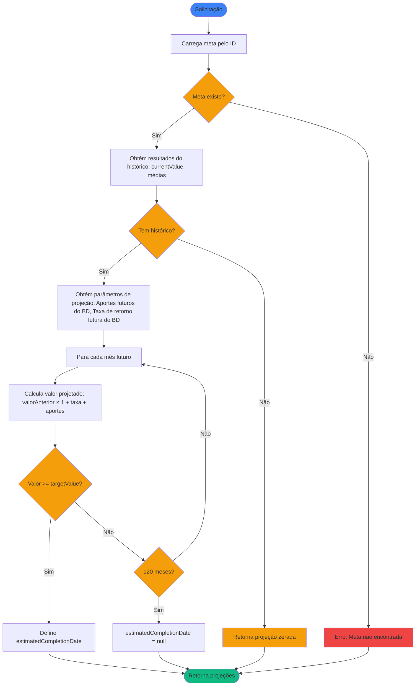

# Regras de Negócio - Calcular Projeção de Meta Financeira

## Índice

1. [Objetivo](#1-objetivo)
2. [Entradas e Saídas](#2-entradas-e-saídas)
3. [Fluxo Principal](#3-fluxo-principal)
4. [Regras de Negócio](#4-regras-de-negócio)
5. [Fórmulas de Cálculo](#5-fórmulas-de-cálculo)
6. [Exemplos Numéricos](#6-exemplos-numéricos)

---

## 1. Objetivo

Projetar valores futuros de uma meta financeira desde o próximo mês até a previsão de término da meta, estimando quando o objetivo será atingido com base nas médias históricas de aportes e rentabilidade.

O sistema utiliza os resultados do cálculo de histórico (ver [RN - Calcular Histórico de Meta Financeira.md](RN%20-%20Calcular%20Histórico%20de%20Meta%20Financeira.md)) para obter médias de aporte e rentabilidade, e projeta valores futuros mês a mês até atingir o objetivo ou completar o período máximo de projeção.

---

## 2. Entradas e Saídas

### Entradas

| Campo    | Tipo | Descrição                        |
|----------|------|----------------------------------|
| `goalId` | Long | Identificador da meta financeira |

**Dependências:**

- Requer os resultados do cálculo de histórico (ver [RN - Calcular Histórico de Meta Financeira.md](RN%20-%20Calcular%20Histórico%20de%20Meta%20Financeira.md)) para obter:
  - `currentValue`: Valor atual consolidado
  - `avgMonthlyContribution`: Média de aportes mensais
  - `avgMonthlyReturnRate`: Taxa média de rentabilidade mensal

### Saídas

A saída é um **mapa de `YearMonth` para `GoalMonthlyData`**, onde cada entrada representa um mês projetado desde o próximo mês até `estimatedCompletionDate` ou 120 meses:

**Estrutura do Mapa:**
```kotlin
Map<YearMonth, GoalMonthlyData>
```

**Estrutura de `GoalMonthlyData`:** Mesma estrutura do histórico (ver [RN - Calcular Histórico de Meta Financeira.md](RN%20-%20Calcular%20Histórico%20de%20Meta%20Financeira.md) seção 2).

**Fontes de Dados para Projeção:**

| Campo              | Fonte de Dados                                                                 |
|--------------------|--------------------------------------------------------------------------------|
| `contributions`    | Prioridade 1: Configuração do BD<br/>Prioridade 2: Média histórica             |
| `appreciationRate` | Prioridade 1: Taxa esperada configurada<br/>Prioridade 2: Média histórica      |
| `withdrawals`      | Geralmente 0 (retiradas não projetadas)                                        |
| Demais campos      | Calculados a partir dos valores acima (ver seção 5.1)                          |

---

## 3. Fluxo Principal



---

## 4. Regras de Negócio

### 4.1. Dependência do Histórico

**Regra:** A projeção requer resultados do cálculo de histórico para obter valores iniciais e médias.

**Comportamento:**

- Utiliza `currentValue` do histórico como valor inicial da projeção
- Utiliza `avgMonthlyContribution` e `avgMonthlyReturnRate` do histórico como valores padrão (se não houver valores configurados no BD)
- Se não houver histórico disponível: retorna projeção vazia ou utiliza valores configurados diretamente na meta

### 4.2. Projeção de Valores Futuros

**Regra:** A projeção utiliza valores de aportes e taxa de retorno (do BD ou médias históricas) para simular meses futuros até atingir a meta.

**Fórmula:** Ver seção [5.1. Projeção de Conclusão](#51-projeção-de-conclusão)

**Comportamento:**

- Projeções iniciam a partir do mês seguinte ao último histórico
- Projeção máxima: 120 meses (10 anos)
- Encerra ao atingir `targetValue` ou ao completar 120 meses
- Cada mês projetado utiliza:
  - `value` anterior como base
  - `appreciationRate` (buscar do BD ou usar média histórica)
  - `contributions` (buscar do BD ou usar média histórica)
  - `withdrawals` geralmente será 0 (retiradas não são projetadas)

### 4.3. Meta Inalcançável

**Regra:** Se após 120 meses a meta não for atingida, considera-se que a projeção é incerta.

**Comportamento:**

- `estimatedCompletionDate`: null
- `projections`: contém os 120 meses projetados
- Meta pode ser alcançada se houver aumento nos aportes ou rentabilidade

### 4.4. Obtenção de Parâmetros

**Fontes de dados:** Ver seção 2 (Saídas).

**Nota sobre retiradas:** `withdrawals = 0` nas projeções (retiradas não são projetadas).

---

## 5. Fórmulas de Cálculo

### 5.1. Projeção de Conclusão

Para cada mês futuro `n`, a partir do mês seguinte ao último histórico:

```
// Mês inicial (base)
value(0) = currentValue (último valor do histórico)

// Para cada mês n de projeção:
appreciation(n) = value(n-1) × (appreciationRate / 100)
growth(n) = appreciation(n) + contributions(n) - withdrawals(n)
growthRate(n) = (growth(n) / value(n-1)) × 100
value(n) = value(n-1) + growth(n)
```

**Onde:**

- `value(0)`: Valor final consolidado do último mês com histórico
- `appreciationRate`: Taxa de retorno projetada para o mês (buscar do BD ou usar média histórica)
- `contributions(n)`: Aportes totais projetados para o mês (buscar do BD ou usar média histórica)
- `withdrawals(n)`: Retiradas totais projetadas para o mês (geralmente 0 em projeções futuras)
- `appreciation(n)`: Lucro projetado do mês
- `growth(n)`: Crescimento total projetado (lucro + aportes - retiradas)
- `growthRate(n)`: Percentual de crescimento projetado
- `value(n)`: Valor projetado (valor anterior + crescimento)

**Critério de conclusão:**

O mês em que `value(n) >= targetValue` é a `estimatedCompletionDate`.

**Limites:**

- Projeção máxima: 120 meses (10 anos)
- Se após 120 meses a meta não for atingida: `estimatedCompletionDate = null`

---

## 6. Exemplos Numéricos

### 6.1. Exemplo: Projeção com Uma Posição

**Cenário:** Meta financeira com uma única posição (CDB):

- Meta: R$ 100.000,00
- Valor atual (do histórico): R$ 25.000,00
- Aporte médio mensal (do histórico): R$ 1.500,00
- Rentabilidade média mensal (do histórico): 0,80%

**Projeção (usando médias históricas):**

| Mês (YearMonth) | value       | contributions | withdrawals | appreciation | appreciationRate | growth      | growthRate |
|-----------------|-------------|---------------|-------------|--------------|------------------|-------------|------------|
| 2026-04         | 26.700,00   | 1.500,00      | 0,00        | 200,00       | 0,80%            | 1.700,00    | 6,80%      |
| 2026-05         | 28.413,60   | 1.500,00      | 0,00        | 213,60       | 0,80%            | 1.713,60    | 6,42%      |
| 2026-06         | 30.140,91   | 1.500,00      | 0,00        | 227,31       | 0,80%            | 1.727,31    | 6,08%      |
| ...             | ...         | ...           | ...         | ...          | ...              | ...         | ...        |
| 2028-02         | 100.520,44  | 1.500,00      | 0,00        | 801,88       | 0,80%            | 2.301,88    | 2,34%      |

**Cálculo detalhado do mês 2026-04:**
```
valorAnterior = 25.000,00 (último mês do histórico)
appreciationRate = 0,80% (média histórica)
contributions = 1.500,00 (média histórica)
withdrawals = 0,00

appreciation = 25.000,00 × 0,80% = 200,00
growth = 200,00 + 1.500,00 - 0,00 = 1.700,00
growthRate = (1.700 / 25.000) × 100 = 6,80%
value = 25.000,00 + 1.700,00 = 26.700,00
```

**Resultado:** Meta alcançada em 2028-02 (mês 35), quando o valor projetado (R$ 100.520,44) ultrapassa o objetivo (R$ 100.000,00).

### 6.2. Exemplo: Projeção com Múltiplas Posições

**Cenário:** Meta financeira com três posições:

- Meta: R$ 200.000,00
- Valor atual (do histórico): R$ 60.000,00
- Aporte médio mensal (do histórico): R$ 3.000,00
- Rentabilidade média mensal (do histórico): 1,46%

**Projeção (usando médias históricas):**

| Mês (YearMonth) | value       | contributions | withdrawals | appreciation | appreciationRate | growth      | growthRate |
|-----------------|-------------|---------------|-------------|--------------|------------------|-------------|------------|
| 2025-04         | 63.876,00   | 3.000,00      | 0,00        | 876,00       | 1,46%            | 3.876,00    | 6,46%      |
| 2025-05         | 67.808,59   | 3.000,00      | 0,00        | 932,59       | 1,46%            | 3.932,59    | 6,15%      |
| ...             | ...         | ...           | ...         | ...          | ...              | ...         | ...        |
| 2027-07         | 204.128,78  | 3.000,00      | 0,00        | 2.938,28     | 1,46%            | 5.938,28    | 2,99%      |

**Resultado:** Meta alcançada no mês 28, quando o valor projetado (R$ 204.128,78) ultrapassa o objetivo (R$ 200.000,00).

### 6.3. Exemplo: Projeção com Retiradas no Histórico

**Cenário:** Meta financeira com histórico de retiradas:

- Meta: R$ 150.000,00
- Valor atual (do histórico): R$ 80.000,00
- Aporte médio mensal (do histórico): R$ 1.666,67 (apenas aportes, sem descontar retiradas)
- Rentabilidade média mensal (do histórico): 0,76%

**Projeção (usando médias históricas, sem considerar retiradas futuras):**

| Mês (YearMonth) | value       | contributions | withdrawals | appreciation | appreciationRate | growth      | growthRate |
|-----------------|-------------|---------------|-------------|--------------|------------------|-------------|------------|
| 2025-04         | 82.274,67   | 1.666,67      | 0,00        | 608,00       | 0,76%            | 2.274,67    | 2,84%      |
| 2025-05         | 84.566,63   | 1.666,67      | 0,00        | 625,29       | 0,76%            | 2.291,96    | 2,79%      |
| ...             | ...         | ...           | ...         | ...          | ...              | ...         | ...        |
| 2028-05         | 151.027,81  | 1.666,67      | 0,00        | 1.141,41     | 0,76%            | 2.808,08    | 1,89%      |

**Resultado:** Meta alcançada em 2028-05 (mês 38), considerando apenas aportes médios (retiradas não são projetadas).

### 6.4. Exemplo: Meta Inalcançável

**Cenário:** Meta financeira com aportes insuficientes:

- Meta: R$ 500.000,00
- Valor atual (do histórico): R$ 50.000,00
- Aporte médio mensal (do histórico): R$ 500,00
- Rentabilidade média mensal (do histórico): 0,50%

**Projeção (primeiros e últimos meses):**

| Mês (YearMonth) | value       | contributions | withdrawals | appreciation | appreciationRate | growth      | growthRate |
|-----------------|-------------|---------------|-------------|--------------|------------------|-------------|------------|
| 2025-04         | 50.750,00   | 500,00        | 0,00        | 250,00       | 0,50%            | 750,00      | 1,50%      |
| 2025-05         | 51.503,75   | 500,00        | 0,00        | 253,75       | 0,50%            | 753,75      | 1,49%      |
| ...             | ...         | ...           | ...         | ...          | ...              | ...         | ...        |
| 2035-03         | 109.275,73  | 500,00        | 0,00        | 542,76       | 0,50%            | 1.042,76    | 0,96%      |

**Resultado:** Após 120 meses (10 anos), o valor projetado (R$ 109.275,73) ainda está abaixo da meta (R$ 500.000,00). `estimatedCompletionDate = null`, indicando que a meta não é alcançável com os aportes e rentabilidade atuais.

**Nota:** A meta pode ser alcançada se houver aumento nos aportes mensais ou melhoria na rentabilidade média.

---

## Referências

- [RN - Calcular Histórico de Meta Financeira.md](RN%20-%20Calcular%20Histórico%20de%20Meta%20Financeira.md) - Dependência: utiliza resultados do histórico e estrutura `GoalMonthlyData`
- [Modelagem de Dominio.md](Modelagem%20de%20Dominio.md) - Definição das entidades do domínio

