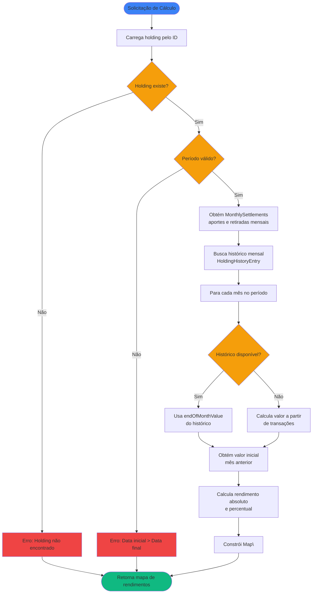

# Regras de Negócio - Calcular Rendimento Mensal de Investimento

## Índice

1. [Objetivo](#1-objetivo)
2. [Entradas e Saídas](#2-entradas-e-saídas)
3. [Fluxo Principal](#3-fluxo-principal)
4. [Regras de Negócio](#4-regras-de-negócio)
5. [Fórmulas de Cálculo](#5-fórmulas-de-cálculo)
6. [Exemplos Numéricos](#6-exemplos-numéricos)

---

## 1. Objetivo

Calcular o rendimento mensal (absoluto e percentual) de uma posição de investimento (`AssetHolding`) para cada mês de um período especificado. O rendimento mensal representa a variação do valor da posição após descontar os aportes e somar as retiradas ocorridas no mês.

O cálculo utiliza o histórico mensal (`HoldingHistoryEntry`) quando disponível, ou calcula os valores a partir das transações (`AssetTransaction`) quando o histórico não estiver disponível. Os aportes e retiradas mensais são obtidos através do cálculo de apurações mensais (ver [RN - Calcular Aportes de Investimento.md](RN%20-%20Calcular%20Aportes%20de%20Investimento.md)).

---

## 2. Entradas e Saídas

### Entradas

| Campo       | Tipo        | Descrição                                                      | Obrigatório |
|-------------|-------------|----------------------------------------------------------------|-------------|
| `holdingId` | Long        | Identificador da posição (`AssetHolding`)                      | Sim         |
| `startDate` | LocalDate?  | Data inicial do período (inclusive). Se null, considera desde a primeira transação/histórico | Não         |
| `endDate`   | LocalDate?  | Data final do período (inclusive). Se null, considera até a última transação/histórico | Não         |

### Saídas

| Campo              | Tipo                                    | Descrição                                                      |
|--------------------|-----------------------------------------|----------------------------------------------------------------|
| `monthlyReturns` | Map\<YearMonth, MonthlyReturn\> | Mapa de rendimentos mensais agrupados por mês/ano              |

### Estruturas de Dados

```kotlin
data class MonthlyReturn(
    val referenceDate: YearMonth,
    val initialValue: Double,
    val finalValue: Double,
    val totalContributions: Double,
    val totalWithdrawals: Double,
    val absoluteReturn: Double,
    val percentageReturn: Double
)
```

**Onde:**

- `referenceDate`: Mês e ano de referência do cálculo
- `initialValue`: Valor da posição no início do mês (valor do final do mês anterior)
- `finalValue`: Valor da posição no final do mês
- `totalContributions`: Soma de todos os aportes do mês
- `totalWithdrawals`: Soma de todas as retiradas do mês
- `absoluteReturn`: Rendimento absoluto do mês em R$ (valorFinal - valorInicial - aportes + retiradas)
- `percentageReturn`: Rendimento percentual do mês (rendimentoAbsoluto / valorInicial × 100)

---

## 3. Fluxo Principal



**Etapas:**

1. **Validação**: Verifica se a posição existe no sistema e se o período é válido
2. **Obtenção de Aportes/Retiradas**: Utiliza o cálculo de apurações mensais para obter aportes e retiradas de cada mês
3. **Obtenção de Valores de Mercado**: Para cada mês, busca o histórico mensal (`HoldingHistoryEntry`) ou calcula a partir de transações
4. **Cálculo do Valor Inicial**: Para cada mês, obtém o valor final do mês anterior como valor inicial
5. **Cálculo do Rendimento**: Para cada mês, calcula:
   - Rendimento absoluto: `valorFinal - valorInicial - aportes + retiradas`
   - Rendimento percentual: `(rendimentoAbsoluto / valorInicial) × 100`
6. **Construção do Map**: Cria o mapa com `YearMonth` como chave e `MonthlyReturn` como valor

---

## 4. Regras de Negócio

### 4.1. Validação da Posição

**Regra:** A posição (`AssetHolding`) deve existir no sistema.

**Comportamento:**

- Se posição não existe: retorna erro `"Holding não encontrado: {holdingId}"`
- Se posição existe: prossegue com o cálculo

### 4.2. Validação do Período

**Regra:** O período especificado deve ser válido.

**Comportamento:**

- Se `startDate > endDate`: retorna erro `"Data inicial não pode ser posterior à data final"` antes de executar o cálculo
- Se apenas `startDate` fornecido: considera desde `startDate` até a última data disponível
- Se apenas `endDate` fornecido: considera desde a primeira data disponível até `endDate`
- Se ambos fornecidos: considera apenas o intervalo `[startDate, endDate]`
- Se nenhum fornecido: considera todo o período disponível (desde a primeira transação/histórico até a última)

### 4.3. Fonte de Dados para Valores de Mercado

**Regra:** O sistema utiliza duas fontes de dados, com prioridade para o histórico mensal.

**Prioridade 1 - Histórico Mensal (`HoldingHistoryEntry`):**

- Se existe histórico para o mês: utiliza `endOfMonthValue` como valor final do mês
- Se existe histórico para o mês anterior: utiliza `endOfMonthValue` do mês anterior como valor inicial
- Vantagem: Valores já calculados e validados, mais preciso e eficiente

**Prioridade 2 - Cálculo a partir de Transações:**

- Se não existe histórico: calcula o valor a partir das transações do mês
- Para Renda Variável: `valor = quantity × unitPrice` (da última transação do mês)
- Para Renda Fixa e Fundos: `valor = soma dos aportes - soma dos resgates` (acumulado até o mês)
- Desvantagem: Pode não refletir valorização real do ativo, apenas movimentações

**Comportamento:**

- Sempre tenta usar histórico primeiro
- Se histórico não disponível, calcula a partir de transações
- Se nenhum dos dois disponível, o mês não aparece no resultado (ou aparece com valores zero)

### 4.4. Cálculo do Valor Inicial do Mês

**Regra:** O valor inicial de um mês é o valor final do mês anterior.

**Comportamento:**

- **Mês com histórico anterior disponível**: `valorInicial = endOfMonthValue(mês anterior)`
- **Mês sem histórico anterior, mas com transações**: Calcula valor acumulado até o final do mês anterior
- **Primeiro mês da posição**: `valorInicial = 0` (não havia posição antes)
- **Mês sem histórico e sem transações anteriores**: `valorInicial = 0`

**Exemplo:**

```
Histórico:
- 2025-01: endOfMonthValue = R$ 10.000,00
- 2025-02: endOfMonthValue = R$ 12.000,00

Cálculo para 2025-02:
- valorInicial = R$ 10.000,00 (valor final de 2025-01)
- valorFinal = R$ 12.000,00 (valor final de 2025-02)
```

### 4.5. Obtenção de Aportes e Retiradas

**Regra:** Os aportes e retiradas mensais são obtidos através do cálculo de apurações mensais.

**Comportamento:**

- Utiliza o use case ou função que calcula `MonthlySettlement` (ver [RN - Calcular Aportes de Investimento.md](RN%20-%20Calcular%20Aportes%20de%20Investimento.md))
- Para cada mês, obtém:
  - `totalContributions`: Soma de todas as transações `PURCHASE` do mês
  - `totalWithdrawals`: Soma de todas as transações `SALE` do mês
- Se um mês não tiver transações: `totalContributions = 0` e `totalWithdrawals = 0`

### 4.6. Cálculo do Rendimento Absoluto

**Regra:** O rendimento absoluto é a diferença entre o valor final e inicial, ajustado por aportes e retiradas.

**Fórmula:** `rendimentoAbsoluto = valorFinal - valorInicial - aportes + retiradas`

**Comportamento:**

- **Rendimento positivo**: O ativo valorizou mais do que os aportes adicionados
- **Rendimento negativo**: O ativo desvalorizou ou os aportes foram maiores que a valorização
- **Rendimento zero**: O valor final é exatamente igual ao valor inicial mais aportes menos retiradas

**Justificativa da Fórmula:**

- `valorFinal`: Valor total da posição no final do mês
- `- valorInicial`: Remove o valor que já existia no início do mês
- `- aportes`: Remove o valor adicionado durante o mês (não é rendimento, é capital investido)
- `+ retiradas`: Adiciona o valor retirado (que estava no valor inicial, mas foi retirado)

**Exemplo:**

```
Valor inicial: R$ 10.000,00
Aportes: R$ 2.000,00
Retiradas: R$ 500,00
Valor final: R$ 12.800,00

Rendimento absoluto = 12.800 - 10.000 - 2.000 + 500 = R$ 1.300,00
```

### 4.7. Cálculo do Rendimento Percentual

**Regra:** O rendimento percentual é a taxa de retorno mensal em percentual.

**Fórmula:** `rendimentoPercentual = (rendimentoAbsoluto / valorInicial) × 100`

**Comportamento:**

- **Se `valorInicial = 0`**: Não é possível calcular percentual (divisão por zero)
  - Retorna `percentageReturn = 0` ou `null` (dependendo da implementação)
  - Ou retorna um valor especial indicando que não há base para cálculo
- **Rendimento positivo**: Percentual positivo indica valorização
- **Rendimento negativo**: Percentual negativo indica desvalorização
- **Precisão**: Percentual com 2 casas decimais

**Exemplo:**

```
Valor inicial: R$ 10.000,00
Rendimento absoluto: R$ 1.300,00

Rendimento percentual = (1.300 / 10.000) × 100 = 13,00%
```

### 4.8. Meses sem Dados

**Regra:** Meses sem histórico e sem transações não aparecem no resultado.

**Comportamento:**

- Se um mês não possui histórico nem transações: não é incluído no mapa de retorno
- O mapa contém apenas meses com pelo menos uma fonte de dados (histórico ou transações)
- O mapa é ordenado cronologicamente por chave (`YearMonth`)

### 4.9. Primeiro Mês da Posição

**Regra:** O primeiro mês de uma posição tem valor inicial zero.

**Comportamento:**

- Se é o primeiro mês com transações ou histórico: `valorInicial = 0`
- O rendimento absoluto será: `valorFinal - aportes + retiradas`
- O rendimento percentual não pode ser calculado (divisão por zero), retorna `0` ou valor especial

**Exemplo:**

```
Primeiro mês (2025-01):
- Aportes: R$ 5.000,00
- Retiradas: R$ 0,00
- Valor final: R$ 5.100,00

Rendimento absoluto = 5.100 - 0 - 5.000 + 0 = R$ 100,00
Rendimento percentual = não calculável (valor inicial = 0)
```

### 4.10. Precisão e Arredondamento

**Regra:** Precisão e arredondamento de valores calculados.

**Comportamento:**

- Valores monetários (absolutos): 2 casas decimais
- Percentuais: 2 casas decimais
- Valores zero são representados como `0.00`

### 4.11. Ordenação do Map

**Regra:** O mapa de rendimentos é ordenado cronologicamente por chave.

**Comportamento:**

- As chaves do mapa (`YearMonth`) são ordenadas em ordem crescente (do mais antigo para o mais recente)
- Facilita iteração e análise temporal dos rendimentos

### 4.12. Integração com Outros Cálculos

**Regra:** O cálculo de rendimento mensal depende de outros cálculos do sistema.

**Dependências:**

- **Cálculo de Aportes Mensais**: Utiliza `MonthlySettlement` para obter aportes e retiradas
- **Histórico Mensal**: Utiliza `HoldingHistoryEntry` para obter valores de mercado
- **Cálculo de Posição**: Pode utilizar `CalculateHoldingPositionUseCase` quando histórico não disponível

**Comportamento:**

- O cálculo de rendimento mensal é uma camada superior que agrega dados de outras fontes
- Não recalcula dados que já foram calculados por outros use cases
- Reutiliza resultados de cálculos anteriores para eficiência

---

## 5. Fórmulas de Cálculo

### 5.1. Obtenção do Valor Final do Mês

O valor final de um mês `m` é obtido de duas formas, com prioridade para histórico:

**Prioridade 1 - Histórico Mensal:**
```
valorFinal(m) = endOfMonthValue(m)
                onde endOfMonthValue vem de HoldingHistoryEntry
```

**Prioridade 2 - Cálculo a partir de Transações:**
```
Para Renda Variável:
valorFinal(m) = quantity × unitPrice
                da última transação do mês

Para Renda Fixa e Fundos:
valorFinal(m) = Σ totalValue(PURCHASE) - Σ totalValue(SALE)
                acumulado até o final do mês
```

### 5.2. Obtenção do Valor Inicial do Mês

O valor inicial de um mês `m` é o valor final do mês anterior:

```
valorInicial(m) = valorFinal(m - 1)

Se m é o primeiro mês:
valorInicial(m) = 0
```

### 5.3. Rendimento Absoluto

Para cada mês `m` (YearMonth), calcula-se:

```
rendimentoAbsoluto(m) = valorFinal(m) - valorInicial(m) - totalContributions(m) + totalWithdrawals(m)
```

**Onde:**
- `valorFinal(m)`: Valor da posição no final do mês `m`
- `valorInicial(m)`: Valor da posição no início do mês `m` (valor final do mês anterior)
- `totalContributions(m)`: Soma de todos os aportes do mês `m` (obtido de `MonthlySettlement`)
- `totalWithdrawals(m)`: Soma de todas as retiradas do mês `m` (obtido de `MonthlySettlement`)

### 5.4. Rendimento Percentual

Para cada mês `m` (YearMonth), calcula-se:

```
Se valorInicial(m) > 0:
    rendimentoPercentual(m) = (rendimentoAbsoluto(m) / valorInicial(m)) × 100

Se valorInicial(m) = 0:
    rendimentoPercentual(m) = 0 ou null (não calculável)
```

**Resultado:** Uma entrada no mapa `Map<YearMonth, MonthlyReturn>` para cada mês que possui dados suficientes para o cálculo.

---

## 6. Exemplos Numéricos

### 6.1. Exemplo: Renda Variável com Histórico Disponível

**Cenário:** Posição de ações PETR4 com histórico mensal disponível:

| Mês      | endOfMonthValue | Aportes | Retiradas |
|----------|-----------------|---------|-----------|
| 2025-01  | R$ 5.636,00     | R$ 5.636,00 | R$ 0,00 |
| 2025-02  | R$ 7.376,00     | R$ 1.740,00 | R$ 0,00 |
| 2025-03  | R$ 6.776,00     | R$ 0,00 | R$ 600,00 |

**Cálculo para 2025-02:**

```
valorInicial = R$ 5.636,00 (endOfMonthValue de 2025-01)
valorFinal = R$ 7.376,00 (endOfMonthValue de 2025-02)
aportes = R$ 1.740,00
retiradas = R$ 0,00

rendimentoAbsoluto = 7.376 - 5.636 - 1.740 + 0 = R$ 0,00
rendimentoPercentual = (0 / 5.636) × 100 = 0,00%
```

**Interpretação:** O valor da posição aumentou exatamente pelo valor dos aportes, sem valorização adicional.

**Cálculo para 2025-03:**

```
valorInicial = R$ 7.376,00 (endOfMonthValue de 2025-02)
valorFinal = R$ 6.776,00 (endOfMonthValue de 2025-03)
aportes = R$ 0,00
retiradas = R$ 600,00

rendimentoAbsoluto = 6.776 - 7.376 - 0 + 600 = R$ 0,00
rendimentoPercentual = (0 / 7.376) × 100 = 0,00%
```

**Interpretação:** O valor da posição diminuiu exatamente pelo valor da retirada, sem desvalorização adicional.

**Resultado - Map de Rendimentos:**

```kotlin
Map(
    2025-02 -> MonthlyReturn(
        referenceDate = 2025-02,
        initialValue = 5636.00,
        finalValue = 7376.00,
        totalContributions = 1740.00,
        totalWithdrawals = 0.00,
        absoluteReturn = 0.00,
        percentageReturn = 0.00
    ),
    2025-03 -> MonthlyReturn(
        referenceDate = 2025-03,
        initialValue = 7376.00,
        finalValue = 6776.00,
        totalContributions = 0.00,
        totalWithdrawals = 600.00,
        absoluteReturn = 0.00,
        percentageReturn = 0.00
    )
)
```

### 6.2. Exemplo: Renda Variável com Valorização

**Cenário:** Posição de ações VALE3 com valorização no mês:

| Mês      | endOfMonthValue | Aportes | Retiradas |
|----------|-----------------|---------|-----------|
| 2025-01  | R$ 10.000,00    | R$ 10.000,00 | R$ 0,00 |
| 2025-02  | R$ 12.500,00    | R$ 2.000,00 | R$ 0,00 |

**Cálculo para 2025-02:**

```
valorInicial = R$ 10.000,00
valorFinal = R$ 12.500,00
aportes = R$ 2.000,00
retiradas = R$ 0,00

rendimentoAbsoluto = 12.500 - 10.000 - 2.000 + 0 = R$ 500,00
rendimentoPercentual = (500 / 10.000) × 100 = 5,00%
```

**Interpretação:** O ativo valorizou R$ 500,00 (5%) além dos aportes realizados.

### 6.3. Exemplo: Renda Fixa (CDB) com Rendimento

**Cenário:** Posição de CDB com histórico mensal:

| Mês      | endOfMonthValue | Aportes | Retiradas |
|----------|-----------------|---------|-----------|
| 2025-01  | R$ 5.000,00    | R$ 5.000,00 | R$ 0,00 |
| 2025-02  | R$ 5.050,00    | R$ 0,00 | R$ 0,00 |
| 2025-03  | R$ 8.100,00    | R$ 3.000,00 | R$ 0,00 |
| 2025-04  | R$ 8.200,00    | R$ 0,00 | R$ 0,00 |

**Cálculo para 2025-02:**

```
valorInicial = R$ 5.000,00
valorFinal = R$ 5.050,00
aportes = R$ 0,00
retiradas = R$ 0,00

rendimentoAbsoluto = 5.050 - 5.000 - 0 + 0 = R$ 50,00
rendimentoPercentual = (50 / 5.000) × 100 = 1,00%
```

**Cálculo para 2025-03:**

```
valorInicial = R$ 5.050,00
valorFinal = R$ 8.100,00
aportes = R$ 3.000,00
retiradas = R$ 0,00

rendimentoAbsoluto = 8.100 - 5.050 - 3.000 + 0 = R$ 50,00
rendimentoPercentual = (50 / 5.050) × 100 = 0,99%
```

**Cálculo para 2025-04:**

```
valorInicial = R$ 8.100,00
valorFinal = R$ 8.200,00
aportes = R$ 0,00
retiradas = R$ 0,00

rendimentoAbsoluto = 8.200 - 8.100 - 0 + 0 = R$ 100,00
rendimentoPercentual = (100 / 8.100) × 100 = 1,23%
```

**Interpretação:** O CDB rende aproximadamente 1% ao mês, com pequenas variações devido aos aportes.

### 6.4. Exemplo: Fundo com Aportes e Retiradas

**Cenário:** Posição de fundo multimercado:

| Mês      | endOfMonthValue | Aportes | Retiradas |
|----------|-----------------|---------|-----------|
| 2025-01  | R$ 15.000,00    | R$ 15.000,00 | R$ 0,00 |
| 2025-02  | R$ 23.200,00    | R$ 8.000,00 | R$ 0,00 |
| 2025-03  | R$ 30.500,00    | R$ 7.000,00 | R$ 0,00 |
| 2025-06  | R$ 18.500,00    | R$ 0,00 | R$ 12.000,00 |

**Cálculo para 2025-02:**

```
valorInicial = R$ 15.000,00
valorFinal = R$ 23.200,00
aportes = R$ 8.000,00
retiradas = R$ 0,00

rendimentoAbsoluto = 23.200 - 15.000 - 8.000 + 0 = R$ 200,00
rendimentoPercentual = (200 / 15.000) × 100 = 1,33%
```

**Cálculo para 2025-03:**

```
valorInicial = R$ 23.200,00
valorFinal = R$ 30.500,00
aportes = R$ 7.000,00
retiradas = R$ 0,00

rendimentoAbsoluto = 30.500 - 23.200 - 7.000 + 0 = R$ 300,00
rendimentoPercentual = (300 / 23.200) × 100 = 1,29%
```

**Cálculo para 2025-06:**

```
valorInicial = R$ 30.500,00 (último valor conhecido de 2025-03)
valorFinal = R$ 18.500,00
aportes = R$ 0,00
retiradas = R$ 12.000,00

rendimentoAbsoluto = 18.500 - 30.500 - 0 + 12.000 = R$ 0,00
rendimentoPercentual = (0 / 30.500) × 100 = 0,00%
```

**Interpretação:** O resgate de R$ 12.000,00 reduziu o valor da posição proporcionalmente, sem perda ou ganho adicional.

### 6.5. Exemplo: Primeiro Mês da Posição

**Cenário:** Primeiro mês de uma nova posição:

| Mês      | endOfMonthValue | Aportes | Retiradas |
|----------|-----------------|---------|-----------|
| 2025-01  | R$ 5.000,00    | R$ 5.000,00 | R$ 0,00 |

**Cálculo para 2025-01:**

```
valorInicial = R$ 0,00 (primeiro mês)
valorFinal = R$ 5.000,00
aportes = R$ 5.000,00
retiradas = R$ 0,00

rendimentoAbsoluto = 5.000 - 0 - 5.000 + 0 = R$ 0,00
rendimentoPercentual = não calculável (divisão por zero) = 0,00
```

**Interpretação:** No primeiro mês, não há rendimento calculável pois não havia valor inicial. O valor final é igual aos aportes.

### 6.6. Exemplo: Mês com Desvalorização

**Cenário:** Posição com desvalorização no mês:

| Mês      | endOfMonthValue | Aportes | Retiradas |
|----------|-----------------|---------|-----------|
| 2025-01  | R$ 10.000,00    | R$ 10.000,00 | R$ 0,00 |
| 2025-02  | R$ 9.500,00    | R$ 0,00 | R$ 0,00 |

**Cálculo para 2025-02:**

```
valorInicial = R$ 10.000,00
valorFinal = R$ 9.500,00
aportes = R$ 0,00
retiradas = R$ 0,00

rendimentoAbsoluto = 9.500 - 10.000 - 0 + 0 = -R$ 500,00
rendimentoPercentual = (-500 / 10.000) × 100 = -5,00%
```

**Interpretação:** O ativo desvalorizou 5% no mês, resultando em perda de R$ 500,00.

### 6.7. Exemplo: Mês com Aporte e Valorização

**Cenário:** Posição com aporte e valorização simultânea:

| Mês      | endOfMonthValue | Aportes | Retiradas |
|----------|-----------------|---------|-----------|
| 2025-01  | R$ 20.000,00    | R$ 20.000,00 | R$ 0,00 |
| 2025-02  | R$ 25.000,00    | R$ 3.000,00 | R$ 0,00 |

**Cálculo para 2025-02:**

```
valorInicial = R$ 20.000,00
valorFinal = R$ 25.000,00
aportes = R$ 3.000,00
retiradas = R$ 0,00

rendimentoAbsoluto = 25.000 - 20.000 - 3.000 + 0 = R$ 2.000,00
rendimentoPercentual = (2.000 / 20.000) × 100 = 10,00%
```

**Interpretação:** O ativo valorizou 10% no mês. Dos R$ 5.000,00 de aumento no valor, R$ 3.000,00 vieram do aporte e R$ 2.000,00 da valorização do ativo.

---

## Referências

- [Modelagem de Dominio.md](Modelagem%20de%20Dominio.md) - Definição das entidades `AssetHolding`, `AssetTransaction`, `HoldingHistoryEntry` e seus subtipos
- [RN - Calcular Aportes de Investimento.md](RN%20-%20Calcular%20Aportes%20de%20Investimento.md) - Utiliza aportes mensais para calcular rendimento
- [RN - Criar novo registro de histórico.md](RN%20-%20Criar%20novo%20registro%20de%20histórico.md) - Contexto sobre histórico mensal de posições e como os valores são obtidos
- [RN - Calcular Progresso de Meta Financeira.md](RN%20-%20Calcular%20Progresso%20de%20Meta%20Financeira.md) - Pode utilizar rendimentos mensais para calcular progresso de metas

