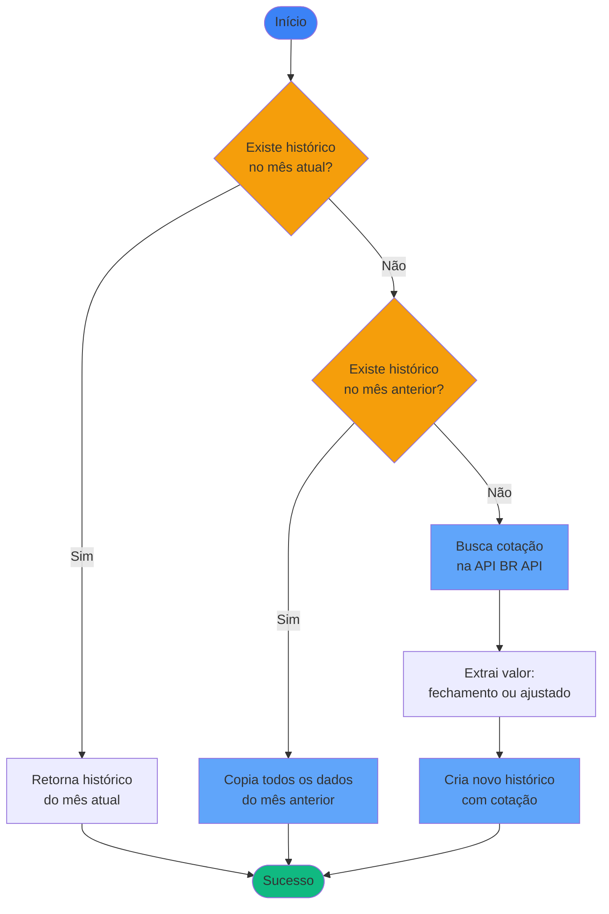

# Regras de Negócio - Criar Novo Registro de Histórico

## Índice

1. [Objetivo](#1-objetivo)
2. [Fluxo Principal](#2-fluxo-principal)
3. [Estratégias por Tipo de Ativo](#3-estratégias-por-tipo-de-ativo)
4. [Regras de Negócio](#4-regras-de-negócio)

---

## 1. Objetivo

Gerar registros mensais de snapshot para posições de ativos, capturando o estado de cada posição no final de um mês específico para permitir análises de evolução ao longo do tempo.

O sistema utiliza estratégias específicas baseadas no tipo de ativo (Renda Fixa, Fundos ou Renda Variável) para determinar como os dados históricos devem ser criados.

---

## 2. Fluxo Principal

O processo recebe como entrada:
- **Data de Referência**: Mês e ano (formato: YYYY-MM)
- **Posição de Ativo**: A posição para a qual o histórico será gerado

**Etapas:**
1. **Validação**: Se data ≤ Out/2025, retorna registro vazio
2. **Seleção**: Identifica tipo de ativo e seleciona estratégia apropriada
3. **Execução**: Estratégia cria ou copia histórico
4. **Persistência**: Salva automaticamente (atualiza se existir, insere se novo)

---

## 3. Estratégias por Tipo de Ativo

### 3.1. Renda Fixa e Fundos

**Aplicável a:** Ativos de Renda Fixa e Fundos de Investimento

**Comportamento:** Copia todos os dados do histórico do mês anterior.

**Justificativa:** Facilita o preenchimento manual realizado todo final de mês. Como não há API para retornar os valores de renda fixa e fundos, copiar do mês anterior facilita o trabalho e auxilia nos cálculos de total em investimentos.

### 3.2. Renda Variável

**Aplicável a:** Ações, ETFs e outros ativos de Renda Variável

**Comportamento:** Primeiro tenta copiar do mês anterior. Se não houver histórico anterior, busca cotação na API BR API.

**Prioridade de cotação:**
1. Valor de fechamento padrão
2. Valor de fechamento ajustado (fallback)

**Comportamento:**
- Se histórico existe no mês atual: retorna o histórico existente (sem alterações)
- Se não existe: tenta copiar todos os dados do mês anterior (sem buscar API)
- Se não existe histórico anterior: busca cotação na API BR API e cria novo histórico
- Se a API falhar: retorna null (use case cria registro vazio)

**Justificativa:** Facilita o preenchimento automático ao abrir a tela. Quando não há histórico no mês atual, copia do mês anterior (como renda fixa/fundos). A busca na API só acontece quando não há histórico anterior disponível, reduzindo chamadas desnecessárias à API.

---

## 4. Regras de Negócio

### 4.1. Data Limite

**Regra:** Datas ≤ Out/2025 retornam registro vazio.

**Valores padrão:**
- Valor de mercado: 0,00
- Quantidade: 1,00
- Custo médio: 0,00
- Valor investido: 0,00

### 4.2. Seleção de Estratégia

**Regra:** Sistema seleciona automaticamente a estratégia baseada no tipo de ativo.

**Mapeamento:**
- Renda Fixa → Estratégia Renda Fixa/Fundos
- Fundos → Estratégia Renda Fixa/Fundos
- Renda Variável → Estratégia Renda Variável
- Tipo não suportado → Registro vazio (fallback)

### 4.3. Persistência Automática

**Regra:** Todo histórico criado é salvo automaticamente.

**Operação:** Upsert (atualiza se existir, insere se novo)

**Garantia:** Não pode haver duplicatas para mesma posição + data.

### 4.4. Fallback

**Regra:** Se estratégia falhar ou não houver dados, cria registro vazio.

**Cenários:**
- Tipo de ativo não suportado
- Falta histórico anterior (Renda Fixa/Fundos)
- Falta histórico anterior e falha na busca de cotação (Renda Variável)

**Comportamento:** Registro vazio é criado e persistido normalmente.

### 4.5. Primeiro Histórico

**Regra:** Quando não há histórico anterior, sistema cria registro vazio.

**Comportamento:** Permite iniciar histórico de uma posição a qualquer momento, sem exigir histórico completo desde o início.

---

## Referências

- [Modelagem de Dominio.md](Modelagem%20de%20Dominio.md)
- [Modelagem do Banco de Dados.md](Modelagem%20do%20Banco%20de%20Dados.md)
