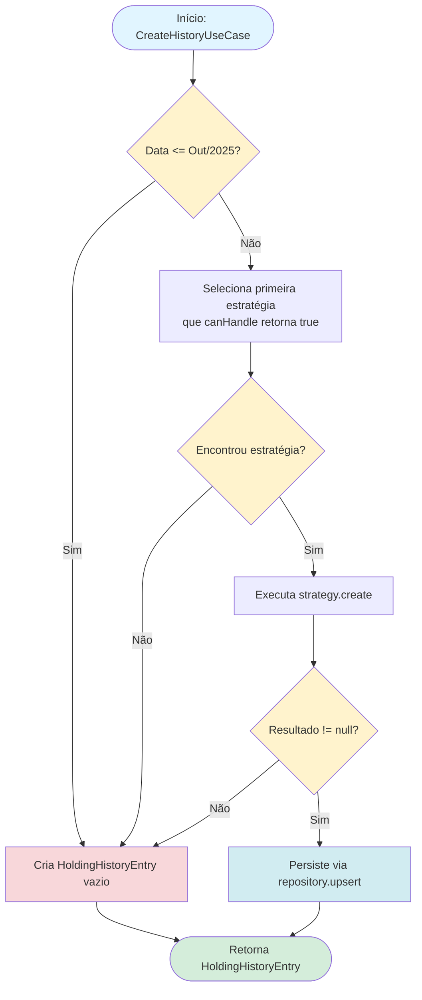
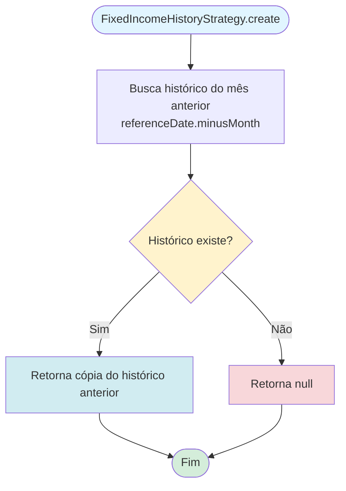
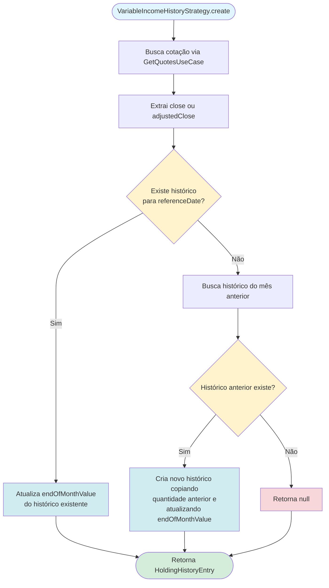

# Regras de Negócio - Criar Novo Registro de Histórico

## Índice

1. [Objetivo](#1-objetivo)
2. [Visão Geral](#2-visão-geral)
3. [CreateHistoryUseCase](#3-createhistoryusecase)
4. [Estratégias de Criação](#4-estratégias-de-criação)
5. [Regras de Negócio](#5-regras-de-negócio)
6. [Fluxo do Processo](#6-fluxo-do-processo)
7. [Entidades Envolvidas](#7-entidades-envolvidas)

---

## 1. Objetivo

O processo de criação de histórico é responsável por gerar registros mensais de snapshot (`HoldingHistoryEntry`) para posições de ativos (`AssetHolding`). Cada registro captura o estado de uma posição no final de um mês específico, permitindo análises de evolução ao longo do tempo.

Este processo utiliza estratégias específicas baseadas no tipo de ativo para determinar como os dados históricos devem ser criados ou copiados, garantindo que os valores de mercado, quantidades e custos médios sejam corretamente preservados ou atualizados.

---

## 2. Visão Geral

O processo de criação de histórico segue um fluxo padronizado:

1. **Validação de Data**: Verifica se a data de referência está dentro do período válido
2. **Seleção de Estratégia**: Identifica qual estratégia deve ser utilizada baseada no tipo de ativo
3. **Criação/Cópia do Histórico**: Executa a estratégia selecionada para gerar o registro
4. **Persistência**: Salva o registro no banco de dados através de operação upsert

O sistema utiliza o padrão Strategy para permitir diferentes comportamentos de criação de histórico dependendo do tipo de ativo (Renda Fixa, Fundos de Investimento ou Renda Variável).

---

## 3. CreateHistoryUseCase

O `CreateHistoryUseCase` é o caso de uso principal responsável por orquestrar a criação de registros de histórico.

### 3.1. Parâmetros de Entrada

```kotlin
data class Param(
    val referenceDate: YearMonth,  // Mês e ano de referência para o histórico
    val holding: AssetHolding      // Posição de ativo para a qual criar o histórico
)
```

### 3.2. Fluxo de Execução

O caso de uso executa as seguintes etapas:

1. **Validação de Data Limite**
   - Se `referenceDate <= YearMonth(2025, 10)`, retorna um `HoldingHistoryEntry` vazio (com valores padrão)
   - Esta validação serve como proteção para períodos históricos específicos

2. **Seleção de Estratégia**
   - Itera sobre a lista de estratégias (`CopyHistoryStrategy`)
   - Seleciona a primeira estratégia que retorna `true` para `canHandle(holding)`
   - Se nenhuma estratégia corresponder, o processo segue para o fallback

3. **Criação do Histórico**
   - Executa o método `create()` da estratégia selecionada
   - A estratégia retorna um `HoldingHistoryEntry?` (pode ser null se não houver histórico anterior)

4. **Persistência**
   - Se o histórico foi criado com sucesso (não null), executa `repository.upsert()` para salvar
   - A operação upsert garante que registros existentes sejam atualizados e novos sejam inseridos

5. **Fallback**
   - Se nenhuma estratégia corresponder ou se a estratégia retornar null, cria um `HoldingHistoryEntry` vazio com valores padrão

### 3.3. Código de Referência

```21:31:core/domain/usecases/src/commonMain/kotlin/com/eferraz/usecases/CreateHistoryUseCase.kt
override suspend fun execute(param: Param): HoldingHistoryEntry {

    if (param.referenceDate <= YearMonth(2025, 10))
        return HoldingHistoryEntry(holding = param.holding, referenceDate = param.referenceDate)

    return strategies
        .firstOrNull { it.canHandle(param.holding) }
        ?.create(param.referenceDate, param.holding)
        ?.also { repository.upsert(it) }
        ?: HoldingHistoryEntry(holding = param.holding, referenceDate = param.referenceDate)
}
```

---

## 4. Estratégias de Criação

O sistema utiliza o padrão Strategy para implementar diferentes lógicas de criação de histórico baseadas no tipo de ativo. Todas as estratégias implementam a interface `CopyHistoryStrategy`.

### 4.1. Interface CopyHistoryStrategy

```kotlin
interface CopyHistoryStrategy {
    fun canHandle(holding: AssetHolding): Boolean
    suspend fun create(referenceDate: YearMonth, holding: AssetHolding): HoldingHistoryEntry?
}
```

**Métodos:**
- `canHandle()`: Determina se a estratégia pode processar o tipo de ativo fornecido
- `create()`: Cria ou copia o histórico para a data de referência especificada

### 4.2. FixedIncomeHistoryStrategy

**Tipo de Ativo:** Renda Fixa (`FixedIncomeAsset`) e Fundos de Investimento (`InvestmentFundAsset`)

**Comportamento:**
- Copia diretamente o histórico do mês anterior (`referenceDate.minusMonth()`)
- Não realiza cálculos adicionais ou buscas de cotações
- Assume que os valores de renda fixa e fundos se mantêm estáveis entre meses

**Lógica:**
```kotlin
override suspend fun create(referenceDate: YearMonth, holding: AssetHolding): HoldingHistoryEntry? =
    holdingHistoryRepository.getByHoldingAndReferenceDate(referenceDate.minusMonth(), holding)
```

**Código de Referência:**
```26:35:core/domain/usecases/src/commonMain/kotlin/com/eferraz/usecases/strategies/CopyHistoryStrategy.kt
@Factory(binds = [CopyHistoryStrategy::class])
public class FixedIncomeHistoryStrategy(
    private val holdingHistoryRepository: HoldingHistoryRepository,
) : CopyHistoryStrategy {

    override fun canHandle(holding: AssetHolding): Boolean =
        holding.asset is FixedIncomeAsset || holding.asset is InvestmentFundAsset

    override suspend fun create(referenceDate: YearMonth, holding: AssetHolding): HoldingHistoryEntry? =
        holdingHistoryRepository.getByHoldingAndReferenceDate(referenceDate.minusMonth(), holding)
```

### 4.3. VariableIncomeHistoryStrategy

**Tipo de Ativo:** Renda Variável (`VariableIncomeAsset`)

**Comportamento:**
- Busca a cotação do ativo para o mês de referência através do `GetQuotesUseCase`
- Atualiza o valor de fechamento do mês (`endOfMonthValue`) com a cotação obtida
- Tenta primeiro buscar um histórico existente para o mês de referência
- Se não existir, copia o histórico do mês anterior e atualiza apenas o valor de fechamento

**Lógica Detalhada:**

1. **Busca de Cotação**
   - Utiliza `GetQuotesUseCase` com o ticker do ativo e a data de referência
   - Obtém o valor de fechamento (`close`) ou fechamento ajustado (`adjustedClose`)

2. **Atualização de Histórico Existente**
   - Se já existe um histórico para o mês de referência, atualiza apenas o `endOfMonthValue`
   - Mantém todas as outras propriedades (quantidade, custo médio, etc.)

3. **Criação a partir do Mês Anterior**
   - Se não existe histórico para o mês de referência, busca o histórico do mês anterior
   - Cria um novo registro copiando a quantidade do mês anterior e atualizando o valor de fechamento

**Código de Referência:**
```40:67:core/domain/usecases/src/commonMain/kotlin/com/eferraz/usecases/strategies/CopyHistoryStrategy.kt
@Factory(binds = [CopyHistoryStrategy::class])
public class VariableIncomeHistoryStrategy(
    private val holdingHistoryRepository: HoldingHistoryRepository,
    private val getQuotesUseCase: GetQuotesUseCase,
) : CopyHistoryStrategy {

    override fun canHandle(holding: AssetHolding): Boolean =
        holding.asset is VariableIncomeAsset

    override suspend fun create(referenceDate: YearMonth, holding: AssetHolding): HoldingHistoryEntry? {

        val asset = holding.asset as? VariableIncomeAsset
            ?: throw IllegalStateException("Asset is not a VariableIncomeAsset")

        val quoteHistory = getQuotesUseCase(GetQuotesUseCase.Params(asset.ticker, referenceDate))
            .getOrThrow()

        val endOfMonthValue = (quoteHistory.close ?: quoteHistory.adjustedClose)
            ?: throw IllegalStateException("Quote history is missing close or adjustedClose")

        holdingHistoryRepository.getByHoldingAndReferenceDate(referenceDate, holding)?.let {
            return it.copy(endOfMonthValue = endOfMonthValue)
        }

        return holdingHistoryRepository.getByHoldingAndReferenceDate(referenceDate.minusMonth(), holding)?.let {
            HoldingHistoryEntry(holding = holding, referenceDate = referenceDate, endOfMonthValue = endOfMonthValue, endOfMonthQuantity = it.endOfMonthQuantity)
        }
    }
```

**Tratamento de Erros:**
- Se o ativo não for `VariableIncomeAsset`, lança `IllegalStateException`
- Se a cotação não possuir `close` ou `adjustedClose`, lança `IllegalStateException`
- Se não houver histórico anterior e não houver histórico existente, retorna `null` (o use case cria um histórico vazio)

---

## 5. Regras de Negócio

### 5.1. Validação de Data Limite

**Regra:** Históricos para datas anteriores ou iguais a outubro de 2025 retornam um registro vazio.

**Motivo:** Proteção para períodos históricos específicos onde não há dados disponíveis ou não se deseja processar.

**Implementação:**
```kotlin
if (param.referenceDate <= YearMonth(2025, 10))
    return HoldingHistoryEntry(holding = param.holding, referenceDate = param.referenceDate)
```

**Valores Padrão Retornados:**
- `endOfMonthValue`: 0.0
- `endOfMonthQuantity`: 1.0
- `endOfMonthAverageCost`: 0.0
- `totalInvested`: 0.0 (igual a `endOfMonthAverageCost`)

### 5.2. Seleção de Estratégia

**Regra:** A primeira estratégia que retornar `true` para `canHandle()` é utilizada.

**Ordem de Verificação:**
- A ordem depende da injeção de dependências (Koin)
- Normalmente: `FixedIncomeHistoryStrategy` e `VariableIncomeHistoryStrategy` são verificadas

**Importante:** Cada estratégia deve ser específica o suficiente para não haver sobreposição. Um ativo não pode ser processado por múltiplas estratégias simultaneamente.

### 5.3. Persistência Automática

**Regra:** Todo histórico criado com sucesso (não null) é automaticamente persistido no banco de dados.

**Operação:** Utiliza `repository.upsert()`, que:
- Insere um novo registro se não existir
- Atualiza um registro existente se já houver um para a mesma combinação `(holding, referenceDate)`

**Garantia de Unicidade:** O banco de dados possui índice único em `(holdingId, referenceDate)`, garantindo que não haja duplicatas.

### 5.4. Fallback para Histórico Vazio

**Regra:** Se nenhuma estratégia corresponder ao tipo de ativo ou se a estratégia retornar `null`, cria um histórico vazio.

**Cenários:**
1. Tipo de ativo não suportado por nenhuma estratégia
2. Estratégia não consegue criar histórico (ex: não há histórico anterior e não há cotação disponível)

**Comportamento:**
```kotlin
?: HoldingHistoryEntry(holding = param.holding, referenceDate = param.referenceDate)
```

### 5.5. Tratamento de Histórico Anterior

**Regra:** As estratégias dependem da existência de histórico do mês anterior para copiar dados.

**Comportamento:**
- Se não houver histórico anterior, a estratégia retorna `null`
- O use case então cria um histórico vazio como fallback
- Isso permite que o sistema funcione mesmo quando não há histórico pré-existente

### 5.6. Atualização de Valores de Renda Variável

**Regra:** Para ativos de renda variável, o valor de fechamento (`endOfMonthValue`) é sempre atualizado com a cotação do mês de referência.

**Prioridade de Cotação:**
1. `quoteHistory.close` (valor de fechamento)
2. `quoteHistory.adjustedClose` (valor de fechamento ajustado) - usado como fallback

**Atualização:**
- Se já existe histórico para o mês, apenas `endOfMonthValue` é atualizado
- Todas as outras propriedades são mantidas

---

## 6. Fluxo do Processo

O diagrama abaixo ilustra o fluxo completo do processo de criação de histórico:



### 6.1. Fluxo por Estratégia

#### FixedIncomeHistoryStrategy



#### VariableIncomeHistoryStrategy



---

## 7. Entidades Envolvidas

### 7.1. HoldingHistoryEntry

Representa um registro de histórico mensal para uma `AssetHolding`.

**Propriedades:**
- `id: Long?` - Identificador único (chave primária)
- `holding: AssetHolding` - Referência à posição de ativo
- `referenceDate: YearMonth` - Mês e ano de referência
- `endOfMonthValue: Double` - Valor de mercado total no final do mês
- `endOfMonthQuantity: Double` - Quantidade do ativo no final do mês
- `endOfMonthAverageCost: Double` - Custo médio do ativo no final do mês
- `totalInvested: Double` - Valor total investido até o final do mês

**Valores Padrão:**
- `endOfMonthValue`: 0.0
- `endOfMonthQuantity`: 1.0
- `endOfMonthAverageCost`: 0.0
- `totalInvested`: 0.0

**Código de Referência:**
```16:29:core/domain/entity/src/commonMain/kotlin/com/eferraz/entities/HoldingHistoryEntry.kt
public data class HoldingHistoryEntry(
    public val id: Long? = null,
    public val holding: AssetHolding,
    public val referenceDate: YearMonth,
    public val endOfMonthValue: Double = DEFAULT_VALUE,
    public val endOfMonthQuantity: Double = DEFAULT_QUANTITY,
    public val endOfMonthAverageCost: Double = DEFAULT_VALUE,
    public val totalInvested: Double = endOfMonthAverageCost, // TODO ENIR
) {
    private companion object {
        private const val DEFAULT_VALUE = 0.0
        private const val DEFAULT_QUANTITY = 1.0
    }
}
```

### 7.2. AssetHolding

Representa a posse de um ativo por um proprietário em uma corretora.

**Propriedades:**
- `id: Long` - Identificador único
- `asset: Asset` - Referência ao ativo (pode ser `FixedIncomeAsset`, `InvestmentFundAsset` ou `VariableIncomeAsset`)
- `owner: Owner` - Proprietário da posição
- `brokerage: Brokerage` - Corretora onde a posição está custodiada

### 7.3. HoldingHistoryRepository

Interface do repositório responsável por operações de persistência e consulta de históricos.

**Métodos Principais:**
- `getByHoldingAndReferenceDate(referenceDate: YearMonth, holding: AssetHolding): HoldingHistoryEntry?` - Busca histórico específico
- `upsert(entry: HoldingHistoryEntry): Long` - Insere ou atualiza um histórico

**Código de Referência:**
```7:12:core/domain/usecases/src/commonMain/kotlin/com/eferraz/usecases/repositories/HoldingHistoryRepository.kt
public interface HoldingHistoryRepository {
    public suspend fun getAllHoldings(): List<AssetHolding>
    public suspend fun getByReferenceDate(referenceDate: YearMonth): List<HoldingHistoryEntry>
    public suspend fun getByHoldingAndReferenceDate(referenceDate: YearMonth, holding: AssetHolding): HoldingHistoryEntry?
    public suspend fun upsert(entry: HoldingHistoryEntry): Long
}
```

---

## Referências

- **Caso de Uso Principal:** [CreateHistoryUseCase.kt](core/domain/usecases/src/commonMain/kotlin/com/eferraz/usecases/CreateHistoryUseCase.kt)
- **Estratégias:** [CopyHistoryStrategy.kt](core/domain/usecases/src/commonMain/kotlin/com/eferraz/usecases/strategies/CopyHistoryStrategy.kt)
- **Entidade de Domínio:** [HoldingHistoryEntry.kt](core/domain/entity/src/commonMain/kotlin/com/eferraz/entities/HoldingHistoryEntry.kt)
- **Repositório:** [HoldingHistoryRepository.kt](core/domain/usecases/src/commonMain/kotlin/com/eferraz/usecases/repositories/HoldingHistoryRepository.kt)
- **Modelagem de Domínio:** [Modelagem de Dominio.md](Modelagem%20de%20Dominio.md)

