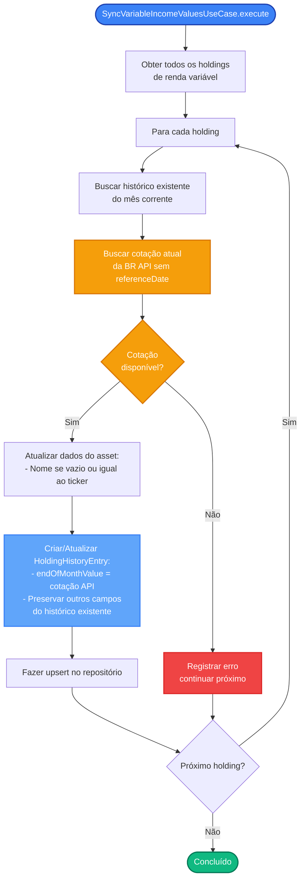

# Regras de Negócio - Sincronizar Valores de Renda Variável

## Índice

1. [Objetivo](#1-objetivo)
2. [Fluxo Principal](#2-fluxo-principal)
3. [Regras de Negócio](#3-regras-de-negócio)
4. [Diferenças em Relação ao CreateHistoryUseCase](#4-diferenças-em-relação-ao-createhistoryusecase)
5. [Tratamento de Erros](#5-tratamento-de-erros)

---

## 1. Objetivo

Sincronizar valores de mercado de ativos de renda variável com cotações atuais da BR API, atualizando apenas o `endOfMonthValue` do mês corrente e preservando os demais campos do histórico existente.

Este use case (`SyncVariableIncomeValuesUseCase`) é utilizado quando é necessário forçar a atualização dos valores de mercado com dados atualizados da API, ignorando qualquer histórico existente do mês corrente.

---

## 2. Fluxo Principal

O processo recebe como entrada:
- **Data de Referência**: Mês e ano (formato: YYYY-MM) para o qual os valores serão sincronizados

**Etapas:**
1. **Obtenção de Holdings**: Busca todos os holdings de renda variável do sistema
2. **Busca de Histórico**: Para cada holding, busca histórico existente do mês corrente (se houver) para preservar campos
3. **Consulta à API**: Busca cotação atual da BR API (sem histórico, para o dia de hoje)
4. **Atualização de Asset**: Atualiza nome do asset se necessário (se vazio ou igual ao ticker)
5. **Criação/Atualização**: Cria ou atualiza `HoldingHistoryEntry` com novo valor de mercado
6. **Persistência**: Salva automaticamente (upsert)

---

## 3. Regras de Negócio

### 3.1. Ignorar Histórico Existente

**Regra:** O use case sempre ignora qualquer histórico existente do mês corrente para o campo `endOfMonthValue`.

**Comportamento:**
- Mesmo que já exista um histórico para o mês corrente, o valor será sobrescrito com a cotação atual da API
- Os demais campos (`endOfMonthQuantity`, `endOfMonthAverageCost`, `totalInvested`) são preservados do histórico existente

**Justificativa:** Garante que os valores de mercado estejam sempre atualizados com as cotações mais recentes da API.

### 3.2. Busca de Cotação Atual

**Regra:** Sempre busca cotação atual da BR API (sem histórico, para o dia de hoje).

**Comportamento:**
- Utiliza `GetQuotesUseCase` sem `referenceDate` (passando `null`)
- Obtém a cotação do dia atual, não uma cotação histórica
- Prioridade de valores: `close` (fechamento padrão) ou `adjustedClose` (fechamento ajustado) como fallback

**Justificativa:** Para sincronização, é necessário obter o valor mais atualizado possível, não valores históricos.

### 3.3. Atualização Parcial do Histórico

**Regra:** Apenas o `endOfMonthValue` é atualizado com dados da API.

**Comportamento:**
- Se histórico existir: preserva `endOfMonthQuantity`, `endOfMonthAverageCost` e `totalInvested`
- Se histórico não existir: usa valores padrão:
  - `endOfMonthQuantity` = 1.0
  - `endOfMonthAverageCost` = 0.0
  - `totalInvested` = 0.0

**Justificativa:** Mantém a integridade dos dados calculados (quantidade, custo médio, total investido) enquanto atualiza apenas o valor de mercado.

### 3.4. Atualização de Dados do Asset

**Regra:** Atualiza nome do asset de renda variável quando necessário.

**Condição para atualizar:**
- Nome do asset está vazio (`asset.name.isBlank()`), OU
- Nome do asset é igual ao ticker (`asset.name == asset.ticker`)

**Comportamento:**
- Quando a API retornar `companyName` no `StockQuoteHistory`
- Verifica se o nome precisa ser atualizado (condição acima)
- Se sim, atualiza o asset com `asset.copy(name = companyName)` e salva usando `AssetRepository.save()`

**Justificativa:** Preenche automaticamente o nome do ativo quando ainda não foi preenchido ou está usando apenas o ticker como nome.

### 3.5. Persistência Automática

**Regra:** Todo histórico criado ou atualizado é salvo automaticamente.

**Operação:** Upsert (atualiza se existir, insere se novo)

**Garantia:** Não pode haver duplicatas para mesma posição + data.

---

## 4. Diferenças em Relação ao CreateHistoryUseCase

O `SyncVariableIncomeValuesUseCase` tem comportamento diferente do `CreateHistoryUseCase` e da `VariableIncomeHistoryStrategy`:

| Aspecto | CreateHistoryUseCase / VariableIncomeHistoryStrategy | SyncVariableIncomeValuesUseCase |
|---------|------------------------------------------------------|----------------------------------|
| **Histórico existente** | Se existe histórico no mês atual, retorna sem alterações | Sempre ignora histórico existente e busca API |
| **Busca de API** | Só busca API se não houver histórico anterior | Sempre busca cotação atual da API |
| **Tipo de cotação** | Busca cotação histórica do mês de referência | Busca cotação atual (dia de hoje) |
| **Campos atualizados** | Pode copiar todos os campos do mês anterior | Atualiza apenas `endOfMonthValue` |
| **Uso** | Criação inicial de histórico | Sincronização/atualização forçada de valores |

**Quando usar cada um:**
- **CreateHistoryUseCase**: Para criação inicial de histórico ou quando se deseja seguir a estratégia padrão (copiar do mês anterior se disponível)
- **SyncVariableIncomeValuesUseCase**: Para forçar atualização de valores de mercado com cotações atuais da API, ignorando histórico existente

---

## 5. Tratamento de Erros

**Regra:** Se a API falhar ou não retornar dados, o sistema registra o erro mas continua processando outros holdings.

**Comportamento:**
- Erros são registrados usando `println` com mensagem descritiva
- O processamento continua para os próximos holdings
- Não interrompe a sincronização de todos os ativos

**Cenários de erro:**
- API não retorna cotação
- Cotação não possui valor de fechamento (`close` ou `adjustedClose`)
- Asset não é do tipo `VariableIncomeAsset`
- Falha na comunicação com a API

**Justificativa:** Garante que a sincronização de um ativo não impeça a sincronização dos demais.

---

## Referências

- [Modelagem de Dominio.md](Modelagem%20de%20Dominio.md)
- [RN - Criar novo registro de histórico.md](RN%20-%20Criar%20novo%20registro%20de%20histórico.md)
- [Modelagem do Banco de Dados.md](Modelagem%20do%20Banco%20de%20Dados.md)

