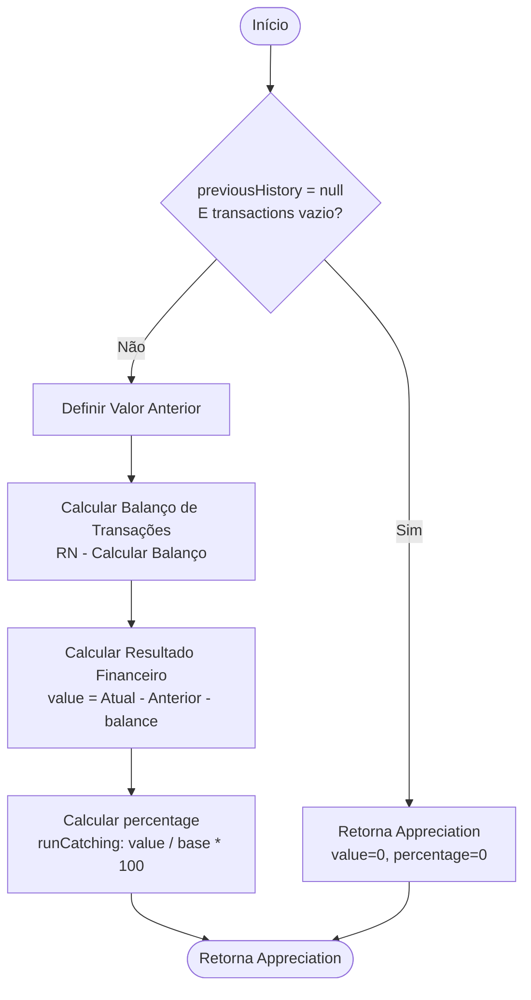

# RN - Calcular Apreciação de uma Posição

## 1. Objetivo
Padronizar o cálculo do resultado financeiro (lucro ou prejuízo) e da rentabilidade percentual de uma posição de investimento em um mês de referência. O objetivo é isolar o desempenho do ativo das movimentações de caixa (aportes e retiradas).



## 2. Entradas

Para realizar o cálculo, são necessários os seguintes dados:

| Dado              | Tipo                     | Descrição                                                                       |
|-------------------|--------------------------|---------------------------------------------------------------------------------|
| `currentHistory`  | `HoldingHistoryEntry`    | Registro do histórico da posição no mês de referência (contém o valor final).   |
| `previousHistory` | `HoldingHistoryEntry?`   | Registro do histórico do mês anterior (pode ser nulo se for o primeiro mês).    |
| `transactions`    | `List<AssetTransaction>` | Lista de transações (compras e vendas) ocorridas *dentro* do mês de referência. |

**Ou, alternativamente:**

| Dado              | Tipo                  | Descrição                                                                     |
|-------------------|-----------------------|-------------------------------------------------------------------------------|
| `currentHistory`  | `HoldingHistoryEntry` | Registro do histórico da posição no mês de referência (contém o valor final). |
| `previousHistory` | `HoldingHistoryEntry?`| Registro do histórico do mês anterior (pode ser nulo se for o primeiro mês).  |
| `balance`         | `TransactionBalance`  | Balanço de aportes e retiradas do mês (calculado pela RN de Balanço).         |

## 3. Saídas

O cálculo resulta em um objeto `Appreciation` contendo:

| Campo        | Tipo     | Descrição                                                                                                                                                                                  |
|--------------|----------|--------------------------------------------------------------------------------------------------------------------------------------------------------------------------------------------|
| `value`      | `Double` | O valor financeiro do lucro (se positivo) ou prejuízo (se negativo), em moeda corrente. Representa quanto o patrimônio variou exclusivamente devido à valorização/desvalorização do ativo. |
| `percentage` | `Double` | O percentual de retorno sobre o capital investido no período.                                                                                                                              |

## 4. Regras de Cálculo

As regras abaixo descrevem a lógica implementada para obter os resultados.

### 4.1. Determinação do Valor Anterior
O valor da posição no início do mês é determinado pelo saldo final do mês anterior.
*   **Regra:** Se `previousHistory` existe, utiliza-se `previousHistory.endOfMonthValue`.
*   **Exceção:** Se `previousHistory` é nulo (indicando início do investimento ou falta de histórico), o valor anterior é considerado **0.0**.
*   **Exceção 2:** Se `previousHistory` é nulo e **não há transações** (`transactions` vazia), assume-se que é apenas um saldo inicial implantado e não um ganho espontâneo. Neste caso, o Resultado Financeiro e a Rentabilidade devem ser **0.0**.

### 4.2. Cálculo do Fluxo de Caixa (Net Flow)
O fluxo de caixa representa a injeção ou retirada líquida de dinheiro novo na posição durante o mês.

**Esta etapa utiliza a regra "RN - Calcular Balanço de Transações" (`TransactionBalance`):**
*   **Compras (`contributions`):** Soma do valor de todas as transações do tipo `PURCHASE`.
*   **Vendas (`withdrawals`):** Soma do valor de todas as transações do tipo `SALE`.
*   **Fluxo Líquido (`balance`):** `contributions - withdrawals`.

**Referência:** Ver [RN - Calcular Balanço de Transações](RN%20-%20Calcular%20Balanço%20de%20Transações.md)

### 4.3. Cálculo do Lucro/Prejuízo Financeiro (`value`)
O resultado financeiro é a variação total do patrimônio descontando o efeito do fluxo de caixa.
*   **Fórmula:**
    ```
    value = Valor_Atual - Valor_Anterior - balance
    ```
    Onde:
    - `Valor_Atual` é `currentHistory.endOfMonthValue`
    - `balance` é o balanço calculado em 4.2 (do `TransactionBalance`)

### 4.4. Cálculo da Rentabilidade Percentual (`percentage`)
A rentabilidade é calculada sobre o capital que estava exposto ao risco. A base considera o valor inicial, os novos aportes e as retiradas realizadas.
*   **Base de Cálculo:** `Valor_Anterior + contributions - withdrawals`
*   **Fórmula:**
    ```
    percentage = (value / base) * 100
    ```
    Onde `base = Valor_Anterior + contributions - withdrawals`
    
*   **Tratamento de Exceções:** 
    *   Se `base > 0`: Calcula normalmente usando `base`
    *   Se `base <= 0` e `contributions > 0`: Usa `contributions` como base (casos de day trade ou quando retiradas excedem o valor anterior + aportes)
    *   Se `base <= 0` e `contributions = 0`: Retorna `0.0` (Para evitar divisão por zero)
    
*   **Comportamento:**
    *   Em casos normais: `base = Valor_Anterior + contributions - withdrawals`
    *   Em day trade ou quando a base fica negativa: usa `contributions` como base para garantir que o capital investido seja considerado

## 5. Casos de Uso e Exemplos

### Exemplo 1: Valorização Pura
*   Início: 1000
*   Fim: 1100
*   Transações: 0
*   Resultado: 1100 - 1000 - 0 = **100**
*   %: 100 / 1000 = **10%**

### Exemplo 2: Aporte com Valorização
*   Início: 1000
*   Aporte: 500
*   Fim: 1600 (1000 + 500 + 100 ganho)
*   Resultado: 1600 - 1000 - (500) = **100**
*   Base: 1000 + 500 = 1500
*   %: 100 / 1500 = **6.66%**

### Exemplo 3: Retirada com Valorização
*   Início: 1000
*   Venda: 200
*   Fim: 900 (1000 - 200 + 100 ganho)
*   Resultado: 900 - 1000 - (-200) = 900 - 1000 + 200 = **100**
*   Base: 1000 + 0 - 200 = 800 (capital exposto ao risco após a retirada)
*   %: 100 / 800 = **12.5%**

### Exemplo 4: Encerramento com Lucro (Zeragem)
*   Início: 0 (Supondo compra no mês)
*   Compra: 1000
*   Venda: 1100
*   Fim: 0
*   Fluxo Líquido: 1000 - 1100 = -100
*   Resultado: 0 (Fim) - 0 (Início) - (-100) = **100**
*   Base: 0 + 1000 = 1000
*   %: 100 / 1000 = **10%**

## 6. Notas Técnicas

### Limitação em Base Negativa
O cálculo da rentabilidade percentual é **travado em 0.0%** quando a base de cálculo (Valor Anterior + Compras) é menor ou igual a zero.
Isso é necessário para evitar inconsistências matemáticas conhecidas como "inversão de sinais":
1.  **Lucro sobre base negativa:** Um resultado positivo (lucro) dividido por uma base negativa resultaria em uma porcentagem **negativa**, indicando erroneamente um prejuízo.
2.  **Prejuízo sobre base negativa:** Um resultado negativo (prejuízo) dividido por uma base negativa resultaria em uma porcentagem **positiva**, indicando erroneamente um lucro.

Portanto, para manter a consistência dos relatórios, nesses cenários excepcionais (comuns em posições vendidas/short ou alavancadas, ou erros de lançamento), a rentabilidade percentual é suprimida.

