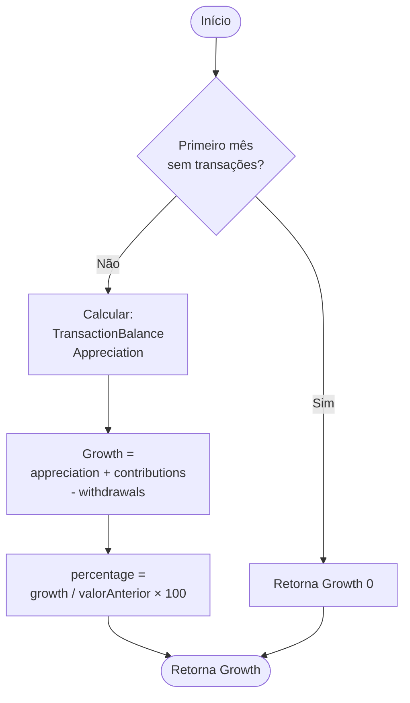

# RN - Calcular Crescimento de uma Posição

## 1. Objetivo
Padronizar o cálculo do crescimento total (absoluto e percentual) de uma posição de investimento em um mês de referência. O crescimento representa a variação total do patrimônio, considerando lucro, aportes e retiradas.



## 2. Entradas

Para realizar o cálculo, são necessários os seguintes dados:

| Dado              | Tipo                     | Descrição                                                                       |
|-------------------|--------------------------|---------------------------------------------------------------------------------|
| `currentHistory`  | `HoldingHistoryEntry`    | Registro do histórico da posição no mês de referência (contém o valor final).   |
| `previousHistory` | `HoldingHistoryEntry?`   | Registro do histórico do mês anterior (pode ser nulo se for o primeiro mês).    |
| `transactions`    | `List<AssetTransaction>` | Lista de transações (compras e vendas) ocorridas *dentro* do mês de referência. |

**Ou, alternativamente:**

| Dado              | Tipo                   | Descrição                                                                     |
|-------------------|------------------------|-------------------------------------------------------------------------------|
| `currentHistory`  | `HoldingHistoryEntry`  | Registro do histórico da posição no mês de referência (contém o valor final). |
| `previousHistory` | `HoldingHistoryEntry?` | Registro do histórico do mês anterior (pode ser nulo se for o primeiro mês).  |
| `balance`         | `TransactionBalance`   | Balanço de aportes e retiradas do mês (calculado pela RN de Balanço).         |
| `appreciation`    | `Appreciation`         | Apreciação (lucro/prejuízo) do mês (calculado pela RN de Apreciação).         |

## 3. Saídas

O cálculo resulta em um objeto `Growth` contendo:

| Campo        | Tipo     | Descrição                                                                                                                                                       |
|--------------|----------|-----------------------------------------------------------------------------------------------------------------------------------------------------------------|
| `value`      | `Double` | O valor financeiro total que entrou no patrimônio, em moeda corrente. Representa a soma entre os aportes realizados e o lucro obtido pela valorização do ativo. |
| `percentage` | `Double` | O percentual de crescimento sobre o capital inicial do período.                                                                                                 |

## 4. Regras de Cálculo

As regras abaixo descrevem a lógica implementada para obter os resultados.

### 4.1. Cálculo do Crescimento Financeiro (`value`)
O crescimento financeiro é a variação total do patrimônio, considerando lucro, aportes e retiradas.

*   **Fórmula:**
    ```
    value = appreciation.value + balance.balance
    ```
    
    Onde:
    - `appreciation.value` é o lucro/prejuízo calculado pela RN de Apreciação
    - `balance.balance` é o balanço líquido (contributions - withdrawals) calculado pela RN de Balanço

**Interpretação:**
- O crescimento representa "quanto o patrimônio variou" no período
- Considera todos os fatores que afetam o patrimônio:
  - **Lucro/Prejuízo**: desempenho do ativo
  - **Aportes**: dinheiro novo aplicado (aumenta o crescimento)
  - **Retiradas**: dinheiro sacado (diminui o crescimento)

**Diferença entre Crescimento e Apreciação:**
- **Apreciação**: Isola apenas o desempenho do ativo (ver [RN - Calcular Apreciação de uma Posição](RN%20-%20Calcular%20Apreciação%20de%20uma%20Posição.md))
- **Crescimento**: Variação total do patrimônio incluindo movimentações (ver fórmula acima)

**Referências:**
- [RN - Calcular Balanço de Transações](RN%20-%20Calcular%20Balanço%20de%20Transações.md) - Para obter aportes e retiradas
- [RN - Calcular Apreciação de uma Posição](RN%20-%20Calcular%20Apreciação%20de%20uma%20Posição.md) - Para obter lucro/prejuízo

### 4.2. Cálculo do Percentual de Crescimento (`percentage`)
O percentual de crescimento é calculado sobre o capital inicial do período.

*   **Base de Cálculo:** `Valor_Anterior`
*   **Fórmula:**
    ```
    percentage = (value / base) * 100
    ```
    
    Onde:
    - `value` é o crescimento calculado em 4.1
    - `base` é determinado conforme regras abaixo
    
*   **Determinação da Base:**
    *   Se não há histórico anterior (`previousHistory == null`): retorna `0.0%` (primeiro mês)
    *   Se `Valor_Anterior > 0`: usa `Valor_Anterior` como base
    *   Se `Valor_Anterior <= 0` e há aportes (`contributions > 0`): usa `contributions` como base (casos de day trade ou quando retiradas excedem o valor anterior)
    *   Caso contrário: retorna `0.0%` (para evitar divisão por zero)
    
*   **Comportamento:**
    *   Em casos normais: calcula sobre o valor anterior do período
    *   Em day trade ou quando a base fica zero/negativa: usa aportes como base para garantir que o capital investido seja considerado

## 5. Casos de Uso e Exemplos

### Exemplo 1: Valorização Pura (sem aportes)
*   Início: 1000
*   Fim: 1100
*   Transações: 0
*   Apreciação: 100 (10%)
*   Aportes: 0
*   Retiradas: 0
*   **Crescimento: 100 + 0 - 0 = 100**
*   **%: 100 / 1000 = 10%**

### Exemplo 2: Aporte com Valorização
*   Início: 1000
*   Aporte: 500
*   Fim: 1600 (1000 + 500 + 100 ganho)
*   Apreciação: 100 (6.66% sobre 1500)
*   Aportes: 500
*   Retiradas: 0
*   **Crescimento: 100 + 500 - 0 = 600**
*   **%: 600 / 1000 = 60%**

**Interpretação:** O patrimônio cresceu 60% em relação ao início, sendo 50% de aportes e 10% de lucro.

### Exemplo 3: Retirada com Valorização
*   Início: 1000
*   Venda: 200
*   Fim: 900 (1000 - 200 + 100 ganho)
*   Apreciação: 100 (10%)
*   Aportes: 0
*   Retiradas: 200
*   **Crescimento: 100 + 0 - 200 = -100**
*   **%: -100 / 1000 = -10%**

**Interpretação:** Apesar do lucro de 100, o patrimônio diminuiu 100 (crescimento negativo) devido à retirada de 200.

### Exemplo 4: Apenas Aportes (sem lucro)
*   Início: 1000
*   Aporte: 500
*   Fim: 1500 (sem variação de preço)
*   Apreciação: 0 (0%)
*   Aportes: 500
*   Retiradas: 0
*   **Crescimento: 0 + 500 - 0 = 500**
*   **%: 500 / 1000 = 50%**

**Interpretação:** O patrimônio cresceu 50% apenas por aportes, sem lucro.

### Exemplo 5: Prejuízo com Aportes
*   Início: 1000
*   Aporte: 500
*   Fim: 1400 (1000 + 500 - 100 prejuízo)
*   Apreciação: -100 (-6.66%)
*   Aportes: 500
*   Retiradas: 0
*   **Crescimento: -100 + 500 - 0 = 400**
*   **%: 400 / 1000 = 40%**

**Interpretação:** Mesmo com prejuízo de 100, o patrimônio cresceu 40% devido aos aportes de 500.

### Exemplo 6: Lucro com Retirada Parcial
*   Início: 1000
*   Venda: 300
*   Fim: 850 (1000 - 300 + 150 ganho)
*   Apreciação: 150 (15%)
*   Aportes: 0
*   Retiradas: 300
*   **Crescimento: 150 + 0 - 300 = -150**
*   **%: -150 / 1000 = -15%**

**Interpretação:** Mesmo com lucro de 150, o patrimônio diminuiu 150 devido à retirada de 300.

### Exemplo 7: Primeiro Mês (sem histórico anterior)
*   Início: 0 (sem histórico)
*   Aporte: 1000
*   Fim: 1000
*   Apreciação: 0 (0% - primeiro mês)
*   Aportes: 1000
*   Retiradas: 0
*   **Crescimento: 0 + 1000 - 0 = 1000**
*   **%: 0%** (base = 0, retorna 0%)

**Interpretação:** Primeiro mês retorna crescimento em reais, mas 0% devido à base zero.

## 6. Notas Técnicas

**Padrão de Implementação:**
- Segue o mesmo padrão de `Appreciation` e `TransactionBalance`
- Classe com construtor privado e factory methods
- Tratamento seguro de divisões por zero

**Casos Especiais:**
- **Base Zero**: Percentual retorna 0% para evitar divisão por zero
- **Retiradas**: Diminuem o crescimento mesmo se houver lucro

---

## Referências

- [RN - Calcular Apreciação de uma Posição](RN%20-%20Calcular%20Apreciação%20de%20uma%20Posição.md) - Cálculo de lucro/prejuízo
- [RN - Calcular Balanço de Transações](RN%20-%20Calcular%20Balanço%20de%20Transações.md) - Cálculo de aportes e retiradas
- [Modelagem de Dominio.md](../Modelagem%20de%20Dominio.md) - Definição das entidades `HoldingHistoryEntry` e `AssetTransaction`
