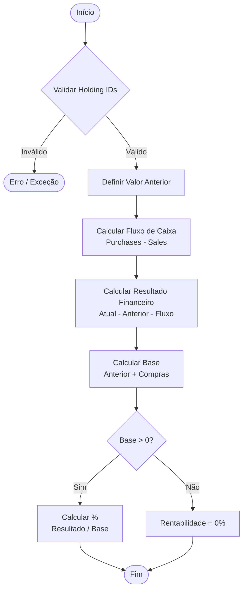

# RN - Calculo do Lucro ou Prejuizo de uma Posição

## 1. Objetivo
Padronizar o cálculo do resultado financeiro (lucro ou prejuízo) e da rentabilidade percentual de uma posição de investimento em um mês de referência. O objetivo é isolar o desempenho do ativo das movimentações de caixa (aportes e retiradas).



## 2. Entradas

Para realizar o cálculo, são necessários os seguintes dados:

| Dado              | Tipo                     | Descrição                                                                       |
|-------------------|--------------------------|---------------------------------------------------------------------------------|
| `holding`         | `AssetHolding`           | A posição (ativo) para a qual o cálculo está sendo realizado.                   |
| `referenceDate`   | `YearMonth`              | Mês de referência para o cálculo.                                               |
| `currentHistory`  | `HoldingHistoryEntry`    | Registro do histórico da posição no mês de referência (contém o valor final).   |
| `previousHistory` | `HoldingHistoryEntry?`   | Registro do histórico do mês anterior (pode ser nulo se for o primeiro mês).    |
| `transactions`    | `List<AssetTransaction>` | Lista de transações (compras e vendas) ocorridas *dentro* do mês de referência. |

## 3. Saídas

O cálculo resulta em um objeto contendo:

| Campo | Tipo | Descrição |
|---|---|---|
| `financialAppreciation` | `Double` | O valor financeiro do lucro (se positivo) ou prejuízo (se negativo), em moeda corrente. Representa quanto o patrimônio variou exclusivamente devido à valorização/desvalorização do ativo. |
| `percentageAppreciation` | `Double` | O percentual de retorno sobre o capital investido no período. |

## 4. Regras de Cálculo

As regras abaixo descrevem a lógica implementada para obter os resultados.

### 4.1. Validação de Pertencimento (`holding`)
Antes de iniciar os cálculos, deve-se validar se os dados informados pertencem à posição especificada.
*   **Regra:** O `holdingId` presente em `currentHistory`, `previousHistory` (se existir) e em cada item da lista `transactions` deve ser igual a `holding.id`.
*   Caso haja divergência, o cálculo não deve prosseguir (lançar exceção ou retornar erro).

### 4.2. Determinação do Valor Anterior
O valor da posição no início do mês é determinado pelo saldo final do mês anterior.
*   **Regra:** Se `previousHistory` existe, utiliza-se `previousHistory.endOfMonthValue`.
*   **Exceção:** Se `previousHistory` é nulo (indicando início do investimento ou falta de histórico), o valor anterior é considerado **0.0**.
*   **Exceção 2:** Se `previousHistory` é nulo e **não há transações** (`transactions` vazia), assume-se que é apenas um saldo inicial implantado e não um ganho espontâneo. Neste caso, o Resultado Financeiro e a Rentabilidade devem ser **0.0**.

### 4.3. Cálculo do Fluxo de Caixa (Net Flow)
O fluxo de caixa representa a injeção ou retirada líquida de dinheiro novo na posição durante o mês.
*   **Compras (`purchases`):** Soma do `totalValue` de todas as transações do tipo `PURCHASE`.
*   **Vendas (`sales`):** Soma do `totalValue` de todas as transações do tipo `SALE`.
*   **Fluxo Líquido (`netFlow`):** `purchases - sales`.

### 4.4. Cálculo do Lucro/Prejuízo Financeiro (`financialAppreciation`)
O resultado financeiro é a variação total do patrimônio descontando o efeito do fluxo de caixa.
*   **Fórmula:**
    ```
    Resultado = Valor_Atual - Valor_Anterior - Fluxo_Líquido
    ```
    Onde `Valor_Atual` é `currentHistory.endOfMonthValue`.

### 4.5. Cálculo da Rentabilidade Percentual (`percentageAppreciation`)
A rentabilidade é calculada sobre o capital que estava exposto ao risco. Nesta implementação, considera-se como base o valor inicial mais os novos aportes.
*   **Base de Cálculo (`balance`):** `Valor_Anterior + Compras`
*   **Regra:**
    *   Se `balance > 0`: `(Resultado / Base) * 100`
    *   Se `balance <= 0`: `0.0` (Para evitar divisão por zero ou resultados inconsistentes em casos sem saldo inicial e apenas vendas).

## 5. Casos de Uso e Exemplos

### Exemplo 1: Valorização Pura
*   Início: 1000
*   Fim: 1100
*   Transações: 0
*   Resultado: 1100 - 1000 - 0 = **100**
*   %: 100 / 1000 = **10%**

### Exemplo 2: Aporte com Valorização
*   Início: 1000
*   Aporte: 500
*   Fim: 1600 (1000 + 500 + 100 ganho)
*   Resultado: 1600 - 1000 - (500) = **100**
*   Base: 1000 + 500 = 1500
*   %: 100 / 1500 = **6.66%**

### Exemplo 3: Retirada com Valorização
*   Início: 1000
*   Venda: 200
*   Fim: 900 (1000 - 200 + 100 ganho)
*   Resultado: 900 - 1000 - (-200) = 900 - 1000 + 200 = **100**
*   Base: 1000 (Vendas não deduzem da base nesta regra simplificada)
*   %: 100 / 1000 = **10%**

### Exemplo 4: Encerramento com Lucro (Zeragem)
*   Início: 0 (Supondo compra no mês)
*   Compra: 1000
*   Venda: 1100
*   Fim: 0
*   Fluxo Líquido: 1000 - 1100 = -100
*   Resultado: 0 (Fim) - 0 (Início) - (-100) = **100**
*   Base: 0 + 1000 = 1000
*   %: 100 / 1000 = **10%**

## 6. Notas Técnicas

### Limitação em Base Negativa
O cálculo da rentabilidade percentual é **travado em 0.0%** quando a base de cálculo (Valor Anterior + Compras) é menor ou igual a zero.
Isso é necessário para evitar inconsistências matemáticas conhecidas como "inversão de sinais":
1.  **Lucro sobre base negativa:** Um resultado positivo (lucro) dividido por uma base negativa resultaria em uma porcentagem **negativa**, indicando erroneamente um prejuízo.
2.  **Prejuízo sobre base negativa:** Um resultado negativo (prejuízo) dividido por uma base negativa resultaria em uma porcentagem **positiva**, indicando erroneamente um lucro.

Portanto, para manter a consistência dos relatórios, nesses cenários excepcionais (comuns em posições vendidas/short ou alavancadas, ou erros de lançamento), a rentabilidade percentual é suprimida.


