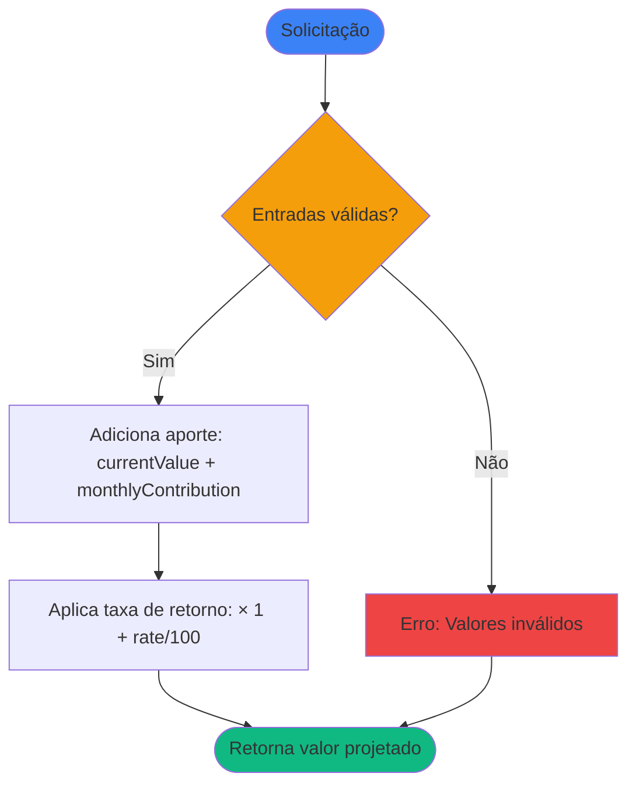

# Regras de Negócio - Calcular Valor Projetado de Meta Financeira

## Índice

1. [Objetivo](#1-objetivo)
2. [Entradas e Saídas](#2-entradas-e-saídas)
3. [Fluxo Principal](#3-fluxo-principal)
4. [Regras de Negócio](#4-regras-de-negócio)
5. [Fórmulas de Cálculo](#5-fórmulas-de-cálculo)
6. [Exemplos Numéricos](#6-exemplos-numéricos)

---

## 1. Objetivo

Calcular o valor projetado de uma meta financeira para um único mês, aplicando a taxa de retorno sobre o valor atual e adicionando o aporte mensal.

Esta é uma regra de negócio atômica que realiza apenas o cálculo matemático de um período, sem considerar iterações ou mapeamentos temporais. É utilizada como base para projeções mais complexas (ver [RN - Gerar Mapa de Projeção de Meta Financeira.md](RN%20-%20Gerar%20Mapa%20de%20Projeção%20de%20Meta%20Financeira.md)).

---

## 2. Entradas e Saídas

### Entradas

| Campo                 | Tipo   | Descrição                                                              |
|-----------------------|--------|------------------------------------------------------------------------|
| `currentValue`        | Double | O valor atual (do mês anterior ou valor inicial)                       |
| `monthlyReturnRate`   | Double | A taxa de retorno mensal esperada (em percentual, ex: 0.80 para 0,80%) |
| `monthlyContribution` | Double | O valor de aporte mensal                                               |

### Saídas

| Campo   | Tipo   | Descrição                                             |
|---------|--------|-------------------------------------------------------|
| Retorno | Double | O valor projetado após aplicar rentabilidade e aporte |

---

## 3. Fluxo Principal



---

## 4. Regras de Negócio

### 4.1. Validação das Entradas

**Regra:** Todos os valores de entrada devem ser não-negativos.

**Comportamento:**

- `currentValue` deve ser ≥ 0
- `monthlyReturnRate` deve ser ≥ 0 (pode ser zero se não houver rentabilidade)
- `monthlyContribution` deve ser ≥ 0 (pode ser zero se não houver aportes)
- Se qualquer valor for negativo: lança exceção

### 4.2. Ordem de Aplicação

**Regra:** O aporte mensal é adicionado primeiro ao valor atual, depois a rentabilidade é aplicada sobre o total.

**Justificativa:** Esta abordagem reflete o cenário em que o investidor aporta no início do mês, permitindo que o aporte já renda no período corrente. É mais vantajoso para o investidor e representa melhor a realidade de aportes mensais programados.

**Comportamento:**

1. Adiciona o aporte ao valor atual: `valorComAporte = currentValue + monthlyContribution`
2. Aplica a rentabilidade sobre o total: `valorFinal = valorComAporte × (1 + monthlyReturnRate/100)`

### 4.3. Tratamento de Valores

**Regra:** O cálculo utiliza `Double` para precisão decimal.

**Comportamento:**

- Não há arredondamento durante o cálculo
- O arredondamento é responsabilidade da camada de apresentação
- O cálculo utiliza os valores exatos fornecidos

---

## 5. Fórmulas de Cálculo

### 5.1. Fórmula Principal

```
valorProjetado = (currentValue + monthlyContribution) × (1 + monthlyReturnRate/100)
```

**Onde:**

- `currentValue`: Valor inicial do mês (valor final do mês anterior ou valor inicial da meta)
- `monthlyContribution`: Aporte mensal fixo (aplicado no início do mês)
- `monthlyReturnRate`: Taxa de retorno mensal em percentual (ex: 0.80 para 0,80% ao mês)

**Exemplos de expansão da fórmula:**

Para `monthlyReturnRate = 0.80%`:
```
valorProjetado = (currentValue + monthlyContribution) × 1.008
```

Para `monthlyReturnRate = 1.00%`:
```
valorProjetado = (currentValue + monthlyContribution) × 1.01
```

---

## 6. Exemplos Numéricos

### 6.1. Exemplo: Cálculo com Aporte e Rentabilidade

**Cenário:**

- Valor atual: R$ 10.000,00
- Taxa mensal: 0,80%
- Aporte mensal: R$ 1.500,00

**Cálculo:**

```
valorProjetado = (10.000 + 1.500) × (1 + 0,80/100)
valorProjetado = 11.500 × 1,008
valorProjetado = R$ 11.592,00
```

**Resultado:** R$ 11.592,00

### 6.2. Exemplo: Apenas Rentabilidade (Sem Aporte)

**Cenário:**

- Valor atual: R$ 50.000,00
- Taxa mensal: 1,00%
- Aporte mensal: R$ 0,00

**Cálculo:**

```
valorProjetado = (50.000 + 0) × (1 + 1,00/100)
valorProjetado = 50.000 × 1,01
valorProjetado = R$ 50.500,00
```

**Resultado:** R$ 50.500,00

### 6.3. Exemplo: Apenas Aporte (Sem Rentabilidade)

**Cenário:**

- Valor atual: R$ 5.000,00
- Taxa mensal: 0,00%
- Aporte mensal: R$ 2.000,00

**Cálculo:**

```
valorProjetado = (5.000 + 2.000) × (1 + 0,00/100)
valorProjetado = 7.000 × 1,00
valorProjetado = R$ 7.000,00
```

**Resultado:** R$ 7.000,00

### 6.4. Exemplo: Partindo do Zero

**Cenário:**

- Valor atual: R$ 0,00
- Taxa mensal: 0,80%
- Aporte mensal: R$ 1.500,00

**Cálculo:**

```
valorProjetado = (0 + 1.500) × (1 + 0,80/100)
valorProjetado = 1.500 × 1,008
valorProjetado = R$ 1.512,00
```

**Resultado:** R$ 1.512,00

**Nota:** Mesmo partindo do zero, o aporte já rende no primeiro mês, resultando em R$ 12,00 de rendimento (1.500 × 0,80%).

### 6.5. Exemplo: Sequência de Meses

**Demonstração de uso sequencial:**

| Mês | Valor Atual | Taxa | Aporte | Cálculo | Valor Projetado |
|-----|-------------|------|--------|---------|-----------------|
| 1   | R$ 0,00     | 0,80% | R$ 1.500 | (0 + 1.500) × 1,008 | R$ 1.512,00 |
| 2   | R$ 1.512,00 | 0,80% | R$ 1.500 | (1.512 + 1.500) × 1,008 | R$ 3.036,10 |
| 3   | R$ 3.036,10 | 0,80% | R$ 1.500 | (3.036,10 + 1.500) × 1,008 | R$ 4.572,39 |
| 4   | R$ 4.572,39 | 0,80% | R$ 1.500 | (4.572,39 + 1.500) × 1,008 | R$ 6.120,97 |

**Nota:** O valor projetado de cada mês se torna o valor atual do mês seguinte, permitindo o efeito de juros compostos. Como o aporte é feito no início do mês, ele já rende no período corrente.

---

## Referências

- [Modelagem de Dominio.md](../Modelagem%20de%20Dominio.md) - Definição da entidade `GoalInvestmentPlan`
- [RN - Gerar Mapa de Projeção de Meta Financeira.md](RN%20-%20Gerar%20Mapa%20de%20Projeção%20de%20Meta%20Financeira.md) - Utiliza esta regra para gerar projeções mês a mês
