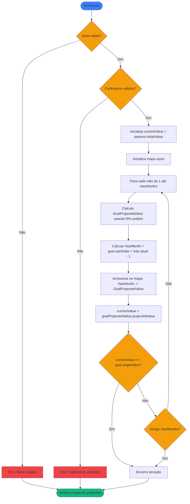

# Regras de Negócio - Gerar Mapa de Projeção de Meta Financeira

## Índice

1. [Objetivo](#1-objetivo)
2. [Entradas e Saídas](#2-entradas-e-saídas)
3. [Fluxo Principal](#3-fluxo-principal)
4. [Regras de Negócio](#4-regras-de-negócio)
5. [Exemplos Numéricos](#5-exemplos-numéricos)

---

## 1. Objetivo

Gerar um mapa completo de projeções mensais de uma meta financeira, calculando iterativamente os valores projetados desde o mês de início até atingir o objetivo ou completar o período máximo de projeção.

Este cálculo utiliza a regra [RN - Calcular Valor Projetado de Meta Financeira.md](RN%20-%20Calcular%20Valor%20Projetado%20de%20Meta%20Financeira.md) repetidamente para cada mês, construindo um mapa que relaciona cada mês (`YearMonth`) ao seu valor projetado.

---

## 2. Entradas e Saídas

### Entradas

| Campo       | Tipo               | Descrição                                                            |
|-------------|--------------------|----------------------------------------------------------------------|
| `params`    | GoalInvestmentPlan | Parâmetros de planejamento (aportes, taxa de retorno, valor inicial) |
| `maxMonths` | Int (opcional)     | Número máximo de meses a projetar (padrão: 120 meses / 10 anos)      |

**Campos de `GoalInvestmentPlan`:**
- `id`: Identificador único do plano (opcional, null para simulações ad-hoc)
- `goal`: Meta financeira associada ao plano
- `monthlyContribution`: Valor de aporte mensal planejado
- `monthlyReturnRate`: Taxa de retorno mensal esperada (em percentual, ex: 0.80 para 0,80%)
- `initialValue`: Valor inicial da meta (opcional, padrão 0.0)

### Saídas

A saída é um mapa de `YearMonth` (chave) para `GoalProjectedValue` (valor), onde:

- **Chave**: Mês e ano de referência da projeção
- **Valor**: Objeto `GoalProjectedValue` contendo o valor total projetado para aquele mês

| Campo   | Tipo                               | Descrição                                     |
|---------|------------------------------------|-----------------------------------------------|
| Retorno | Map<YearMonth, GoalProjectedValue> | Mapa contendo o valor projetado para cada mês |

**Campos de `GoalProjectedValue`:**
- `projectedValue`: O valor projetado após aplicar rentabilidade e aporte mensal

**Nota:** `GoalProjectedValue` é criado através da RN de cálculo unitário, que recebe como parâmetros:
- `currentValue`: Valor atual do mês anterior
- `monthlyReturnRate`: Taxa de retorno mensal
- `monthlyContribution`: Valor do aporte mensal

**Características do mapa retornado:**
- Mapa ordenado cronologicamente do mês mais antigo para o mais recente
- Cada entrada relaciona um `YearMonth` ao seu `GoalProjectedValue` correspondente
- Começa sempre no primeiro mês relativo à data de início da meta
- Termina quando a meta é atingida ou quando atinge o número máximo de meses

---

## 3. Fluxo Principal

---

## 4. Regras de Negócio

### 4.2. Validação dos Parâmetros

**Regra:** Os parâmetros de projeção devem ser válidos.

**Comportamento:**

- Se `monthlyContribution` = 0 e `monthlyReturnRate` = 0 e `initialValue` < `targetValue`: lança exceção (meta inalcançável)

### 4.3. Iteração Mensal

**Regra:** Para cada mês, utiliza-se o RN de cálculo unitário ([RN - Calcular Valor Projetado de Meta Financeira.md](RN%20-%20Calcular%20Valor%20Projetado%20de%20Meta%20Financeira.md)) para calcular o novo valor.

**Comportamento:**

1. Inicializa `currentValue` com `params.initialValue`
2. Para cada mês `n` de 1 até `maxMonths`:
   - Chama o método estático `GoalProjectedValue.calculate(currentValue, params.monthlyReturnRate, params.monthlyContribution)`
   - Obtém o `GoalProjectedValue` retornado
   - Calcula o `YearMonth` correspondente: `goal.startDate + (n - 1) meses`
   - Armazena no mapa: `map[yearMonth] = goalProjectedValue`
   - Atualiza `currentValue = goalProjectedValue.projectedValue` para o próximo mês
3. Verifica critério de parada após cada iteração

**Nota importante:** `GoalProjectedValue` possui construtor privado. SEMPRE use o método estático `GoalProjectedValue.calculate()` para criar instâncias.

### 4.4. Conversão de Datas

**Regra:** A chave do mapa (`YearMonth`) é calculada a partir da `startDate` da meta.

**Fórmula:** Para o mês n (1, 2, 3, ...), o `YearMonth` correspondente é: `goal.startDate + (n - 1) meses`

**Exemplos:**
- Meta iniciada em 15/01/2026:
  - Mês 1 → YearMonth = 2026-01
  - Mês 2 → YearMonth = 2026-02
  - Mês 13 → YearMonth = 2027-01

**Nota:** O dia específico da `startDate` é ignorado; apenas ano e mês são considerados.

### 4.5. Critério de Parada

**Regra:** A iteração encerra quando uma das seguintes condições é atendida:

1. O valor projetado atinge ou ultrapassa `goal.targetValue`
2. O número de meses projetados atinge `maxMonths`

**Comportamento:**

- Se `currentValue >= goal.targetValue`: encerra a iteração e retorna o mapa
- Se completou `maxMonths` iterações: encerra e retorna o mapa
- O mapa sempre contém desde o mês 1 até o mês de conclusão

### 4.6. Número Máximo de Meses

**Regra:** Por padrão, o número máximo de meses a projetar é 120 (10 anos).

**Comportamento:**

- Se não especificado: `maxMonths = 120`
- Se especificado pelo usuário: utiliza o valor fornecido
- Mínimo de 1 mês na projeção

### 4.7. Meta Inalcançável

**Regra:** Se após `maxMonths` a meta não for atingida, o mapa é retornado completo sem indicação de erro.

**Comportamento:**

- O mapa conterá todos os `maxMonths` projetados
- A meta não foi alcançada, mas a projeção é válida
- A camada de apresentação pode analisar se o último valor atingiu a meta

### 4.8. Estrutura do Mapa Retornado

**Regra:** O mapa é ordenado cronologicamente (do mês mais antigo para o mais recente).

**Comportamento:**

- Chaves (`YearMonth`) em ordem crescente
- Valores (`GoalProjectedValue`) contêm o valor acumulado projetado até aquele mês
- Sempre começa no mês 1 (relativo à `startDate`)
- Para acessar o valor numérico, use `goalProjectedValue.projectedValue`

---

## 5. Exemplos Numéricos

### 5.1. Exemplo: Meta de R$ 100.000 com Aportes e Rentabilidade

**Cenário:**

- Meta: R$ 100.000,00
- Data de início: janeiro/2026
- Valor inicial: R$ 0,00
- Aporte mensal: R$ 1.500,00
- Rentabilidade mensal: 0,80%
- maxMonths: 120

**Iteração (primeiros 4 meses):**

| Mês | currentValue (inicial) | Cálculo (via RN unitário)  | Valor Projetado | YearMonth | Atingiu meta? |
|-----|------------------------|----------------------------|-----------------|-----------|---------------|
| 1   | R$ 0,00                | (0 + 1.500) × 1,008        | R$ 1.512,00     | 2026-01   | Não           |
| 2   | R$ 1.512,00            | (1.512 + 1.500) × 1,008    | R$ 3.036,10     | 2026-02   | Não           |
| 3   | R$ 3.036,10            | (3.036,10 + 1.500) × 1,008 | R$ 4.572,39     | 2026-03   | Não           |
| 4   | R$ 4.572,39            | (4.572,39 + 1.500) × 1,008 | R$ 6.120,97     | 2026-04   | Não           |

**Mapa de saída (primeiros meses):**

| YearMonth | Valor Projetado |
|-----------|-----------------|
| 2026-01   | R$ 1.512,00     |
| 2026-02   | R$ 3.036,10     |
| 2026-03   | R$ 4.572,39     |
| 2026-04   | R$ 6.120,97     |
| ...       | ...             |
| 2028-10   | R$ 100.179,35   |

**Resultado:** Meta atingida no mês 34 (outubro/2028). O mapa contém 34 entradas.

### 5.2. Exemplo: Meta de R$ 50.000 com Valor Inicial

**Cenário:**

- Meta: R$ 50.000,00
- Data de início: março/2026
- Valor inicial: R$ 10.000,00
- Aporte mensal: R$ 2.000,00
- Rentabilidade mensal: 1,00%
- maxMonths: 120

**Iteração (primeiros 3 meses):**

| Mês | currentValue (inicial) | Cálculo (via RN unitário)  | Valor Projetado | YearMonth | Atingiu meta? |
|-----|------------------------|----------------------------|-----------------|-----------|---------------|
| 1   | R$ 10.000,00           | (10.000 + 2.000) × 1,01    | R$ 12.120,00    | 2026-03   | Não           |
| 2   | R$ 12.120,00           | (12.120 + 2.000) × 1,01    | R$ 14.261,20    | 2026-04   | Não           |
| 3   | R$ 14.261,20           | (14.261,20 + 2.000) × 1,01 | R$ 16.423,81    | 2026-05   | Não           |

**Mapa de saída (primeiros meses):**

| YearMonth | Valor Projetado |
|-----------|-----------------|
| 2026-03   | R$ 12.120,00    |
| 2026-04   | R$ 14.261,20    |
| 2026-05   | R$ 16.423,81    |
| ...       | ...             |
| 2027-07   | R$ 50.307,33    |

**Resultado:** Meta atingida no mês 17 (julho/2027). O mapa contém 17 entradas.

### 5.3. Exemplo: Meta Inalcançável no Período

**Cenário:**

- Meta: R$ 500.000,00
- Data de início: janeiro/2026
- Valor inicial: R$ 0,00
- Aporte mensal: R$ 500,00
- Rentabilidade mensal: 0,50%
- maxMonths: 120

**Mapa de saída:**

| YearMonth | Valor Projetado |
|-----------|-----------------|
| 2026-01   | R$ 502,50       |
| 2026-02   | R$ 1.007,51     |
| ...       | ...             |
| 2035-12   | R$ 110.186,43   |

**Comportamento:** Após 120 meses, o valor projetado (R$ 110.186,43) ainda está abaixo da meta (R$ 500.000,00). O mapa contém todas as 120 entradas, mas a meta não foi atingida.

### 5.4. Exemplo: Apenas Rentabilidade (Sem Aportes)

**Cenário:**

- Meta: R$ 20.000,00
- Data de início: janeiro/2026
- Valor inicial: R$ 10.000,00
- Aporte mensal: R$ 0,00
- Rentabilidade mensal: 2,00%
- maxMonths: 120

**Iteração (primeiros 3 meses):**

| Mês | currentValue (inicial) | Cálculo (via RN unitário) | Valor Projetado | YearMonth | Atingiu meta? |
|-----|------------------------|---------------------------|-----------------|-----------|---------------|
| 1   | R$ 10.000,00           | (10.000 + 0) × 1,02       | R$ 10.200,00    | 2026-01   | Não           |
| 2   | R$ 10.200,00           | (10.200 + 0) × 1,02       | R$ 10.404,00    | 2026-02   | Não           |
| 3   | R$ 10.404,00           | (10.404 + 0) × 1,02       | R$ 10.612,08    | 2026-03   | Não           |

**Resultado:** Meta atingida em aproximadamente 36 meses através apenas da rentabilidade composta. O mapa contém 36 entradas.

---

## Referências

- [Modelagem de Dominio.md](../Modelagem%20de%20Dominio.md) - Definição das entidades `FinancialGoal` e `GoalInvestmentPlan`
- [RN - Calcular Valor Projetado de Meta Financeira.md](RN%20-%20Calcular%20Valor%20Projetado%20de%20Meta%20Financeira.md) - Regra de cálculo unitário utilizada por esta regra
- [RN - Calcular Projeção de Meta Financeira.md](../RN%20-%20Calcular%20Projeção%20de%20Meta%20Financeira.md) - Projeção baseada em histórico real (diferente desta regra)
- [RN - Calcular Histórico de Meta Financeira.md](../RN%20-%20Calcular%20Histórico%20de%20Meta%20Financeira.md) - Cálculo de histórico real de metas
