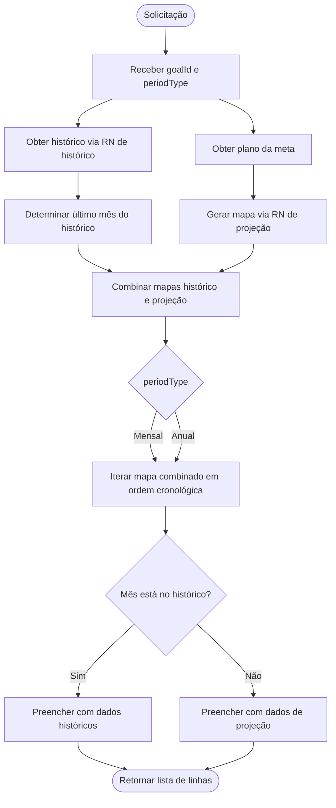

# UC - Obter Tabela da Tela de Acompanhamento das Metas

## 1. Objetivo

Descrever como obter os dados da tabela de evolução exibida na Tela de Acompanhamento das Metas, combinando dados históricos (passado) e projeções (futuro) da meta financeira. Os dados históricos são obtidos através da [RN - Calcular Histórico de Meta Financeira.md](../RN%20-%20Calcular%20Histórico%20de%20Meta%20Financeira.md) e as projeções através da [RN - Gerar Mapa de Projeção de Meta Financeira.md](../rules/RN%20-%20Gerar%20Mapa%20de%20Projeção%20de%20Meta%20Financeira.md).

## 2. Entradas

| Campo        | Tipo       | Descrição                                                                       |
|--------------|------------|---------------------------------------------------------------------------------|
| `goalId`     | UUID       | Identificador da meta selecionada na tela                                       |
| `periodType` | PeriodType | Período de visualização: `Mensal` ou `Anual` (sem agrupamento por ano, por ora) |

## 3. Saída

Lista ordenada de linhas para a tabela de evolução, uma por mês do período, com as colunas abaixo. Para `periodType = Anual`, a lista é a mesma do período mensal, por enquanto.

| Coluna             | Tipo        | Origem / Regra                                                             |
|--------------------|-------------|----------------------------------------------------------------------------|
| `monthYear`        | YearMonth   | Chave do mapa (histórico ou projeção)                                     |
| `goalValue`        | Money       | `GoalProjectedValue.projectedValue` do mapa de projeção (apenas meses futuros) |
| `totalValue`       | Money       | `GoalMonthlyData.value` do histórico (meses passados) ou `0.0` (futuro)  |
| `balance`          | Money       | `GoalMonthlyData.contributions - GoalMonthlyData.withdrawals` (histórico) ou `0.0` |
| `contributions`    | Money       | `GoalMonthlyData.contributions` do histórico ou `0.0` (futuro)           |
| `withdrawals`      | Money       | `GoalMonthlyData.withdrawals` do histórico ou `0.0` (futuro)               |
| `growthValue`      | Money       | `GoalMonthlyData.growth` do histórico ou `0.0` (futuro)                   |
| `growthPercent`    | Percentage  | `GoalMonthlyData.growthRate` do histórico ou `0.0` (futuro)                |
| `profitValue`      | Money       | `GoalMonthlyData.appreciation` do histórico ou `0.0` (futuro)              |
| `profitPercent`    | Percentage  | `GoalMonthlyData.appreciationRate` do histórico ou `0.0` (futuro)           |

## 4. Fluxo Principal

1. Receber `goalId` e `periodType`.
2. Obter o histórico da meta chamando a regra [RN - Calcular Histórico de Meta Financeira.md](../RN%20-%20Calcular%20Histórico%20de%20Meta%20Financeira.md), que retorna um `Map<YearMonth, GoalMonthlyData>`.
3. Obter o plano de investimento associado à meta e gerar o mapa de projeção chamando a regra [RN - Gerar Mapa de Projeção de Meta Financeira.md](../rules/RN%20-%20Gerar%20Mapa%20de%20Projeção%20de%20Meta%20Financeira.md), que retorna um `Map<YearMonth, GoalProjectedValue>`.
4. Determinar o último mês do histórico (último mês completo disponível).
5. Combinar os dois mapas:
   - Para meses no histórico (até o último mês completo): usar dados de `GoalMonthlyData`.
   - Para meses nas projeções (após o último mês do histórico): usar dados de `GoalProjectedValue`.
6. Se `periodType = Mensal` ou `periodType = Anual`, para cada entrada combinada (em ordem cronológica):
   - `monthYear` = chave `YearMonth`.
   - Se o mês está no histórico:
     - `goalValue` = `GoalProjectedValue.projectedValue` (se disponível na projeção) ou `0.0`.
     - `totalValue` = `GoalMonthlyData.value`.
     - `balance` = `GoalMonthlyData.contributions - GoalMonthlyData.withdrawals`.
     - `contributions` = `GoalMonthlyData.contributions`.
     - `withdrawals` = `GoalMonthlyData.withdrawals`.
     - `growthValue` = `GoalMonthlyData.growth`.
     - `growthPercent` = `GoalMonthlyData.growthRate`.
     - `profitValue` = `GoalMonthlyData.appreciation`.
     - `profitPercent` = `GoalMonthlyData.appreciationRate`.
   - Se o mês está apenas na projeção:
     - `goalValue` = `GoalProjectedValue.projectedValue`.
     - Demais campos com `0.0`.
7. Retornar a lista de linhas da tabela ordenada cronologicamente.

## 5. Fluxograma

## 6. Regras e Observações

- A ordem das linhas deve seguir a ordem cronológica, combinando histórico e projeções.
- Para `periodType = Mensal`, cada `YearMonth` do mapa combinado gera uma linha.
- Para `periodType = Anual`, cada `YearMonth` do mapa combinado gera uma linha (sem agrupamento por ano, por ora).
- Meses históricos (até o último mês completo) usam dados reais de `GoalMonthlyData`.
- Meses projetados (após o último mês histórico) usam dados de `GoalProjectedValue` apenas para `goalValue`, demais campos ficam com `0.0`.
- O histórico começa no mês de `startDate` da meta e vai até o último mês completo disponível.
- As projeções começam no mês seguinte ao último histórico e vão até atingir a meta ou o limite de 120 meses.

## Referências

- [RF - Tela de Acompanhamento das Metas.md](../screens/RF%20-%20Tela%20de%20Acompanhamento%20das%20Metas.md)
- [RN - Calcular Histórico de Meta Financeira.md](../RN%20-%20Calcular%20Histórico%20de%20Meta%20Financeira.md) - Para dados históricos (passado)
- [RN - Gerar Mapa de Projeção de Meta Financeira.md](../rules/RN%20-%20Gerar%20Mapa%20de%20Projeção%20de%20Meta%20Financeira.md) - Para dados projetados (futuro)