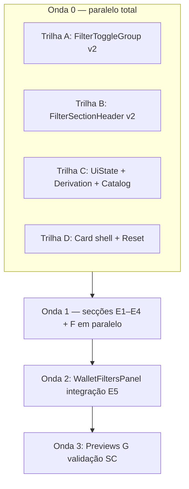

# Implementation Plan: Filtros da carteira

**Branch**: `014-wallet-filters` | **Date**: 2026-06-02 | **Spec**: [spec.md](spec.md)

**Input**: Feature specification from `specs/014-wallet-filters/spec.md`

**Diretriz do utilizador**: **priorizar paralelismo** — trilhas independentes, secções desacopladas, tarefas `[P]` em `tasks.md`.

## Summary

Entregar o **painel de filtros da carteira** (UI + estado local) no **`composeApp`**, dentro de um **Outlined Card** M3 Expressive, com secções derivadas da carteira injectada, multi-selecção em toggles, menu **Vence até** com meses reais, tooltips para abreviaturas e **Reset**. Primitivo reutilizável **`FilterToggleGroup`** no **design-system-v2** (multi-selecção, morph pill→rectângulo, tamanhos standard/compact). **Sem** ViewModel, **sem** integração Histórico, **sem** domínio/use cases.

## Technical Context

**Language/Version**: Kotlin 2.x — KMP

**Primary Dependencies**: Compose Multiplatform + Material3 Expressive (`foundation.library.comp`); `kotlinx-datetime` (vencimentos); `:features:design-system-v2`; `:features:composeApp` (já depende de v2 + usecases)

**Storage**: N/A

**Testing**: Previews Compose (light/dark, dataset completo + dinâmico); funções puras de derivação testáveis opcionalmente em `composeApp` — **sem** `./gradlew` automático (princípio IX)

**Target Platform**: Android, iOS, Desktop — `commonMain`

**Project Type**: Widget de apresentação (`composeApp`) + biblioteca de primitivos (`design-system-v2`)

**Performance Goals**: Recomposição fluida ao alternar toggles; derivação O(n) sobre carteira de demo (< 500 itens)

**Constraints**: `explicitApi()`; `AppThemeV2` obrigatório; sem `Color` na API pública v2; sem `:features:design-system` v1 no pacote `walletfilters`; previews `private`; FR-017 (zero alteração Histórico)

**Scale/Scope**: ~2–4 ficheiros v2; ~8–10 ficheiros composeApp; zero módulos novos Gradle

## Constitution Check

*GATE: Must pass before Phase 0 research. Re-check after Phase 1 design.*

| Princípio | Status | Observação |
|-----------|--------|------------|
| I — SOLID/DRY | ✅ | Primitivo único para toggles; derivação centralizada; secções finas. |
| II — Clean Architecture | ✅ | Só `:features:*`; sem `:data`; sem use cases novos. |
| III — KMP First | ✅ | `commonMain`; `YearMonth` para vencimentos. |
| IV — Plugins Foundation | ✅ | Sem plugins novos. |
| V — Testes Use Cases | ✅ N/A | Sem alteração em `:domain:usecases`. |
| VI — API Explícita | ✅ | `public` só em v2 primitivos; painel `internal` no composeApp. |
| VII — Documentação | ✅ | Artefactos spec/; `AGENTS.md` na PR de implementação se novos primitivos v2. |
| VIII — Idioma | ✅ | Docs pt-BR; código inglês. |
| IX — Validação | ✅ | Plano/quickstart: build Gradle sob pedido; aceite por previews. |

**Resultado do gate (pré-design)**: PASS

**Re-check pós-design**: PASS — painel `internal` sem `*Contract.kt` umbrella (padrão `SummaryGridWidget`); DS v2 sem registo obrigatório em apps.

## Project Structure

### Documentation (this feature)

```text
specs/014-wallet-filters/
├── plan.md
├── research.md
├── data-model.md
├── quickstart.md
├── contracts/
│   ├── FilterToggleGroupContract.md
│   └── WalletFiltersPanelContract.md
└── tasks.md              # Phase 2 (/speckit.tasks)
```

### Source Code (repository root)

```text
core/presentation/design-system-v2/
└── src/commonMain/kotlin/com/eferraz/design_system_v2/
    └── filter/
        ├── FilterToggleGroup.kt
        ├── FilterToggleGroupDefaults.kt
        └── FilterSectionHeader.kt          # opcional [P com A]

core/presentation/composeApp/
└── src/commonMain/kotlin/com/eferraz/presentation/features/walletfilters/
    ├── WalletFiltersPanel.kt
    ├── WalletFiltersUiState.kt
    ├── WalletFiltersDerivation.kt
    ├── WalletFiltersPreviewCatalog.kt
    ├── MaturityFilterDropdown.kt
    └── sections/
        ├── ClassFilterSection.kt           # [P]
        ├── SubtypeFilterSections.kt        # [P]
        ├── LiquidityFilterSection.kt       # [P]
        └── B3SettledFilterRow.kt           # [P]
```

**Structure Decision**: Pacote `walletfilters/` análogo a `summary/`. Primitivos em `filter/` no v2, paralelos a `dateselector/` e `summary/`.

## Estratégia de paralelismo

### Diagrama de trilhas



### Matriz de dependências

| Trilha | Entregável | Bloqueia | Bloqueado por |
|--------|------------|----------|---------------|
| **A** | `FilterToggleGroup` | E1–E4 | — |
| **B** | `FilterSectionHeader` | E1–E4 (estética) | — |
| **C** | Derivação + catalog | E1–F | — |
| **D** | Cartão + Reset (stub secções) | E5 | — |
| **E1** | Classe | E5 | A, C |
| **E2** | Subtipos | E5 | A, C |
| **E3** | Liquidez | E5 | A, C |
| **E4** | B3 + Liquidados | E5 | A, C |
| **F** | `MaturityFilterDropdown` | E5 | C |
| **E5** | Montagem `WalletFiltersPanel` | G | D, E1–E4, F |
| **G** | Previews light/dark/dinâmico | — | E5 |

**Regra**: E1–E4 e F podem ser desenvolvidos **em paralelo** por diferentes subagentes/tarefas `[P]` após conclusão de **A** e **C** (D pode avançar em paralelo com stub de secções).

### Ordem de user stories (integração)

1. **US1** (cartão) — Trilha **D**
2. **US2 + US3** (classe + subtipos + toggles) — **A** + **E1** + **E2**
3. **US3** (liquidez, B3, liquidados) — **E3** + **E4**
4. **US4** (vence até) — **F**
5. **US5–US7** (tooltips, reset, derivação) — transversal; validar em **G**

## Phase 0: Research

Concluído — ver [research.md](research.md).

**Decisões-chave**:
- Painel no `composeApp`; v2 só primitivos
- **Não** reutilizar `SegmentedControl` (exclusivo / radio)
- Novo `FilterToggleGroup` multi-selecção
- `MaturityFilterDropdown` no composeApp (padrão `MonthYearSelector`)
- Estado `remember` + derivação pura; sem ViewModel

## Phase 1: Design & Contracts

Concluído:
- [data-model.md](data-model.md)
- [contracts/FilterToggleGroupContract.md](contracts/FilterToggleGroupContract.md)
- [contracts/WalletFiltersPanelContract.md](contracts/WalletFiltersPanelContract.md)
- [quickstart.md](quickstart.md)

## Phase 2: Tasks (não gerado por este comando)

O `/speckit.tasks` DEVE marcar com **`[P]`** todas as tarefas das trilhas A, B, C, D, E1–E4 e F na **Onda 0/1**, e serializar apenas E5 e G.

## Fora do escopo (esta entrega)

- ViewModel, Koin, `AssetHistoryScreen`
- Use cases / filtragem real
- Persistência de filtros
- `WalletFiltersPanel` no design-system-v2
- Chips em vez de ToggleButton Expressivo
- Cores ou tipografia fora de tokens M3

## Complexity Tracking

| Item | Nota |
|------|------|
| Novo primitivo v2 vs copiar v1 | v1 é single-select; novo API evita breaking change |
| `FlowRow` + button groups conectados | Necessário para FR-M3-009 em várias linhas |
| Não depender de `design-system` v1 no painel | Reduz acoplamento; só v2 + compose |

## Artefactos gerados

| Artefacto | Caminho |
|-----------|---------|
| Plano | `specs/014-wallet-filters/plan.md` |
| Research | `specs/014-wallet-filters/research.md` |
| Data model | `specs/014-wallet-filters/data-model.md` |
| Contracts | `specs/014-wallet-filters/contracts/*.md` |
| Quickstart | `specs/014-wallet-filters/quickstart.md` |

**Próximo comando sugerido**: `/speckit.tasks` (com paralelismo explícito nas tarefas `[P]`)
