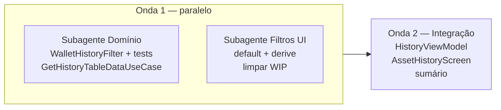

# Implementation Plan: Filtros da carteira no histórico

**Branch**: `015-history-wallet-filters` | **Date**: 2026-06-02 | **Spec**: [spec.md](spec.md)

**Input**: Feature specification from `specs/015-history-wallet-filters/spec.md`

**Diretriz do utilizador**: **menor esforço, menos código, mais simplicidade, melhor legibilidade** — planeamento orientado a **subagentes** com fronteiras estreitas e diffs pequenos.

## Summary

Integrar o **`WalletFiltersPanel`** (014) ao histórico substituindo controlos segmentados legados, com regras **OR/AND** numa **função pura** em `:domain:usecases`, estado no **`HistoryViewModel`**, opções derivadas das facetas do mês, default **«Não liquidado»**, e sumário agregado **só das linhas filtradas**. Sem módulos novos, sem use case extra, sem `WalletFiltersSlotGrid`.

## Technical Context

**Language/Version**: Kotlin 2.x — KMP

**Primary Dependencies**: `:domain:usecases`, `:domain:entity`, `:features:composeApp`, `:features:design-system-v2` (já integrado em 014)

**Storage**: N/A

**Testing**: `WalletHistoryFilterTest.kt` (≥8 cenários GIVEN_WHEN_THEN); ajustes pontuais em `GetHistoryTableDataUseCaseTest` se existir — **sem** `./gradlew` automático (princípio IX)

**Target Platform**: Android, iOS, Desktop — `commonMain`

**Project Type**: Integração domínio + ecrã existente

**Performance Goals**: Recálculo em memória O(n) sobre linhas do mês (< 500 posições); UI < 1s (SC-002)

**Constraints**: Clean Architecture (filtro no domain); `explicitApi()`; corretora inalterada; zero redesign do painel 014; legibilidade > abstrações

**Scale/Scope**: ~2 ficheiros novos domain + ~5 ficheiros alterados composeApp/history — **não** expandir `WalletFiltersPanel.kt` salvo derivação

## Constitution Check

*GATE: Must pass before Phase 0 research. Re-check after Phase 1 design.*

| Princípio | Status | Observação |
|-----------|--------|------------|
| I — SOLID/KISS | ✅ | Uma função de match; mapper fino VM→criteria; sem over-engineering. |
| II — Clean Architecture | ✅ | Domain não importa composeApp; facetas→criteria no boundary. |
| III — KMP First | ✅ | Tudo em `commonMain` / `jvmTest`. |
| IV — Plugins Foundation | ✅ | Sem alterações Gradle. |
| V — Testes Use Cases | ✅ | Testes obrigatórios na função de filtro. |
| VI — API Explícita | ✅ | Novos tipos `public` só se outro módulo consumir; preferir `internal` no match helper se só use case usa. |
| VII — Documentação | ✅ | Artefactos `specs/015-*`; `AGENTS.md` só se mudar convenção global. |
| VIII — Idioma | ✅ | Docs pt-BR; código inglês. |
| IX — Validação | ✅ | quickstart: build sob pedido. |

**Resultado do gate (pré-design)**: PASS

**Re-check pós-design**: PASS — sem violações; Complexity Tracking vazio.

## Project Structure

### Documentation (this feature)

```text
specs/015-history-wallet-filters/
├── plan.md              # Este ficheiro
├── research.md          # Phase 0
├── data-model.md        # Phase 1
├── quickstart.md        # Phase 1
├── contracts/
│   └── HistoryWalletFiltersContract.md
└── tasks.md             # Phase 2 (/speckit.tasks — não criado por /speckit.plan)
```

### Source Code (repository root)

```text
core/domain/usecases/src/commonMain/kotlin/com/eferraz/usecases/screens/
├── GetHistoryTableDataUseCase.kt      # alterar Param + pipeline
└── WalletHistoryFilter.kt             # NOVO (~80–120 linhas)

core/domain/usecases/src/jvmTest/kotlin/.../
└── WalletHistoryFilterTest.kt

core/presentation/composeApp/.../walletfilters/
├── WalletFilters.kt                   # defaultForHistory + derive
├── WalletFilterHoldingFacetMappers.kt # reutilizar
└── WalletFiltersDerivation.kt         # fundir/limpar WIP OU apagar

core/presentation/composeApp/.../history/
├── HistoryState.kt
├── HistoryViewModel.kt
├── AssetHistoryScreen.kt
└── WalletFiltersToCriteria.kt         # NOVO opcional: mapper UiState→Criteria
```

**Structure Decision**: Nenhum ficheiro novo em `design-system-v2`. Pacote `walletfilters/` só ganha derivação + default; pacote `history/` concentra wiring.

## Estratégia de subagentes

Objetivo: cada subagente entrega um diff **revisável isoladamente**, com contrato em [contracts/HistoryWalletFiltersContract.md](contracts/HistoryWalletFiltersContract.md).

### Diagrama de ondas



### Matriz de subagentes

| Subagente | Prompt foco | Entregável | Bloqueia |
|-----------|-------------|------------|----------|
| **D — Domínio** | Implementar `WalletHistoryFilter.kt`, testes ≥8, alterar `GetHistoryTableDataUseCase` (Param, remover goal/category/liquidity, remover skip zero, aplicar match) | Domain compilável conceptualmente + testes escritos | Integração VM |
| **F — Filtros UI** | `defaultForHistory()`/`reset()`, `deriveWalletFiltersPanelOptions(facets)`, apagar tipos WIP em `WalletFiltersDerivation.kt` | composeApp walletfilters coerente | Integração VM |
| **H — Histórico** | `HistoryState`, intents, `loadInitialData`, sumário por linhas, `AssetHistoryScreen` sem segmentados | E2E manual do ecrã | — |

**Ordem**: D e F em **paralelo**; H só após D (criteria estável). F pode começar antes de D mas H precisa de ambos.

### Prompts canónicos (copiar para Task tool)

**D — Domínio**
```text
Feature 015-history-wallet-filters. Read specs/015-history-wallet-filters/contracts/HistoryWalletFiltersContract.md and research.md.
Add WalletHistoryFilter.kt with WalletHistoryFilterCriteria, WalletHistoryFilterCandidate, matchesWalletHistoryFilter (OR/AND, RF-only liquidity/maturity, saturated Sim+Nao).
Update GetHistoryTableDataUseCase: Param(brokerage, walletFilter), remove implicit zero exclusion, remove legacy category/liquidity/goal filters.
Add WalletHistoryFilterTest.kt with GIVEN_WHEN_THEN T1–T9 from contract. Minimal code, no new UseCase class.
```

**F — Filtros UI**
```text
Feature 015. Fix walletfilters: WalletFiltersUiState.defaultForHistory() with selectedSettled={NO}; reset() same.
Implement deriveWalletFiltersPanelOptions(List<WalletFilterHoldingFacet>) -> WalletFiltersPanelOptions in one place; delete/merge broken WalletFiltersDerivation.kt WIP types. Do not add WalletFiltersSlotGrid. Keep WalletFiltersPanel unchanged.
```

**H — Histórico**
```text
Feature 015. US1 MVP (tasks T014–T021): VM + derive options after load + wire panel + remove legacy Segmenteds/intents in same sprint.
Map UiState to WalletHistoryFilterCriteria; pass to GetHistoryTableDataUseCase. US5 summary only after domain filter (T007) and legacy removal.
```

## Phase 0: Research

Concluído em [research.md](research.md). Sem `NEEDS CLARIFICATION` em aberto.

Decisões-chave para simplicidade:
- **Uma função** `matchesWalletHistoryFilter` em vez de novo use case.
- **Sumário** por soma das linhas já calculadas no use case.
- **Fundir** derivação WIP; não criar `WalletFiltersSlotGrid`.

## Phase 1: Design & Contracts

| Artefacto | Path |
|-----------|------|
| Data model | [data-model.md](data-model.md) |
| Contract | [contracts/HistoryWalletFiltersContract.md](contracts/HistoryWalletFiltersContract.md) |
| Quickstart | [quickstart.md](quickstart.md) |

**Agent context**: `.cursor/rules/specify-rules.mdc` → `specs/015-history-wallet-filters/plan.md`

## Phase 2: Task generation (outline para `/speckit.tasks`)

Não gerar `tasks.md` neste comando. Esboço para tarefas **pequenas** e `[P]` onde possível:

| ID | Tarefa | Paralelo | Subagente |
|----|--------|----------|-----------|
| T003–T008 | `WalletHistoryFilter` + testes T1–T9 + `GetHistoryTableDataUseCase` | — | D |
| T009–T013 | `defaultForHistory` + derive (FR-018) + limpar WIP | [P] | F |
| T014–T021 | MVP US1: VM + painel + **remover legados** + FR-012 | — | H |
| T022–T024 | US2–US3 integração | — | H |
| T025 | US4 validação período/opções | — | H |
| T026–T027 | US5 sumário (após T007 + legados removidos) | — | H |
| T028–T030 | Polish | [P] | — |

Ver `tasks.md` para detalhe completo (30 tarefas T001–T030).

**Critério de done**: checklist em [quickstart.md](quickstart.md) + SC-001–SC-005 da spec.

## Complexity Tracking

> Nenhuma violação da constituição que exija justificação.

| Violation | Why Needed | Simpler Alternative Rejected Because |
|-----------|------------|-------------------------------------|
| — | — | — |

## Riscos e mitigação (legibilidade)

| Risco | Mitigação simples |
|-------|-------------------|
| Duplicar facetas domain vs presentation | Candidate construído **dentro** do use case a partir de `Asset`/`HoldingHistoryResult`; presentation mantém `WalletFilterHoldingFacet` só para derivação UI |
| `WalletFiltersDerivation.kt` não compila | Apagar tipos mortos; uma função `derive` em ficheiro único |
| Regressão sumário | Um bloco em `loadInitialData` que soma campos da lista já filtrada |
| Testes frágeis | Tabela de casos na função pura; sem MockK no match |

## Extension Hooks

**Optional Pre-Hook**: git  
Command: `/speckit.git.commit`  
Description: Auto-commit before implementation planning  

Prompt: Commit outstanding changes before planning?  
To execute: `/speckit.git.commit`
