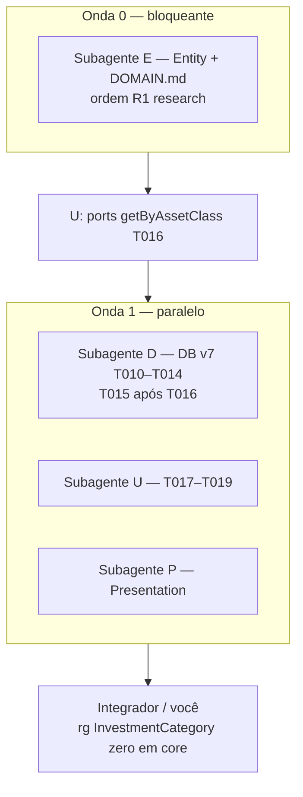

# Implementation Plan: Reestruturação da taxonomia de ativos

**Branch**: `016-asset-taxonomy-refactor` | **Date**: 2026-06-02 | **Spec**: [spec.md](./spec.md)

**Input**: Feature specification from `/specs/016-asset-taxonomy-refactor/spec.md`  
**Diretriz do utilizador**: **simplicidade de código** e **paralelismo** — ondas curtas, subagentes com fronteiras por camada, sem camadas adapter nem aliases deprecated.

## Summary

Refatorar a taxonomia de ativos em todo o monorepo:

- `InvestmentCategory` → **`AssetClass`** (`assetClass` / coluna `asset_class`)
- Indexador RF → **`YieldIndexer`** (`indexer` / coluna `indexer`)
- Produto RF → **`FixedIncomeAssetType`** (ex-`FixedIncomeSubType`, coluna `type`)
- Contrato **`AssetType`** marcadora nos três enums de produto
- Room **v6 → v7** com rename de colunas (`Migration6To7`)
- **`DOMAIN.md`** sincronizado (princípio VII)

Abordagem: **uma onda bloqueante** no módulo `entity`, depois **três subagentes em paralelo** (database, usecases+testes, presentation+naming). Renomeação mecânica; zero novos módulos Gradle.

### Mappers — discriminador persistido (planeado, não implementar fora da 016)

Hoje `AssetMappers.kt` grava `INVESTMENT_FUND` em `assets.category` e `TransactionMappers.kt` grava `FUNDS` em `asset_transactions.category`. Na implementação (subagente **D**, T010/T013):

1. **`PersistedAssetClass`** em `AssetMappers.kt` — fonte única dos literais `FIXED_INCOME`, `VARIABLE_INCOME`, `INVESTMENT_FUND`.
2. **`TransactionMappers.kt`** importa/reutiliza as mesmas constantes (fundos → `INVESTMENT_FUND`, não `FUNDS`).
3. **`Migration6To7`**: após `@RenameColumn`, `onPostMigrate` com `UPDATE … SET asset_class = 'INVESTMENT_FUND' WHERE asset_class = 'FUNDS'`.

Detalhe: [research.md](./research.md) R5, [data-model.md](./data-model.md) § discriminador, contrato em [contracts/AssetTaxonomyContract.md](./contracts/AssetTaxonomyContract.md).

## Technical Context

**Language/Version**: Kotlin 2.x — KMP, Compose Multiplatform

**Primary Dependencies**: `:domain:entity`, Room 3 (`androidx.room3`), Koin, kotlinx.datetime

**Storage**: SQLite — migração 6→7 (`assets`, `asset_transactions`, `fixed_income_assets`)

**Testing**: Escrever/atualizar `jvmTest` em `:domain:usecases` — **sem** `./gradlew` automático (princípio IX)

**Target Platform**: Android, iOS, Desktop — `commonMain`

**Project Type**: Refactor transversal domínio → data → usecases → UI

**Performance Goals**: N/A (rename + migração O(1) por linha)

**Constraints**: Clean Architecture; `explicitApi()`; enum **values** inalterados; discriminador TEXT unificado (`INVESTMENT_FUND`, não `FUNDS` em transações — ver R5)

**Scale/Scope**: ~45 ficheiros `.kt` em `core/`; 1 `Migration6To7`; 0 módulos novos

## Constitution Check

*GATE: Deve passar antes da Phase 0. Revalidado após Phase 1.*

| # | Princípio | Verificação | Status |
|---|-----------|-------------|--------|
| I | SOLID, KISS, YAGNI | `AssetType` vazia; rename direto; sem facade | **APROVADO** |
| II | Clean Architecture | Entity → data → usecases → features | **APROVADO** |
| III | KMP First | `commonMain` / `jvmTest` | **APROVADO** |
| IV | Plugins Foundation | Sem alteração `build.gradle.kts` | **APROVADO** |
| V | Testes Use Cases | Atualizar testes existentes (Upsert, History, WalletFilter) | **APROVADO** |
| VI | API Explícita | Tipos `public` só onde já expostos | **APROVADO** |
| VII | Documentação | `DOMAIN.md` + artefactos `specs/016-*` | **APROVADO** |
| VIII | Idioma | Docs pt-BR; código inglês | **APROVADO** |
| IX | Validação | quickstart: build/test sob pedido | **APROVADO** |

**Resultado do gate (pós-design)**: **APROVADO** — Complexity Tracking vazio.

## Project Structure

### Documentation (this feature)

```text
specs/016-asset-taxonomy-refactor/
├── plan.md              # Este ficheiro
├── spec.md
├── research.md          # Phase 0
├── data-model.md        # Phase 1
├── quickstart.md        # Phase 1
├── contracts/
│   └── AssetTaxonomyContract.md
└── tasks.md             # Phase 2 (/speckit.tasks)
```

### Source Code (alterações previstas)

```text
core/domain/entity/.../assets/
├── AssetClass.kt                    # rename InvestmentCategory
├── YieldIndexer.kt                  # novo (ex-indexador FixedIncomeAssetType)
├── FixedIncomeAssetType.kt          # produto (ex-FixedIncomeSubType)
├── AssetType.kt                     # marcadora
├── Asset.kt, FixedIncomeAsset.kt, VariableIncomeAsset.kt, InvestmentFundAsset.kt
└── (remover InvestmentCategory.kt, FixedIncomeSubType.kt, indexador antigo)

core/domain/entity/docs/DOMAIN.md

core/data/database/
├── core/AppDatabase.kt              # v7, AutoMigration 6→7
├── migrations/Migration6To7.kt      # @RenameColumn
├── entities/assets/*.kt
├── mappers/AssetMappers.kt (PersistedAssetClass), TransactionMappers.kt (mesma fonte)
└── daos/AssetDao.kt, AssetHoldingDao.kt

core/domain/usecases/               # HistoryTableData, filters, repos ports, tests
core/data/repositories/             # getByAssetClass
core/data/filestore/                # imports

core/presentation/
├── asset-management/.../assets/    # VM, Screen, Events, Map
├── naming/FieldLabels.kt, TableIcons.kt
└── composeApp/.../walletfilters/, history/
```

**Structure Decision**: Refactor mecânico; fronteira de paralelismo = **camada Gradle**, não ficheiro solto em `entity`.

## Estratégia de subagentes (simplicidade + paralelismo)

Contrato único: [contracts/AssetTaxonomyContract.md](./contracts/AssetTaxonomyContract.md).

### Diagrama de ondas



### Matriz de subagentes

| ID | Escopo | Ficheiros (~) | Depende de | Paralelo com |
|----|--------|---------------|------------|--------------|
| **E** | `entity` + `DOMAIN.md` | 10 | — | — |
| **D** | `:data:database` + `:data:repositories` | 12 | E, **U (T016)** | U, P (T015 após ports) |
| **U** | `:domain:usecases` + tests + `filestore` | 15 | E | D, P — **T016 primeiro** |
| **P** | `asset-management`, `composeApp` walletfilters/history, `naming` | 18 | E | D, U |

**Não paralelizar** `entity` (colisão de nomes `FixedIncomeAssetType` — ver [research.md](./research.md) R1).

### Prompts canónicos (Task tool)

**E — Entity**

```text
Feature 016-asset-taxonomy-refactor. Read specs/016-asset-taxonomy-refactor/contracts/AssetTaxonomyContract.md and research.md R1.
Execute rename order: AssetClass; YieldIndexer (delete old FixedIncomeAssetType indexador); FixedIncomeSubType file → FixedIncomeAssetType product enum; AssetType marker; update Asset.assetClass, FixedIncomeAsset.indexer+type.
Update core/domain/entity/docs/DOMAIN.md §2,§5,§6.5,§9.1. No Gradle. Minimal diff.
```

**D — Database**

```text
Feature 016. After entity types exist. AppDatabase v7, Migration6To7 with RenameColumn: assets.category→asset_class, asset_transactions.category→asset_class, fixed_income_assets type→indexer, subType→type.
Migration6To7 onPostMigrate: UPDATE asset_transactions SET asset_class = 'INVESTMENT_FUND' WHERE asset_class = 'FUNDS' (ver research R5).
PersistedAssetClass em AssetMappers.kt; TransactionMappers.kt usa as mesmas constantes (INVESTMENT_FUND para FundsTransaction).
Update FixedIncomeAssetEntity, AssetEntity, AssetTransactionEntity, DAOs @Query asset_class. AssetRepositoryImpl getByAssetClass. No new tables.
```

**U — Use cases**

```text
Feature 016. Rename InvestmentCategory→AssetClass, FixedIncomeSubType→FixedIncomeAssetType product, indexador→YieldIndexer in HistoryTableData (indexer+type fields), HoldingHistoryView, WalletHistoryFilter, GetHistoryTableDataUseCase, MergeHistoryUseCase, repository interfaces, TestDataFactory, jvmTests. No behavior change.
```

**P — Presentation**

```text
Feature 016. asset-management: AssetManagement* events/state/screen/map for AssetClass, YieldIndexer, product FixedIncomeAssetType; labels Indexador/Tipo RF.
naming: FieldLabels YieldIndexer.asLabel, AssetClass.asLabel; TableIcons AssetClass.
composeApp walletfilters + history: replace InvestmentCategory/FixedIncomeSubType imports. No new UI components.
```

## Phase 0 — Research

Concluído em [research.md](./research.md). Clarificações da spec incorporadas (SQL rename, `YieldIndexer`, produto `FixedIncomeAssetType`, `AssetType` vazia, transações `asset_class`, unificação `FUNDS`→`INVESTMENT_FUND` — R5).

Sem `NEEDS CLARIFICATION` em aberto.

## Phase 1 — Design & Contracts

| Artefacto | Caminho |
|-----------|---------|
| Data model | [data-model.md](./data-model.md) |
| Contract | [contracts/AssetTaxonomyContract.md](./contracts/AssetTaxonomyContract.md) |
| Quickstart | [quickstart.md](./quickstart.md) |
| Domínio canónico | [core/domain/entity/docs/DOMAIN.md](../../core/domain/entity/docs/DOMAIN.md) (tarefa subagente E) |

**Agent context**: `.cursor/rules/specify-rules.mdc` → `specs/016-asset-taxonomy-refactor/plan.md`

## Phase 2 — Task generation (outline para `/speckit.tasks`)

Não gerar `tasks.md` neste comando. Esboço mínimo:

| ID | Tarefa | Paralelo | Subagente |
|----|--------|----------|-----------|
| T001 | Setup: confirmar branch 016 | — | — |
| T002–T008 | Entity + DOMAIN (R1) | — | E |
| T009–T014 | DB v7 + Migration6To7 | [P] após T008 | D |
| T016 | Ports `getByAssetClass` | — após T009 | U |
| T015 | Repos/datasources impl | após T016 | D |
| T017–T022 | Use cases + tests | [P] após T016 | U |
| T023–T030 | Presentation + naming | [P] após T009 | P |
| T028–T032 | `rg` repo, AGENTS, quickstart | — | — |

**Done**: [quickstart.md](./quickstart.md) + SC-001–SC-004 da spec.

## Complexity Tracking

> Nenhuma violação da constituição.

| Violation | Why Needed | Simpler Alternative Rejected Because |
|-----------|------------|-------------------------------------|
| — | — | — |

## Riscos e mitigação

| Risco | Mitigação |
|-------|-----------|
| Colisão `FixedIncomeAssetType` | Onda 0 única (E); ordem R1 |
| Paralelo quebra compile | D/U/P só após E mergeado na branch |
| Conflito merge repos | **T016 (ports) antes de T015 (impl)** — ver tasks.md I1 |
| `HistoryTableData` confunde type/indexer | Renomear `indexer` + `type` no mesmo PR (U) |
| Room rename falha | `Migration6To7` explícita; validar quickstart §3 |
| `FUNDS` legado em transações | `onPostMigrate` R5 + `PersistedAssetClass` nos mappers |

## Extension Hooks

**Optional Pre-Hook**: git  
Command: `/speckit.git.commit`  
Description: Auto-commit before implementation planning  

Prompt: Commit outstanding changes before planning?  
To execute: `/speckit.git.commit`
