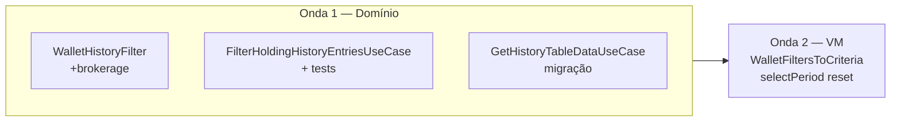

# Implementation Plan: Filtragem de histórico por critérios unificados (incl. corretora)

**Branch**: `018-holding-history-filter` | **Date**: 2026-06-03 | **Spec**: [spec.md](spec.md)

**Input**: Feature specification from `specs/018-holding-history-filter/spec.md`

**Diretriz**: Menor diff possível — estender contrato 015, um caso de uso novo, migrar pipeline da tabela; **zero** alteração visual (FR-007).

## Summary

Unificar a filtragem do histórico num único caminho: **`FilterHoldingHistoryEntriesUseCase`** sobre `HoldingHistoryEntry` + **`WalletHistoryFilterCriteria`** com grupo **Corretora** (`brokerageIds`), reutilizando `matchesWalletHistoryFilter`. **`GetHistoryTableDataUseCase`** deixa de receber `brokerage` à parte e filtra só `currentEntry` após merge. **`HistoryViewModel`** mapeia corretora para critérios, deriva facetas com critério só-corretora, e **limpa corretora** ao mudar período. Testes obrigatórios em `:domain:usecases`; UI inalterada.

## Technical Context

**Language/Version**: Kotlin 2.x — KMP (`commonMain` / `jvmTest`)

**Primary Dependencies**: `:domain:usecases`, `:domain:entity` (`HoldingHistoryEntry`, `Brokerage`), `:features:composeApp` (history/walletfilters wiring only)

**Storage**: N/A

**Testing**: `FilterHoldingHistoryEntriesUseCaseTest.kt` (novo); extensão `WalletHistoryFilterTest.kt`; ajustes `GetHistoryTableDataUseCaseTest` — **sem** `./gradlew` automático (princípio IX)

**Target Platform**: Android, iOS, Desktop

**Project Type**: Extensão domínio + wiring ViewModel

**Performance Goals**: O(n) sobre entradas do mês (< 500 posições, SC-004); subsegundo em memória

**Constraints**: Clean Architecture; `explicitApi()`; sem novos módulos Gradle; sem mudanças em `WalletFiltersPanel` / design-system-v2

**Scale/Scope**: ~3 ficheiros novos/alterados em usecases; ~2 em composeApp/history; 0 ficheiros UI layout

## Constitution Check

*GATE: Must pass before Phase 0 research. Re-check after Phase 1 design.*

| Princípio | Status | Observação |
|-----------|--------|------------|
| I — SOLID/KISS | ✅ | UC fino + match puro existente; mapper único VM→criteria. |
| II — Clean Architecture | ✅ | Filtro em usecases; composeApp só mapeia estado. |
| III — KMP First | ✅ | `commonMain` / `jvmTest`. |
| IV — Plugins Foundation | ✅ | Sem alterações Gradle. |
| V — Testes Use Cases | ✅ | Novos testes corretora + regressão 015. |
| VI — API Explícita | ✅ | Tipos `public` só onde outros módulos importam. |
| VII — Documentação | ✅ | `specs/018-*`; `AGENTS.md` se actualizar convenção de filtros. |
| VIII — Idioma | ✅ | Docs pt-BR; código/testes inglês. |
| IX — Validação | ✅ | quickstart com Gradle sob pedido. |

**Resultado do gate (pré-design)**: PASS

**Re-check pós-design**: PASS — Complexity Tracking vazio.

## Project Structure

### Documentation (this feature)

```text
specs/018-holding-history-filter/
├── plan.md
├── research.md
├── data-model.md
├── quickstart.md
├── contracts/
│   └── HoldingHistoryFilterContract.md
└── tasks.md             # Phase 2 (/speckit.tasks)
```

### Source Code (repository root)

```text
core/domain/usecases/src/commonMain/kotlin/com/eferraz/usecases/screens/
├── WalletHistoryFilter.kt                    # +brokerageIds, +brokerageId, matchesBrokerage
├── FilterHoldingHistoryEntriesUseCase.kt     # NOVO
├── GetHistoryTableDataUseCase.kt             # Param sem brokerage; pipeline UC
└── HoldingHistoryFilterMappers.kt            # OPCIONAL: entry.toWalletHistoryFilterCandidate()
                                              # ou manter extensões no mesmo ficheiro do UC

core/domain/usecases/src/jvmTest/kotlin/com/eferraz/usecases/screens/
├── WalletHistoryFilterTest.kt                # +cenários corretora
└── FilterHoldingHistoryEntriesUseCaseTest.kt # NOVO

core/presentation/composeApp/.../history/
├── WalletFiltersToCriteria.kt                # +brokerageIds
└── HistoryViewModel.kt                       # facet criteria, reset período, Param único
```

**Structure Decision**: Sem módulos novos. Reutilizar pacote `screens/` da 015. UI (`AssetHistoryScreen`) **não** entra no diff salvo imports indirectos.

## Estratégia de implementação (ondas)



| Onda | Entregável | Bloqueia |
|------|------------|----------|
| **1 — Domínio** | `brokerageIds`/match **antes** do UC; mapper entry; UC; pipeline tabela; testes T1–T9 | VM |
| **1b — Testes corretora** | Cenários SC-001 + edge cases (US2 em `tasks.md`) | — |
| **2 — Histórico VM** | Mapper + `facetCriteriaForHistory`; remover `Param.brokerage` e filtro paralelo | — |

**Paralelismo**: Onda 2 só após T003–T011. **FR-005 completo** (sem `Param.brokerage`) só na Onda 2 — MVP domínio (Onda 1) pode manter filtro paralelo temporariamente (`tasks.md`).

### Prompt canónico — Onda 1 (Domínio)

```text
Feature 018. Extend WalletHistoryFilterCriteria with brokerageIds and WalletHistoryFilterCandidate with brokerageId; implement matchesBrokerage (OR, empty=inactive, optional saturation). Add HoldingHistoryEntry.toWalletHistoryFilterCandidate() (settled from entry patrimony). Add FilterHoldingHistoryEntriesUseCase @Factory. Migrate GetHistoryTableDataUseCase: remove Param.brokerage, filter via UC on currentEntry list then filter HoldingHistoryResult. Tests: WalletHistoryFilterTest brokerage cases + FilterHoldingHistoryEntriesUseCaseTest + fix GetHistoryTableDataUseCaseTest. Contract: specs/018-holding-history-filter/contracts/HoldingHistoryFilterContract.md
```

### Prompt canónico — Onda 2 (VM)

```text
Feature 018. WalletFiltersToCriteria: pass selected Brokerage into brokerageIds. HistoryViewModel: table Param uses full criteria; facet load uses Criteria(brokerageIds only); SelectPeriod clears brokerage.selected. No AssetHistoryScreen layout changes. Contract: HoldingHistoryFilterContract.md HistoryViewModel section.
```

## Phase 0 — Research

Concluído em [research.md](research.md). Sem NEEDS CLARIFICATION pendentes.

## Phase 1 — Design & Contracts

| Artefacto | Path |
|-----------|------|
| Modelo | [data-model.md](data-model.md) |
| Contrato | [contracts/HoldingHistoryFilterContract.md](contracts/HoldingHistoryFilterContract.md) |
| Quickstart | [quickstart.md](quickstart.md) |

## Phase 2 — Tasks

Gerar com `/speckit.tasks` (não criado por este comando).

## Riscos e mitigação

| Risco | Mitigação |
|-------|-----------|
| Regressão listagem vs corretora antiga | SC-003: testes + cenário manual 2/3 no quickstart |
| Facetas vazias com corretora sem activos | Edge case spec; manter derive actual |
| Reset corretora ao mudar período (novo) | Documentado FR-010; teste VM ou manual |

## Complexity Tracking

> Vazio — sem violações da constituição.
