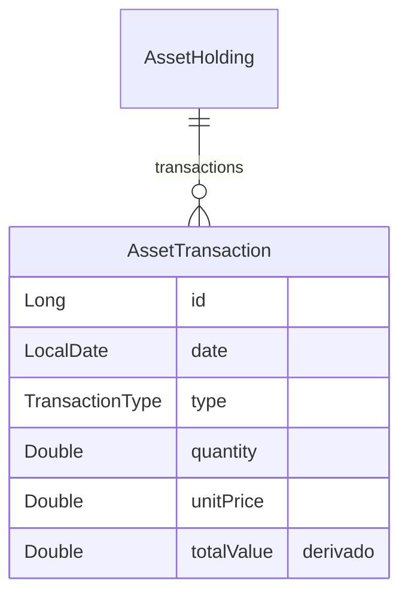

# Data Model: Feature 023 — Modelo unificado de transações

## Visão geral

Todas as transações de ativo passam a partilhar **um único tipo** de domínio e **uma única linha** na tabela `asset_transactions`. O valor total é **sempre derivado** na leitura; observações deixam de existir.

---

## Domínio — `:domain:entity`

### `AssetTransaction` (substitui sealed interface + 3 subclasses)

**Pacote**: `com.eferraz.entities.transactions`

**Antes** (remover):
- `sealed interface AssetTransaction`
- `FixedIncomeTransaction`, `VariableIncomeTransaction`, `FundsTransaction`

**Depois**:

```kotlin
public data class AssetTransaction(
    public val id: Long,
    public val date: LocalDate,
    public val type: TransactionType,
    public val quantity: Double,
    public val unitPrice: Double,
) {
    public val totalValue: Double
        get() = quantity * unitPrice
}
```

| Campo | Tipo | Persistido | Regras |
|-------|------|------------|--------|
| `id` | `Long` | Sim | `0L` = novo registo |
| `date` | `LocalDate` | Sim | — |
| `type` | `TransactionType` | Sim | `PURCHASE` \| `SALE` |
| `quantity` | `Double` | Sim | RV: inteiro positivo na UI; RF/Fundos: `1.0` |
| `unitPrice` | `Double` | Sim | Sem arredondamento na gravação |
| `totalValue` | `Double` | **Não** | Derivado: `quantity * unitPrice` |

**Removidos**: `observations`; subtipos por classe de ativo.

### `TransactionBalance`

Sem alteração de API pública. Implementação interna usa `transaction.totalValue` directamente (sem `when` por subtipo).

### `AssetHolding` (inalterado)

```kotlin
data class AssetHolding(
    // ...
    val transactions: List<AssetTransaction> = emptyList(),
)
```

A **classe do ativo** (`AssetClass`) permanece em `Asset` / `AssetHolding`, não em `AssetTransaction`.

---

## Persistência — `:data:database`

### `AssetTransactionEntity` (tabela `asset_transactions`)

**Alterações**:

| Coluna | Acção |
|--------|--------|
| `quantity` | **ADD** REAL NOT NULL (default 1 na migração) |
| `unitPrice` | **ADD** REAL NOT NULL (default 0 na migração) |
| `observations` | **DROP** |
| `asset_class` | **DROP** (índice associado removido) |
| `id`, `holdingId`, `transactionDate`, `type` | Manter |

**Classe do ativo**: obtida via `asset_holdings` → `assets.asset_class` — não duplicada na transação.

### Tabelas removidas

- `fixed_income_transactions`
- `variable_income_transactions`
- `funds_transactions`

### `TransactionWithDetails`

**Antes**: `@Embedded` base + 3 `@Relation` opcionais.

**Depois**: eliminar wrapper ou reduzir a alias de `AssetTransactionEntity` — leitura/escrita directa na tabela base.

### Migração de dados legados (FR-008)

| Origem | `quantity` | `unitPrice` |
|--------|------------|-------------|
| `variable_income_transactions` | `quantity` existente | `unitPrice` existente |
| `fixed_income_transactions` | `1` | `totalValue` legado |
| `funds_transactions` | `1` | `totalValue` legado |

Conteúdo de `observations` **descartado** (não migrado).

**Versão DB**: 9 → **10**

---

## UI — `:features:asset-management`

### `TransactionDraftUi`

```kotlin
internal data class TransactionDraftUi(
    val id: Long? = null,
    val assetClass: AssetClass,
    val isNew: Boolean = false,
    val dateDigits: String = "",
    val type: TransactionType = TransactionType.PURCHASE,
    val quantity: String = "",      // RF/Fundos: default "1", readOnly na UI
    val unitPrice: String = "",
    val totalValue: String = "",    // calculado, nunca editável
    // observations REMOVIDO
)
```

**Mapeamento**:

- `fromDomain(tx, assetClass)`: preenche qty, unitPrice, totalValue de `tx.quantity`, `tx.unitPrice`, `tx.totalValue`
- `toDomainTransaction(assetClass)`: constrói `AssetTransaction` único; RF/Fundos forçam qty=1 na UI antes do save
- `syncTotal()`: substitui `syncVariableIncomeTotal()` — aplica a **todas** as classes quando qty e price parseiam

**Validação de campos** (transacções):

| Campo | Erro bloqueante |
|-------|-----------------|
| Data | Opcional — `dateError` pode permanecer; save ignora linhas com `toDomainTransaction == null` |
| Quantidade | **Nenhum** (spec: sem validação) |
| Preço unitário | **Nenhum** |
| Valor total | **Nenhum** |

### `TransactionFormContent` — estados de campo

| Classe de ativo | Quantidade | Preço unit. | Valor total |
|-----------------|------------|-------------|-------------|
| Renda variável | Editável (inteiro) | Editável | Read-only, calculado |
| Renda fixa | `"1"`, read-only | Editável | Read-only, calculado |
| Fundos | `"1"`, read-only | Editável | Read-only, calculado |

**Eventos**: `TransactionTotalValueChanged` pode ser removido ou tornar-se no-op (total nunca editável).

---

## Diagrama (pós-unificação)



---

## Ficheiros de domínio/dados a eliminar

```
core/domain/entity/.../FixedIncomeTransaction.kt
core/domain/entity/.../VariableIncomeTransaction.kt
core/domain/entity/.../FundsTransaction.kt
core/data/database/.../FixedIncomeTransactionEntity.kt
core/data/database/.../VariableIncomeTransactionEntity.kt
core/data/database/.../FundsTransactionEntity.kt
core/data/database/.../BaseTransactionEntity.kt  (se ficar órfão)
```
