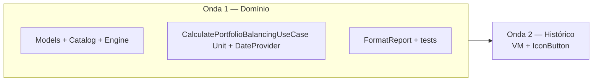

# Implementation Plan: Balanceamento de carteira

**Branch**: `024-portfolio-balancing` | **Date**: 2026-06-06 | **Spec**: [spec.md](spec.md)

**Input**: Feature specification from `specs/024-portfolio-balancing/spec.md`

**Diretriz**: Menor diff possível — `CalculatePortfolioBalancingUseCase` **autossuficiente** (`AppUseCase<Unit, …>`), período via `DateProvider.getCurrentYearMonth()`, catálogo estático extensível, botão no histórico com saída em log; **sem** ecrã dedicado, **sem** persistência de pesos, **sem** novos módulos Gradle.

## Summary

Introduzir **balanceamento de carteira** como operação de domínio reutilizável e **autónoma**: `CalculatePortfolioBalancingUseCase(Unit)` obtém o mês corrente via `DateProvider`, lê posições já persistidas com `GetHoldingHistoriesUseCase` (carteira completa, sem filtros; **sem** `CreateHistoryUseCase`), executa o motor (catálogo 3 grupos / 11 componentes, classificação, actual/ideal/desvio) e devolve `PortfolioBalancingReport`. O histórico, ao tocar no `IconButton` ao lado do import B3, invoca `useCase(Unit)` e faz `println` do relatório formatado — botão sempre activo, toques repetidos permitidos.

## Technical Context

**Language/Version**: Kotlin 2.x — KMP (`commonMain` / `jvmTest`)

**Primary Dependencies**: `:domain:usecases` (`AppUseCase`, `DateProvider`, `GetHoldingHistoriesUseCase`), `:domain:entity` (taxonomia de ativos), `:features:composeApp` (botão + invoke)

**Storage**: N/A (catálogo em código na v1)

**Testing**: `PortfolioBalancingEngineTest`, `PortfolioBalancingPartitionTest`, `CalculatePortfolioBalancingUseCaseTest` em `:domain:usecases:jvmTest` — **sem** `./gradlew` automático (princípio IX)

**Target Platform**: Android, iOS, Desktop

**Project Type**: Extensão domínio + wiring mínimo no histórico

**Performance Goals**: Relatório completo em < 5 s para ≤ 200 posições activas (SC-002); O(n × componentes) em memória

**Constraints**: Clean Architecture; `explicitApi()`; SOLID (catálogo / engine / formatação separados); sem estado `isBalancing` na UI; período = **data corrente** (`DateProvider`), não o mês seleccionado no selector do histórico

**Scale/Scope**: ~6 ficheiros novos em `usecases/balancing/`; ~2 alterados em `composeApp/history/`; 0 alterações Room/entity/repositories

## Constitution Check

*GATE: Must pass before Phase 0 research. Re-check after Phase 1 design.*

| Princípio | Status | Observação |
|-----------|--------|------------|
| I — SOLID/KISS | ✅ | UC único; `DateProvider` existente; sem port novo. |
| II — Clean Architecture | ✅ | Orquestração no UC; VM só invoca `Unit` + println. |
| III — KMP First | ✅ | `commonMain` / `jvmTest`. |
| IV — Plugins Foundation | ✅ | Sem alterações Gradle. |
| V — Testes Use Cases | ✅ | Engine + orquestração + partição. |
| VI — API Explícita | ✅ | `public` só em UC e tipos de relatório. |
| VII — Documentação | ✅ | `specs/024-*`. |
| VIII — Idioma | ✅ | Docs pt-BR; código/testes inglês. |
| IX — Validação | ✅ | quickstart com Gradle sob pedido. |
| X — Escopo focado | ✅ | Sem ecrã, sem edição de pesos, sem persistência. |

**Resultado do gate (pré-design)**: PASS

**Re-check pós-design**: PASS — Complexity Tracking vazio.

## Project Structure

### Documentation (this feature)

```text
specs/024-portfolio-balancing/
├── plan.md
├── research.md
├── data-model.md
├── quickstart.md
├── contracts/
│   └── PortfolioBalancingContract.md
└── tasks.md             # Phase 2 (/speckit.tasks)
```

### Source Code (repository root)

```text
core/domain/usecases/src/commonMain/kotlin/com/eferraz/usecases/balancing/
├── PortfolioBalancingModels.kt              # TargetWeight, Report, ReportLine, ids
├── PortfolioBalancingCatalog.kt             # grupos, componentes, predicados, tickers
├── PortfolioBalancingEngine.kt              # cálculo puro (entries → report); testável
├── CalculatePortfolioBalancingUseCase.kt    # AppUseCase<Unit, PortfolioBalancingReport>
└── FormatPortfolioBalancingReport.kt        # string tabular para log

core/domain/usecases/src/jvmTest/kotlin/com/eferraz/usecases/balancing/
├── PortfolioBalancingEngineTest.kt          # cenários FR-014 (motor puro)
├── PortfolioBalancingPartitionTest.kt
└── CalculatePortfolioBalancingUseCaseTest.kt  # orquestração com mocks

core/presentation/composeApp/.../history/
├── HistoryViewModel.kt                      # intent → useCase(Unit) + println
└── AssetHistoryScreen.kt                    # IconButton Balance após import B3
```

**Structure Decision**: Pacote `balancing/` dentro de usecases existente. Período via `DateProvider` — mesmo padrão de `ExportToCsvUseCase`. Sem módulo novo.

## Estratégia de implementação (ondas)



| Onda | Entregável | Bloqueia |
|------|------------|----------|
| **1 — Domínio** | Engine, catálogo FR-007, UC autónomo `Unit` + `DateProvider`, formatter, testes FR-014/007a | UI |
| **2 — Histórico** | Intent → `useCase(Unit)` + println; `IconButton` | — |

**Paralelismo**: Onda 2 só após testes de domínio escritos (execução Gradle opcional).

### Prompt canónico — Onda 1 (Domínio)

```text
Feature 024. Create package com.eferraz.usecases.balancing: PortfolioBalancingModels, PortfolioBalancingCatalog (FR-007), PortfolioBalancingEngine (pure), CalculatePortfolioBalancingUseCase @Factory as AppUseCase<Unit, PortfolioBalancingReport> — injects DateProvider + GetHoldingHistoriesUseCase only (no CreateHistoryUseCase); period = dateProvider.getCurrentYearMonth(); entries = getHoldingHistoriesUseCase(ByReferenceDate(period)). FormatPortfolioBalancingReport. Tests: PortfolioBalancingEngineTest (FR-014) + PortfolioBalancingPartitionTest (FR-007a) + CalculatePortfolioBalancingUseCaseTest (mocked orchestration). Contract: specs/024-portfolio-balancing/contracts/PortfolioBalancingContract.md
```

### Prompt canónico — Onda 2 (Histórico)

```text
Feature 024. HistoryViewModel: inject CalculatePortfolioBalancingUseCase; HistoryIntent.CalculatePortfolioBalancing → calculatePortfolioBalancingUseCase(Unit) + println(format). No fetch/filter/sync in VM. AssetHistoryScreen: IconButton Balance after B3 import, no loading state. Contract: PortfolioBalancingContract.md HistoryViewModel section.
```

## Complexity Tracking

> Sem violações da constituição — tabela vazia.

| Violation | Why Needed | Simpler Alternative Rejected Because |
|-----------|------------|-------------------------------------|
| — | — | — |
